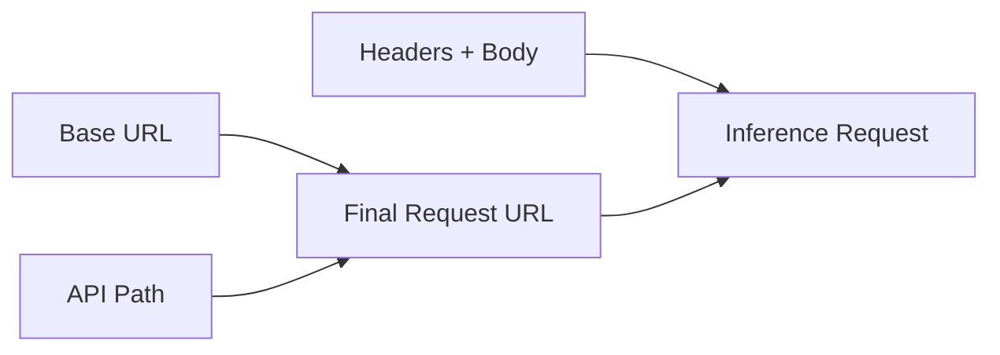

## Endpoint Model

Each integration request targets a project endpoint exposed by a deployed model. In practice, requests combine:
- **Base URL** from the deployment/project route
- **API path** such as `/v1/chat/completions` or `/v1/embeddings`
- **Model value** expected by the selected endpoint

## Authentication and Scope

Bud uses bearer token authentication with project-scoped API keys.

**Required header**:
- `Authorization: Bearer <API_KEY>`

Project scoping ensures:
- Team-level separation
- Usage attribution per project
- Easier key rotation and revocation

## Request Patterns

Most endpoints follow OpenAI-style JSON requests. Some endpoints (for example, audio transcription) require multipart form uploads.

| Endpoint Type | Common Path | Body Style |
|---|---|---|
| Chat | `/v1/chat/completions` | JSON |
| Completions | `/v1/completions` | JSON |
| Embeddings | `/v1/embeddings` | JSON |
| Classify | `/v1/classify` | JSON |
| Image Generation | `/v1/images/generations` | JSON |
| Audio Transcription | `/v1/audio/transcriptions` | Multipart form |
| Text-to-Speech | `/v1/audio/speech` | JSON |
| Documents | `/v1/documents` | JSON |

## Reliability Concepts

**Timeouts**
Define client timeouts that match endpoint workload characteristics.

**Retries**
Use exponential backoff for transient errors (`429`, `5xx`), and avoid retrying invalid requests (`400`, `401`).

**Idempotency**
Use idempotency keys when supported by your integration pattern to protect against duplicate submissions.

## Observability Concepts

Track these signals from day one:
- Request latency percentiles
- Error rate by status code
- Request and token volume
- Endpoint-level throughput

This helps correlate model behavior, scaling limits, and user experience.
