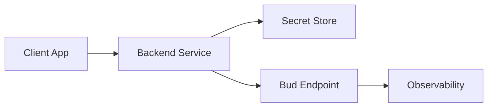

## Goal

Integrate one deployed endpoint into an application service with secure auth, robust request handling, and baseline observability.

## Architecture



## Step 1: Prepare Endpoint Information

From your project, open **Use this model** and collect:
- Base URL
- Endpoint path
- Model name
- Endpoint type (chat, embedding, image, audio, etc.)

## Step 2: Configure Secrets

Set environment variables in your service:

```bash
export BUD_BASE_URL="https://YOUR_BASE_URL"
export BUD_API_KEY="YOUR_API_KEY"
export BUD_MODEL_NAME="YOUR_MODEL_NAME"
```

## Step 3: Implement a Minimal API Client (Python)

```python
import os
import requests

url = f"{os.environ['BUD_BASE_URL']}/v1/chat/completions"
headers = {
    "Authorization": f"Bearer {os.environ['BUD_API_KEY']}",
    "Content-Type": "application/json",
}
payload = {
    "model": os.environ["BUD_MODEL_NAME"],
    "messages": [{"role": "user", "content": "Return a short project status update."}],
    "max_tokens": 120,
}

response = requests.post(url, headers=headers, json=payload, timeout=30)
response.raise_for_status()
print(response.json())
```

## Step 4: Add Retry and Error Mapping

Implement client-side handling:
- Retry `429` and `5xx` with backoff.
- Surface `401/403` as credential/permission issues.
- Treat `400/422` as payload validation errors.

## Step 5: Add Monitoring Hooks

Capture and store:
- Request ID (if available)
- Endpoint URL/path
- Status code
- Latency
- Token/request usage metrics

## Validation Checklist

<Check>Request succeeds with valid key and payload</Check>
<Check>Invalid key returns expected auth error handling</Check>
<Check>Retry path works for simulated transient failures</Check>
<Check>Logs include endpoint, status, and latency fields</Check>

## Next Steps

Proceed to advanced usage:
- [Guides](/api-integration/guides/openai-compatible-clients)
- [Reference](/api-integration/reference/request-response-reference)
- [Troubleshooting](/api-integration/troubleshooting)
