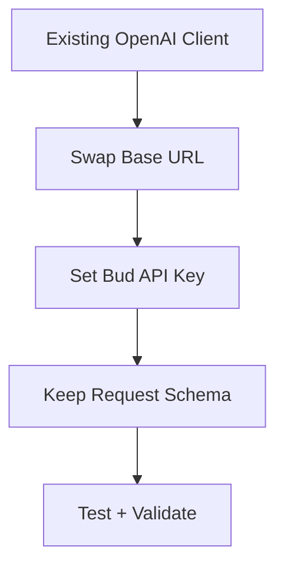

## Why This Guide

Bud endpoints are designed to support OpenAI-compatible payload structures, allowing teams to migrate faster with minimal code changes.

## Migration Steps

1. Replace provider base URL with your Bud base URL.
2. Use a project API key for authentication.
3. Keep request schema aligned with the target endpoint type.
4. Validate response shape and streaming behavior.

## Compatibility Checklist

- Chat/completions request fields are valid.
- Model identifier matches deployed route expectations.
- Timeout settings align with endpoint latency profile.
- Retries are enabled for transient errors.

## Example Strategy

For each endpoint type, validate in this order:
1. cURL smoke test
2. SDK/client library request
3. End-to-end application path with monitoring

## Common Pitfalls

- Using wrong base URL for environment.
- Mixing model IDs between projects.
- Forgetting bearer token prefix in auth header.
- Missing multipart handling for file-based endpoints.
