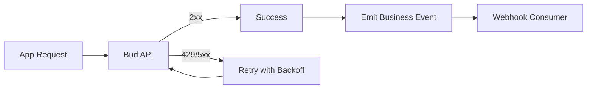

## Resilience Pattern Overview

Use retries for transient failures and webhooks/events for asynchronous business workflows.

## Retry Recommendations

- Retry on `429`, `500`, `502`, `503`, `504`.
- Use exponential backoff with jitter.
- Cap max attempts and total retry window.
- Log every attempt with reason and delay.

## Webhook/Event Workflow Guidance

- Treat webhooks as at-least-once delivery.
- Verify signatures where applicable.
- Make consumers idempotent.
- Persist delivery attempts for audits.

## Operational Guardrails

- Separate user-facing timeout from background retry timeout.
- Alert on sustained error-rate increases.
- Track queue depth and callback lag for async workloads.
