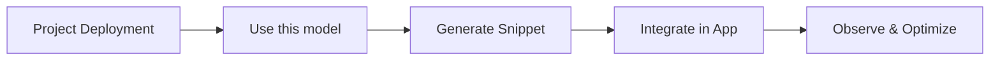

## Overview

The API Integration module helps teams move from a deployed model to production-ready application traffic. It combines endpoint discovery, project-scoped authentication, request patterns, and observability into one workflow.

## What You Can Do

**Discover endpoints quickly**
Find base URLs and model IDs from project routes and deployment details.

**Use OpenAI-compatible APIs**
Integrate chat, completions, embeddings, image, audio, and document flows with familiar request formats.

**Apply project-level governance**
Use project-scoped API keys, role-based access, and usage controls.

**Operate with confidence**
Track latency, token usage, and errors in observability dashboards tied to endpoints.

## Integration Building Blocks

| Capability | What it enables |
|---|---|
| Endpoint discovery | Locate deployment URL, route, and endpoint type |
| Authentication | Secure requests using API keys and Authorization headers |
| Request templates | Bootstrap cURL, Python, and JavaScript calls from UI snippets |
| Error handling | Standardized status code handling and retries |
| Observability | Production monitoring of request volume, cost, and failures |

## Typical Use Cases

<CardGroup cols={2}>
  <Card title="Customer-facing chat" icon="comments">
    Power conversational experiences with low-latency chat completions
  </Card>

  <Card title="Knowledge retrieval" icon="database">
    Generate embeddings and route semantic search requests
  </Card>

  <Card title="Media workflows" icon="photo-film">
    Integrate image generation, text-to-speech, and transcription APIs
  </Card>

  <Card title="Backend automation" icon="gear">
    Connect service-to-service inference with retries and observability
  </Card>
</CardGroup>

## Next Steps

<CardGroup cols={3}>
  <Card title="Quickstart" icon="play" href="/api-integration/quickstart">
    Send your first API request in minutes
  </Card>

  <Card title="Concepts" icon="book" href="/api-integration/api-integration-concepts">
    Understand endpoints, auth, and request patterns
  </Card>

  <Card title="Troubleshooting" icon="wrench" href="/api-integration/troubleshooting">
    Resolve common integration issues quickly
  </Card>
</CardGroup>
