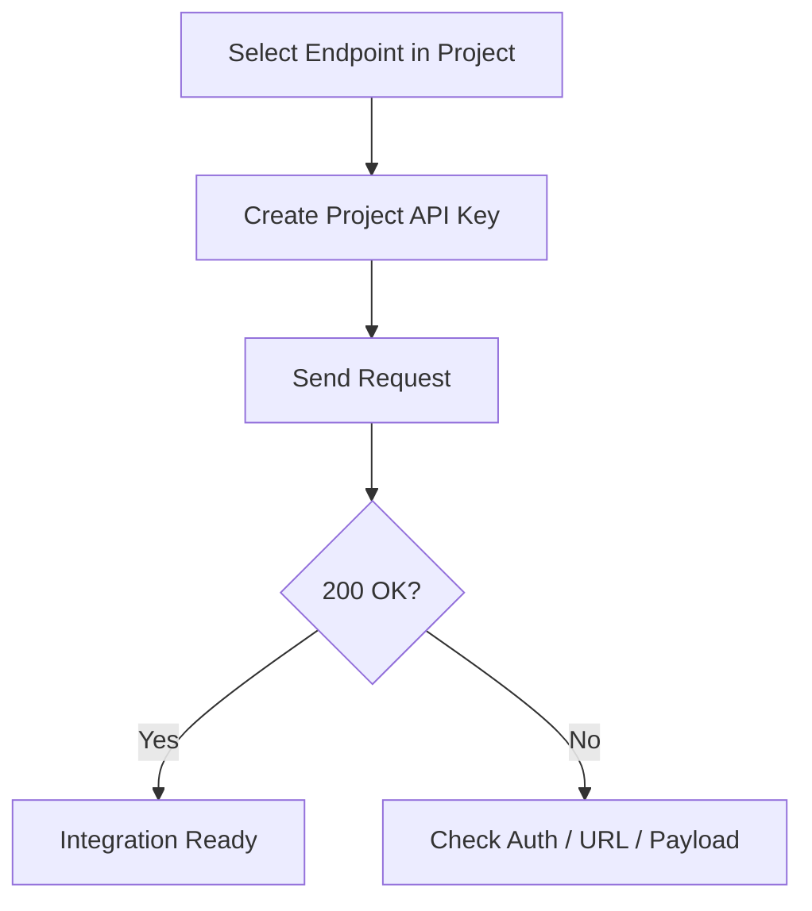

This guide walks through a minimal end-to-end flow: get endpoint details from a project, create a project API key, and send a request.

## Step 1: Open a Project Endpoint

1. In Bud AI Foundry, open **Projects**.
2. Select your project.
3. In the routes/deployments area, click **Use this model** for a running endpoint.
4. Note the generated base URL, path, and model name.

## Step 2: Create a Project API Key

1. Navigate to **API Keys**.
2. Create a key scoped to the same project.
3. Copy the key securely.

<Warning>
Store API keys in a secret manager or environment variable. Do not hardcode keys in source code.
</Warning>

## Step 3: Send a Test Request

```bash
curl --location 'https://YOUR_BASE_URL/v1/chat/completions' \
  --header 'Authorization: Bearer YOUR_API_KEY' \
  --header 'Content-Type: application/json' \
  --data '{
    "model": "YOUR_MODEL_NAME",
    "messages": [{"role": "user", "content": "Give me a one-line summary of Bud AI Foundry."}],
    "max_tokens": 128
  }'
```

## Step 4: Validate the Response

Confirm that:
- You receive HTTP `200`.
- The response includes a completion payload.
- The model and endpoint match your selected project route.



## Step 5: Move to Application Code

Use generated snippets from the **Use this model** drawer for:
- cURL
- Python (`requests`)
- JavaScript (`fetch`)

Then add retry and timeout policies before production rollout.

## What to Read Next

- [API Integration Concepts](/api-integration/api-integration-concepts)
- [Creating Your First API Integration](/api-integration/creating-first-api-integration)
- [Troubleshooting](/api-integration/troubleshooting)
