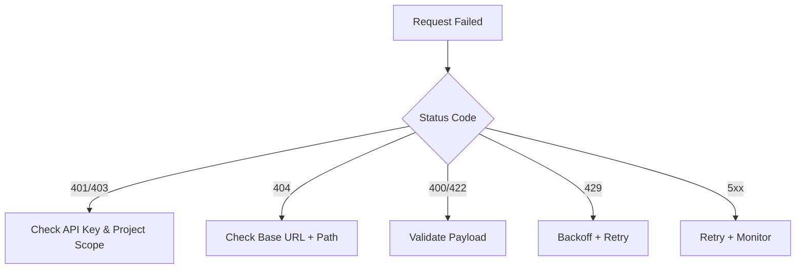

## Fast Triage Flow

## Authentication Errors (`401` / `403`)

**Causes**
- Invalid or expired API key
- Key from another project
- Missing `Bearer` prefix

**Fixes**
- Rotate and reconfigure API key
- Confirm project scope alignment
- Ensure `Authorization: Bearer <KEY>` format

## Not Found (`404`)

**Causes**
- Incorrect base URL
- Wrong endpoint path for selected model type

**Fixes**
- Re-copy URL from **Use this model**
- Verify route is active in project deployments

## Payload Validation (`400` / `422`)

**Causes**
- Wrong field names or types
- Missing required fields (`model`, `messages`, etc.)

**Fixes**
- Compare payload against endpoint reference
- Start from generated snippet and then customize incrementally

## Rate Limits (`429`)

**Fixes**
- Add exponential backoff with jitter
- Smooth traffic bursts using queues
- Review project quotas and request patterns

## Intermittent Server Errors (`5xx`)

**Fixes**
- Retry with bounded attempts
- Track error spikes in observability dashboards
- Escalate with request IDs and timestamps

## Still Blocked?

Collect this bundle before escalation:
- Request timestamp and status code
- Endpoint URL/path
- Sanitized payload sample
- Request/trace ID
- Retry attempt history
