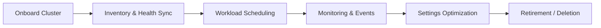
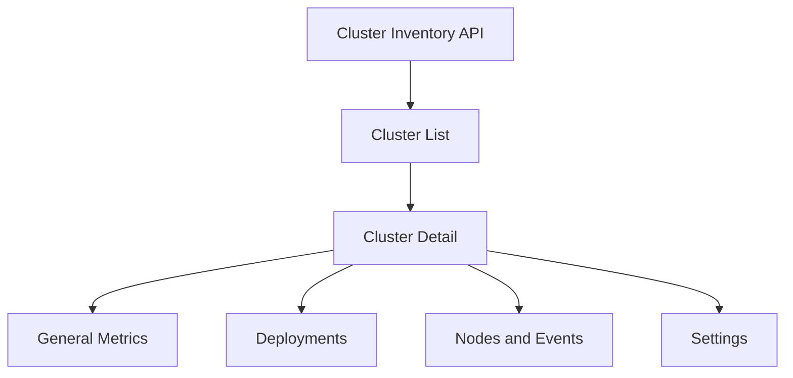

## What is a Cluster in Bud?

A **cluster** is a registered Kubernetes environment where Bud can schedule and run inference workloads, evaluations, and supporting services. Clusters expose compute inventory (CPU/GPU/HPU), endpoint capacity, and runtime settings for deployments.

## Cluster Lifecycle

## Cluster Types

- **Cloud-managed clusters** from supported providers.
- **Self-managed / existing Kubernetes clusters** connected through configuration and ingress details.
- **Mixed hardware clusters** with CPU and accelerator resources.

## Detail Tabs and Their Purpose

| Tab | Purpose |
|-----|---------|
| **General** | View resource summaries, node counts, and high-level utilization |
| **Deployments** | Track endpoints and model workloads running on this cluster |
| **Nodes** | Inspect node-level status, allocatable resources, and event history |
| **Analytics** | Analyze broader utilization and operational KPIs |
| **Settings** | Define default storage class and access mode for deployments |

## Governance and Permissions

Cluster actions align with role-based access control:
- **cluster:view** for read-only operations.
- **cluster:manage** for add/edit/delete and settings changes.

Every critical action (registration, updates, deletion) should be traceable through audit and activity trails.

## Capacity and Reliability Principles

<Check>Prioritize healthy clusters before scheduling new workloads.</Check>
<Check>Use node-level events to diagnose instability quickly.</Check>
<Check>Apply storage defaults to reduce deployment-time misconfiguration.</Check>
<Check>Avoid deleting clusters with active endpoints unless migration is complete.</Check>

## Conceptual Data Flow

## Next Steps

<CardGroup cols={2}>
  <Card title="Quick Start" icon="play" href="/clusters/quickstart">
    Register a cluster and verify readiness
  </Card>

  <Card title="Cluster Tabs Reference" icon="table" href="/clusters/reference/cluster-tabs-reference">
    Review each cluster tab and key actions
  </Card>
</CardGroup>
