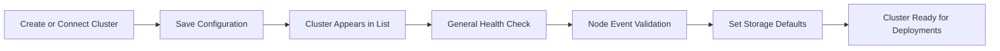

## What You'll Build

In this walkthrough, you will:
1. Register a new or existing cluster.
2. Validate health and node readiness.
3. Review running deployments on the cluster.
4. Configure default storage settings.

## Prerequisites

- Access to Bud Admin with cluster management permissions.
- Kubernetes cluster details (provider context, kube config, and ingress URL as needed).
- Network path from Bud control plane to cluster APIs.

## Step 1: Start Cluster Onboarding

1. Go to **Clusters**.
2. Click **+ Cluster**.
3. Select **Create New Cluster** or **Connect to Existing Cluster**.

## Step 2: Enter Core Configuration

1. Set cluster name and icon/identifier.
2. Choose provider or upload existing cluster configuration.
3. Provide ingress URL and required connection details.
4. Continue to submit onboarding.

## Step 3: Confirm in Cluster Listing

1. Return to cluster list view.
2. Verify the new cluster appears.
3. Review endpoint and hardware indicators.

## Step 4: Validate General Health

1. Open the cluster details page.
2. In **General**, check available nodes and resource summaries.
3. Use time filters to compare recent utilization.

## Step 5: Inspect Nodes and Events

1. Open **Nodes** tab.
2. Validate ready status and request-vs-allocatable signals.
3. Use **See More** on a node to inspect event details.

## Step 6: Configure Storage Defaults

1. Open **Settings** tab.
2. Select default storage class from discovered options.
3. Apply recommended access mode where appropriate.
4. Save and verify persistence.

## End-to-End Workflow

## Operational Checklist

<Check>Cluster appears in list and is selectable.</Check>
<Check>General tab shows healthy resource indicators.</Check>
<Check>Nodes tab has no unresolved critical events.</Check>
<Check>Settings are saved with expected storage defaults.</Check>

## Next Steps

<CardGroup cols={2}>
  <Card title="Cluster Operations Guide" icon="screwdriver-wrench" href="/clusters/guides/cluster-operations">
    Learn day-2 management patterns
  </Card>

  <Card title="Troubleshooting" icon="triangle-exclamation" href="/clusters/troubleshooting">
    Handle onboarding and runtime issues quickly
  </Card>
</CardGroup>
