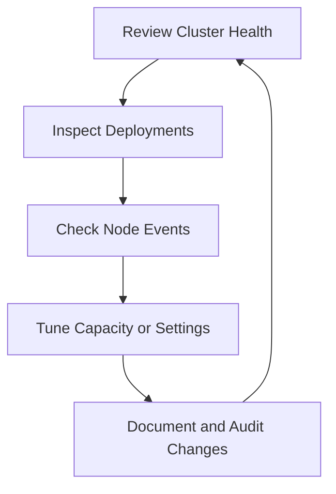
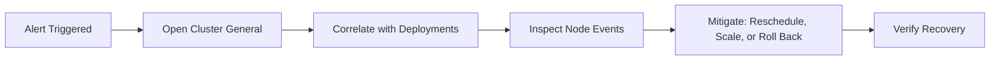

## Overview

After onboarding, operators use Clusters for continuous health management, deployment oversight, and safe lifecycle changes.

## Daily Operations Loop

## 1) Health Monitoring

- Review **General** tab for CPU/GPU/memory/storage trends.
- Check for abrupt drops in available workers or nodes.
- Use time windows to detect regressions.

## 2) Deployment Oversight

- Open **Deployments** tab to review active workloads.
- Confirm deployment status, worker counts, and routing behavior.
- Escalate unhealthy deployments before cluster-wide degradation.

## 3) Node Diagnostics

- Use **Nodes** tab for request-vs-allocatable analysis.
- Open node event panels for warnings (scheduling failures, connectivity, taints).
- Prioritize repeated or high-severity events for immediate remediation.

## 4) Safe Editing and Deletion

- Use edit actions to update metadata like name or ingress.
- Before deletion, confirm no active endpoints depend on the cluster.
- Record change rationale for governance and post-incident reviews.

## Incident Response Pattern

## Best Practices

<Check>Separate production and non-production clusters with clear naming.</Check>
<Check>Review node events before and after major deployment rollouts.</Check>
<Check>Avoid destructive operations during unresolved incidents.</Check>
<Check>Align cluster actions with RBAC and audit policy requirements.</Check>
