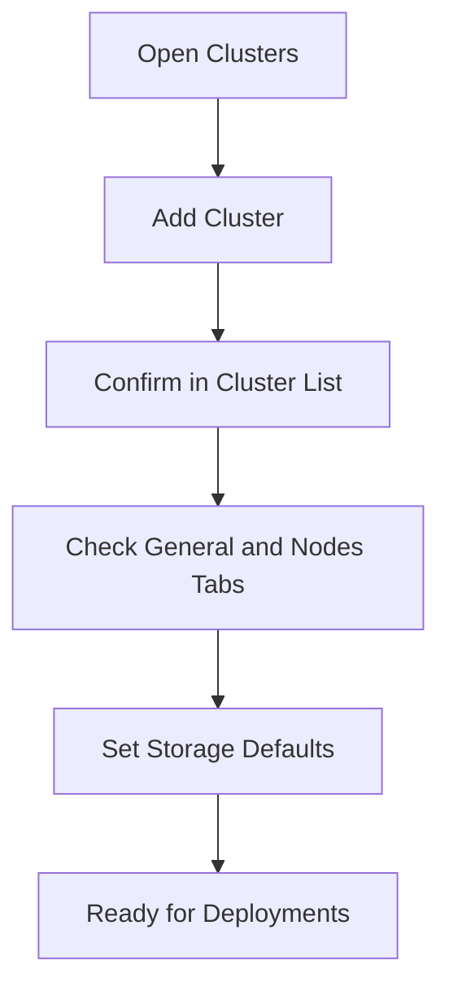

## Step 1: Open the Clusters Module

1. Sign in to Bud Admin.
2. In the sidebar, click **Clusters**.
3. Confirm you can access the cluster list page.

## Step 2: Add a Cluster

1. Click **+ Cluster**.
2. Choose one onboarding path:
   - **Create New Cluster** for cloud-provisioned flow.
   - **Connect to Existing Cluster** for already-running Kubernetes.
3. Provide required details (name, provider/context, ingress URL, and configuration file where applicable).
4. Submit to start onboarding.

## Step 3: Verify Cluster Registration

1. Return to the cluster listing.
2. Locate your new cluster.
3. Confirm hardware summary and status are visible.

## Step 4: Validate Health and Capacity

1. Open the cluster detail page.
2. On **General**, verify nodes and available resources.
3. Open **Nodes** and check ready status and recent events.

## Step 5: Set Default Storage Behavior

1. Open the **Settings** tab.
2. Select a default storage class.
3. Choose access mode (for example, `ReadWriteOnce` or `ReadWriteMany`).
4. Save settings for future deployments.

## Quick Start Flow

## Next Steps

<CardGroup cols={2}>
  <Card title="Creating Your First Cluster" icon="server" href="/clusters/creating-first-cluster">
    Complete guided setup with operational checks
  </Card>

  <Card title="Troubleshooting" icon="screwdriver-wrench" href="/clusters/troubleshooting">
    Resolve common registration and health issues
  </Card>
</CardGroup>
