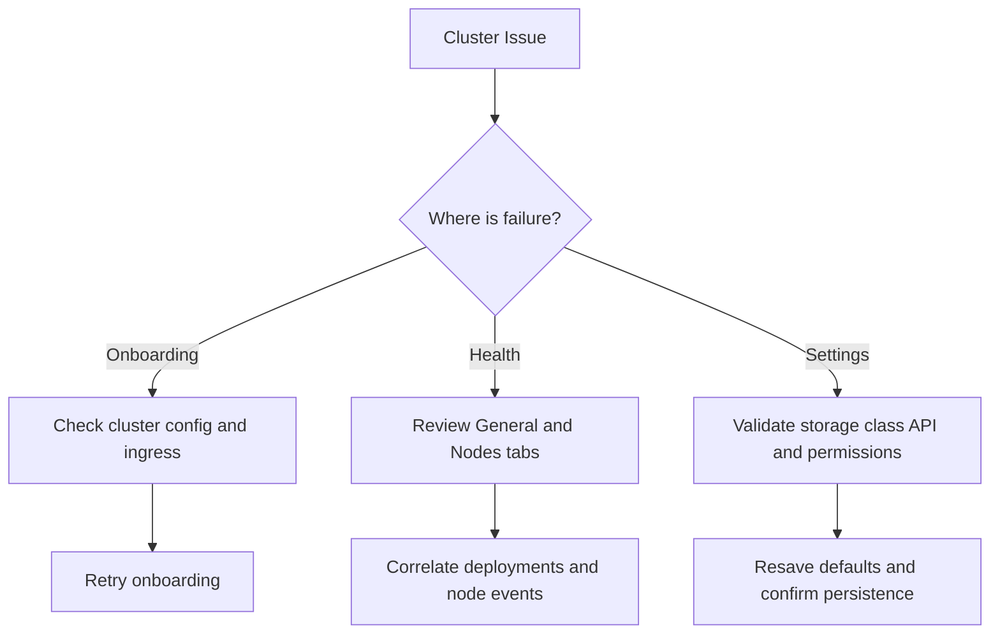

## Overview

Use this guide to diagnose common problems in cluster onboarding, health monitoring, and settings management.

## Troubleshooting Decision Tree

<AccordionGroup>
  <Accordion title="Cluster does not appear after onboarding">
    **Possible causes**
    - Incomplete onboarding form data.
    - Invalid kube configuration or provider credentials.
    - Backend workflow failed during registration.

    **Recommended checks**
    1. Re-run onboarding with validated configuration inputs.
    2. Confirm ingress and API connectivity.
    3. Check platform logs for onboarding workflow errors.
  </Accordion>

  <Accordion title="Cluster cannot be deleted">
    **Possible causes**
    - Active deployments still attached to the cluster.
    - Insufficient permissions to perform delete.

    **Recommended checks**
    1. Review Deployments tab and drain or migrate active endpoints.
    2. Confirm `cluster:manage` permission.
    3. Retry deletion after dependencies are cleared.
  </Accordion>

  <Accordion title="General tab shows degraded or missing metrics">
    **Possible causes**
    - Metrics pipeline latency or outage.
    - Node exporter/connectivity issues.

    **Recommended checks**
    1. Compare with Nodes tab readiness and event data.
    2. Validate monitoring integration health.
    3. Check if issue is cluster-local or platform-wide.
  </Accordion>

  <Accordion title="Node events show repeated scheduling failures">
    **Possible causes**
    - Insufficient allocatable CPU/GPU/memory.
    - Taints/affinity mismatch.
    - Storage constraints.

    **Recommended checks**
    1. Inspect request-vs-allocatable values on affected nodes.
    2. Validate scheduling constraints in deployment configs.
    3. Scale capacity or rebalance workloads.
  </Accordion>

  <Accordion title="Unable to save storage settings">
    **Possible causes**
    - Storage classes unavailable from cluster API.
    - Access mode incompatible with selected storage class.
    - API or permission errors.

    **Recommended checks**
    1. Reload settings and confirm storage class discovery works.
    2. Select recommended access mode.
    3. Verify user has manage permission and retry.
  </Accordion>
</AccordionGroup>

## Escalation Data to Capture

- Cluster ID and environment.
- Timestamp and user action attempted.
- Screenshot or export of relevant tab state.
- Node event snippets and affected workloads.

## Next Steps

<CardGroup cols={2}>
  <Card title="Cluster Concepts" icon="book" href="/clusters/cluster-concepts">
    Revisit lifecycle and tab responsibilities
  </Card>

  <Card title="Cluster Operations Guide" icon="toolbox" href="/clusters/guides/cluster-operations">
    Strengthen day-2 operational practices
  </Card>
</CardGroup>
