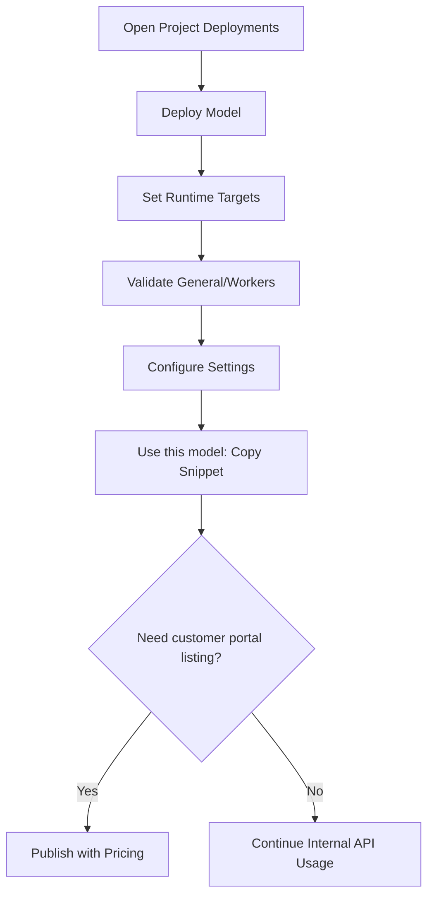

## What You'll Build

In this walkthrough, you will create a deployment, validate runtime health, use endpoint snippets, add reliability settings, and optionally publish it to the Customer Dashboard portal.

## Prerequisites

- Access to a project workspace
- Permission to manage deployments
- At least one available model source and cluster target

## Step 1: Navigate to Deployments

1. Open **Projects**.
2. Select your project.
3. Click **Deployments**.

## Step 2: Start Deployment Creation

1. Click **Deploy Model**.
2. Choose model source.
3. Select cluster and template/use-case profile.

## Step 3: Configure Runtime Targets

1. Enter deployment name.
2. Set concurrency and performance targets.
3. Review context/sequence-related runtime fields as applicable.

## Step 4: Launch and Validate

1. Submit the deployment.
2. Open its detail page.
3. Confirm **General** tab status is healthy.
4. If local, verify **Workers** activity.

## Step 5: Harden Reliability Settings

1. Open **Settings**.
2. Configure rate limiting strategy and quotas.
3. Add retry and fallback logic.
4. Save changes.

## Step 6: Use This Model for Integration

1. Click **Use this model** from the deployment row or detail page.
2. Copy cURL/Python/JavaScript snippet.
3. Run a test request from your application or API client.

## Step 7: Publish for Customer Dashboard (Optional)

1. Return to Deployments table.
2. Click **Publish** and provide pricing metadata.
3. Confirm the model is available in the **Customer Dashboard portal**.

## End-to-End Flow

## Best Practices

- Use clear, environment-aware naming conventions for deployments.
- Validate deployment status before sharing snippets or publishing.
- Keep **Use this model** for direct API integration workflows.
- Use **Publish** only when the deployment should appear in the customer-facing portal.
