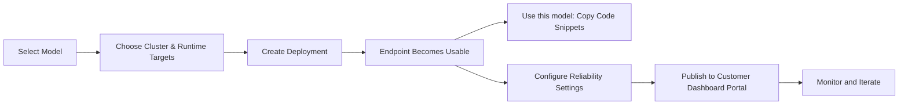

## Overview

The **Deployments** module is where a project turns models into live endpoints. It centralizes endpoint creation, runtime tuning, publishing, and lifecycle operations for both cloud and local models.

From a single project tab, teams can deploy workloads, monitor status, control reliability policies, and expose approved endpoints to downstream consumers.

## Why Deployments Matter

**Immediate endpoint usability after deploy**
Once a model is deployed and active, the endpoint is available. Use **Use this model** to copy cURL, Python, or JavaScript snippets for integration.

**Separate publish workflow for customer portal**
**Publish** is used to expose models in the **Customer Dashboard portal** with pricing metadata for customer consumption.

**Built-in reliability controls**
Configure retries, fallback chains, and rate limiting directly from deployment settings.

**Production visibility**
Track endpoint health and review runtime details through deployment-level tabs.

## Deployment Lifecycle

## Core Areas in Deployments

| Area | What you can do |
|------|------------------|
| **Deployment List** | Search, filter, deploy, publish, and manage project endpoints |
| **General Tab** | Review model/cluster metadata and deployment status |
| **Workers Tab** | Inspect and scale workers for local deployments |
| **Settings Tab** | Set rate limits, retries, and fallback behavior |
| **Model Evaluations Tab** | Review quality checks before wider rollout |

## Typical Workflow

1. Open a project and navigate to **Deployments**.
2. Deploy a model with the right cluster and runtime profile.
3. Validate endpoint readiness from deployment details.
4. Use **Use this model** to copy integration snippets and test endpoint calls.
5. Publish with pricing metadata only when you want the model available in the **Customer Dashboard portal**.

## Getting Started

<CardGroup cols={3}>
  <Card title="Quick Start" icon="play" href="/deployments/quickstart">
    Launch your first deployment in minutes
  </Card>

  <Card title="Deployment Concepts" icon="book" href="/deployments/deployment-concepts">
    Understand endpoint usage, publish behavior, and lifecycle states
  </Card>

  <Card title="Step-by-Step Tutorial" icon="graduation-cap" href="/deployments/creating-first-deployment">
    Build and publish a first deployment with best practices
  </Card>
</CardGroup>
