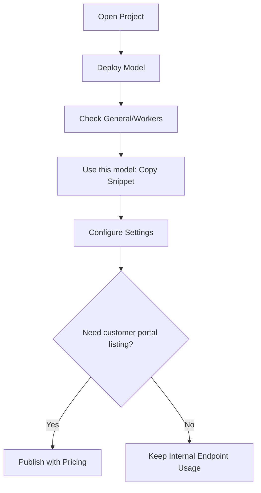

## Step 1: Open Project Deployments

1. Go to **Projects** and open your target project.
2. Select the **Deployments** tab.
3. Confirm you can view existing endpoints and action controls.

## Step 2: Create a Deployment

1. Click **Deploy Model**.
2. Choose a model source (cloud or local).
3. Select cluster and runtime profile.
4. Set deployment name and performance targets.
5. Submit the deployment request.

## Step 3: Validate Deployment Readiness

1. Open the deployment detail page.
2. Review the **General** tab for status and metadata.
3. If this is a local deployment, check **Workers** for node health.

## Step 4: Use the Endpoint

1. Return to the deployment row (or open General tab actions).
2. Click **Use this model**.
3. Copy cURL, Python, or JavaScript snippets.
4. Run a test call in your app or API client.

## Step 5: Configure Reliability

1. Open **Settings**.
2. Enable and configure rate limiting strategy.
3. Add retries and fallback deployment chain if needed.
4. Save your settings.

## Step 6: Publish for Customer Dashboard (Optional)

1. Return to the Deployments list.
2. Click **Publish** for the target deployment.
3. Set pricing details and confirm publication.
4. Verify the model appears in the **Customer Dashboard portal** catalog.

## Quick Start Flow

## Next Steps

<CardGroup cols={2}>
  <Card title="Creating Your First Deployment" icon="rocket" href="/deployments/creating-first-deployment">
    Full guided walkthrough with practical configuration tips
  </Card>

  <Card title="Troubleshooting" icon="screwdriver-wrench" href="/deployments/troubleshooting">
    Resolve common deployment, endpoint usage, and publish issues
  </Card>
</CardGroup>
