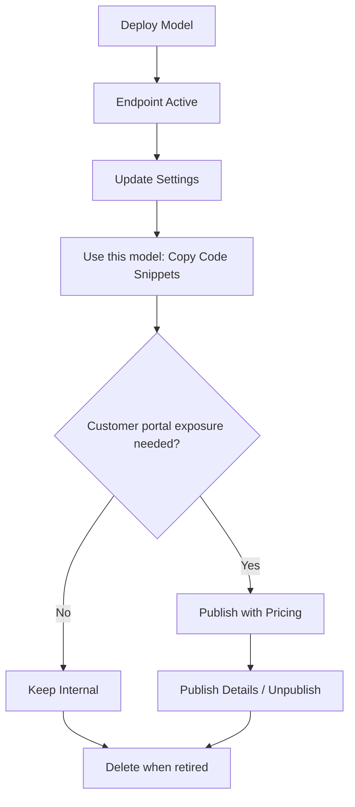

## Overview

This page summarizes the most common deployment actions available from project deployment views.

## Action Flow

## Core Actions

| Action              | Where                   | Purpose                                                                  |
| ------------------- | ----------------------- | ------------------------------------------------------------------------ |
| **Deploy Model**    | Deployments list        | Create a new endpoint from selected model + cluster                      |
| **Use this model**  | List row or General tab | Copy cURL, Python, and JavaScript snippets for immediate endpoint use    |
| **Publish**         | Deployments list row    | Publish model to the **Customer Dashboard portal** with pricing metadata |
| **Publish Details** | Published endpoint row  | Review or adjust publication pricing metadata                            |
| **Unpublish**       | Published endpoint row  | Remove model from customer portal while keeping deployment active        |
| **Delete**          | Deployments list row    | Remove endpoint after dependency checks                                  |

## Detail-Page Actions

| Tab          | Action                                   | Use Case                                                           |
| ------------ | ---------------------------------------- | ------------------------------------------------------------------ |
| **General**  | Use this model / View deployment summary | Access endpoint snippets and validate model-cluster-status context |
| **Workers**  | Add Worker                               | Increase local serving capacity                                    |
| **Settings** | Save policy changes                      | Apply rate limits, retries, and fallback rules                     |

## Operational Notes

- Deploying a model makes the endpoint usable; publishing is not required for internal API use.
- Publish/unpublish controls specifically govern visibility in the customer-facing portal.
- Workers tab appears only for non-cloud deployments.