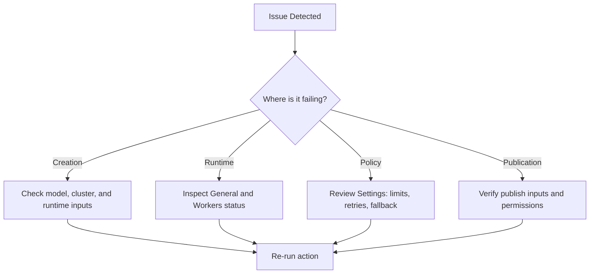

## Troubleshooting Flow

## Creation Issues

### Deployment fails to start

- Validate model source and cluster availability.
- Ensure all required runtime fields are provided.
- Confirm you have deployment manage permissions.

## Runtime Issues

### Deployment appears unhealthy

- Check status and metadata on the General tab.
- For local deployments, inspect Workers for inactive or failing nodes.
- Scale workers or adjust runtime settings as needed.

## Settings and Reliability Issues

### Requests are being throttled unexpectedly

- Re-check rate limit algorithm and quota thresholds.
- Confirm burst configuration matches traffic pattern.

### Frequent request failures

- Increase retry tolerance where appropriate.
- Add or validate fallback deployment chains.

## Publish and Access Issues

### Unable to publish endpoint

- Confirm deployment is active.
- Check permission scope for publish actions.
- Verify pricing fields are valid and complete.

### Consumers cannot integrate successfully

- Regenerate snippets from **Use this model**.
- Validate endpoint selection and environment assumptions.

## When to Escalate

Escalate with deployment name, project ID, action attempted, timestamp, and screenshots/log excerpts from the failing page state.
