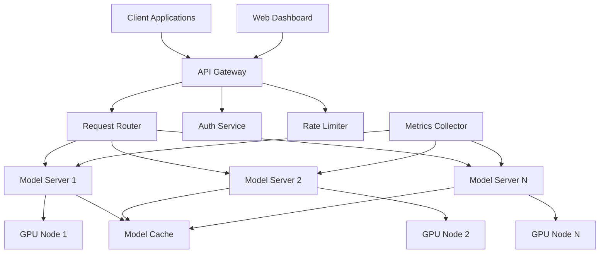

## System Architecture

Bud Runtime is built on a microservices architecture designed for scalability, reliability, and performance.

### Core Components



### Component Details

#### API Gateway

The API Gateway serves as the single entry point for all client requests:

- **Load Balancing**: Distributes requests across model servers
- **Authentication**: Validates API keys and JWT tokens
- **Rate Limiting**: Enforces usage quotas
- **Request Routing**: Routes to appropriate model servers


#### Model Servers

Model servers handle the actual inference workloads:

- **Model Loading**: Efficient loading and caching of models
- **Batch Processing**: Groups requests for better throughput
- **GPU Management**: Optimal GPU memory utilization
- **Health Monitoring**: Regular health checks and auto-recovery

#### Storage Layer

```yaml
Storage Components:
  Model Repository:
    - Type: Object Storage (S3-compatible)
    - Purpose: Central model storage
    - Features: Versioning, replication

  Cache Layer:
    - Type: Distributed cache (Redis)
    - Purpose: Fast model weight access
    - Features: LRU eviction, persistence

  Metadata Store:
    - Type: PostgreSQL
    - Purpose: Model metadata, configurations
    - Features: ACID compliance, replication
```

## Request Flow

### Text Generation Request

1. **Client Request**: Client sends request to API Gateway
2. **Authentication**: Gateway validates credentials
3. **Rate Limiting**: Checks against usage quotas
4. **Routing**: Determines optimal model server
5. **Model Loading**: Server loads model if not cached
6. **Inference**: Processes request on GPU
7. **Response**: Returns generated text to client

```sequence
Client->Gateway: POST /v1/completions
Gateway->Auth: Validate token
Auth->Gateway: Token valid
Gateway->Router: Route request
Router->ModelServer: Forward request
ModelServer->GPU: Run inference
GPU->ModelServer: Return output
ModelServer->Gateway: Send response
Gateway->Client: Return completion
```

### Image Generation Request

Similar flow with additional steps:

1. **Preprocessing**: Image prompt processing
2. **Model Selection**: Choose appropriate image model
3. **Generation**: Multi-step diffusion process
4. **Post-processing**: Image encoding and storage
5. **URL Generation**: Create accessible image URL

## Scaling Architecture

### Horizontal Scaling

```yaml
Scaling Strategy:
  Model Servers:
    - Auto-scaling based on GPU utilization
    - Min replicas: 1
    - Max replicas: 100
    - Target GPU utilization: 70%

  API Gateway:
    - CPU-based auto-scaling
    - Min replicas: 2
    - Max replicas: 20
    - Target CPU: 60%
```

### Vertical Scaling

```yaml
GPU Tiers:
  Small Models:
    - GPU: NVIDIA T4
    - Memory: 16GB
    - Models: 7B parameters

  Medium Models:
    - GPU: NVIDIA A10
    - Memory: 24GB
    - Models: 13B parameters

  Large Models:
    - GPU: NVIDIA A100
    - Memory: 80GB
    - Models: 70B+ parameters
```

## High Availability

### Redundancy

- **Multi-zone deployment**: Spread across availability zones
- **Model replication**: Multiple copies of each model
- **Database replication**: Primary-replica setup
- **Gateway redundancy**: Multiple gateway instances

### Failover Strategy

```yaml
Failover Configuration:
  Health Checks:
    - Interval: 10s
    - Timeout: 5s
    - Threshold: 3 failures

  Recovery:
    - Automatic pod restart
    - Node evacuation on failure
    - Cross-zone failover
    - Circuit breaker pattern
```

## Performance Architecture

### Caching Strategy

```python
class ModelCache:
    """Multi-level caching for model weights."""

    def __init__(self):
        self.l1_cache = {}  # In-memory cache
        self.l2_cache = RedisCache()  # Distributed cache
        self.l3_cache = S3Storage()  # Persistent storage

    async def get_model(self, model_id: str) -> Model:
        # Try L1 cache first
        if model_id in self.l1_cache:
            return self.l1_cache[model_id]

        # Try L2 cache
        model = await self.l2_cache.get(model_id)
        if model:
            self.l1_cache[model_id] = model
            return model

        # Load from L3 storage
        model = await self.l3_cache.load(model_id)
        await self.l2_cache.set(model_id, model)
        self.l1_cache[model_id] = model
        return model
```

### Batch Processing

```go
type BatchProcessor struct {
    batchSize    int
    batchTimeout time.Duration
    queue        chan Request
    processor    ModelProcessor
}

func (b *BatchProcessor) Process() {
    batch := make([]Request, 0, b.batchSize)
    timer := time.NewTimer(b.batchTimeout)

    for {
        select {
        case req := <-b.queue:
            batch = append(batch, req)
            if len(batch) >= b.batchSize {
                b.processBatch(batch)
                batch = batch[:0]
                timer.Reset(b.batchTimeout)
            }
        case <-timer.C:
            if len(batch) > 0 {
                b.processBatch(batch)
                batch = batch[:0]
            }
            timer.Reset(b.batchTimeout)
        }
    }
}
```

## Security Architecture

### Network Security

```yaml
Network Policies:
  Ingress:
    - Allow from Load Balancer only
    - TLS 1.3 minimum
    - Certificate pinning

  Egress:
    - Model repository access
    - Metrics endpoints
    - No external internet access

  Inter-service:
    - mTLS between services
    - Service mesh (Istio)
    - Network segmentation
```

### Data Security

- **Encryption at rest**: All stored data encrypted
- **Encryption in transit**: TLS for all communications
- **Key management**: Integrated with KMS
- **Access control**: RBAC with fine-grained permissions

## Monitoring Architecture

### Metrics Collection

```yaml
Metrics Stack:
  Collection:
    - Prometheus for metrics
    - OpenTelemetry for traces
    - Fluentd for logs

  Storage:
    - Thanos for long-term metrics
    - Elasticsearch for logs
    - Jaeger for traces

  Visualization:
    - Grafana dashboards
    - Custom monitoring UI
    - Alert manager
```

### Key Metrics

```promql
# System Metrics
- GPU Utilization: gpu_utilization_percent
- Memory Usage: container_memory_usage_bytes
- Request Latency: http_request_duration_seconds
- Error Rate: http_requests_total{status=~"5.."}

# Business Metrics
- Tokens Generated: tokens_generated_total
- Model Usage: model_requests_total{model}
- User Activity: active_users_daily
- Cost per Request: request_cost_dollars
```

## Development Architecture

### CI/CD Pipeline

```yaml
Pipeline Stages:
  Build:
    - Code compilation
    - Docker image creation
    - Security scanning

  Test:
    - Unit tests
    - Integration tests
    - Performance tests

  Deploy:
    - Staging deployment
    - Smoke tests
    - Production rollout
    - Health verification
```

### Development Environment

```yaml
Dev Setup:
  Local:
    - Kind/Minikube cluster
    - Mock GPU support
    - Local model cache

  Staging:
    - Full cluster replica
    - Subset of models
    - Performance testing

  Production:
    - Multi-region deployment
    - Full model catalog
    - High availability
```

For implementation guidelines, see [Development Guidelines](/development/guidelines).
