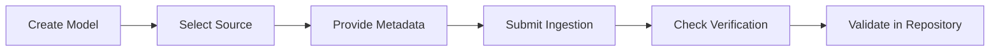

This tutorial shows how to onboard a model from source selection to readiness checks.

## What you'll build

A production-ready model entry that includes:

1. source configuration,
2. searchable metadata,
3. readiness verification,
4. baseline validation for team usage.

## Prerequisites

- Access to Bud AI Foundry.
- Permissions to create models.
- Valid source credentials or artifact access.

## Step 1: Create a new model

1. Open **Models**.
2. Click **\+ Model**.
3. Choose a modality that matches your use case.

## Step 2: Pick source and connect

Choose one source path:

- **Cloud**: select provider and model.
- **Hugging Face**: provide model identifier.
- **URL**: add approved download URL.
- **Disk**: specify server/mounted path.

## Step 3: Add governance metadata

Populate metadata fields before submission:

- name and description,
- owner/author,
- tags and tasks,
- relevant public links.

<Tip>
  Consistent tags improve filtering for large multi-team model inventories.
</Tip>

## Step 4: Submit onboarding

1. Confirm details.
2. Submit the form.
3. Wait for ingestion and validation updates.

## Step 5: Review model details

Open the model detail view and verify:

- source and modality,
- verification and scan indicators,
- compatibility context for downstream deployment.

## Step 6: Validate discoverability

1. Return to repository list.
2. Search/filter by name, source, or tags.
3. Confirm the model appears for intended teams.

## Step 7: Optional baseline checks

- Run a security scan if required.
- Trigger benchmark/evaluation workflows for baseline quality and performance evidence.

## Expected result

<Check>
  Your model is successfully onboarded and visible in the repository.
</Check>

 <Check>
  Verification signals are available for governance review.
</Check>

 <Check>
  The model is ready for deployment and project workflows.
</Check>

## Next steps

<CardGroup cols={2}>
  <Card icon="book" href="/models/model-concepts" title="Model concepts">
    Understand lifecycle and governance states.
  </Card>
  <Card icon="shield" href="/models/guides/model-security-and-verification" title="Security and verification">
    Apply trust controls before production usage.
  </Card>
  <Card icon="gauge" href="/models/guides/performance-benchmarks" title="Performance benchmarks">
    Compare latency and throughput across options.
  </Card>
</CardGroup>
