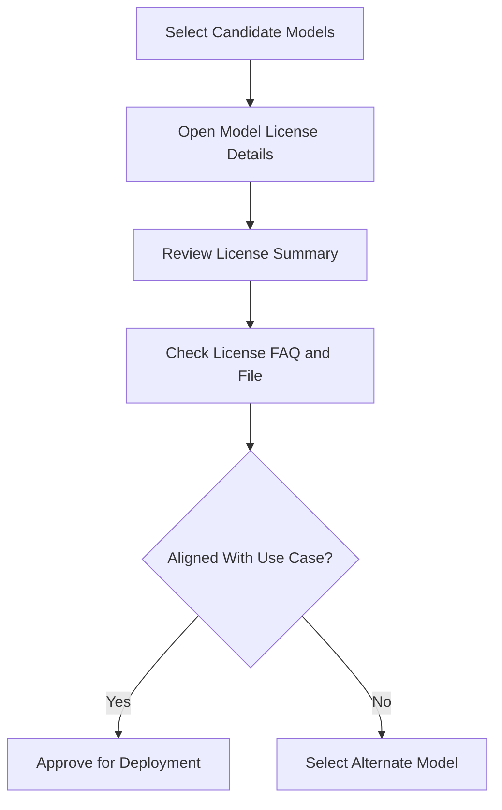

If you are deciding between model families like LLAMA and Qwen—or even between close variants like LLAMA 3.1 and LLAMA 3.2—licensing often becomes the deciding factor.

Bud AI Foundry includes a built-in license analysis experience so your team can review license details directly in the model workflow, instead of manually parsing long legal text each time.

## What this feature solves

- Reduces manual license interpretation work.
- Gives teams a repeatable review step before onboarding or deployment.
- Surfaces license details and FAQs in one place for faster decisions.

## How it works in Bud

The model details flow supports viewing license details and FAQs, including license files/URLs and structured Q&A content.

## Recommended decision workflow

1. Identify candidate models for the task.
2. Open each model's license details page.
3. Compare usage constraints against your product scenario.
4. Record your approval/rejection outcome with rationale.
5. Continue onboarding/deployment only for approved candidates.

<Tip>
Treat license review as a required quality gate, alongside performance and security checks.
</Tip>

## Practical examples

- **Commercial SaaS feature**: confirm redistribution and commercial usage rights.
- **Internal enterprise assistant**: verify internal-use allowances and attribution obligations.
- **Fine-tuned derivative model**: validate derivative-use terms before publishing.

## Related docs

- [Model Operations Reference](/models/reference/model-operations-reference)
- [Model Security and Verification](/models/guides/model-security-and-verification)
- [Troubleshooting](/models/troubleshooting)
