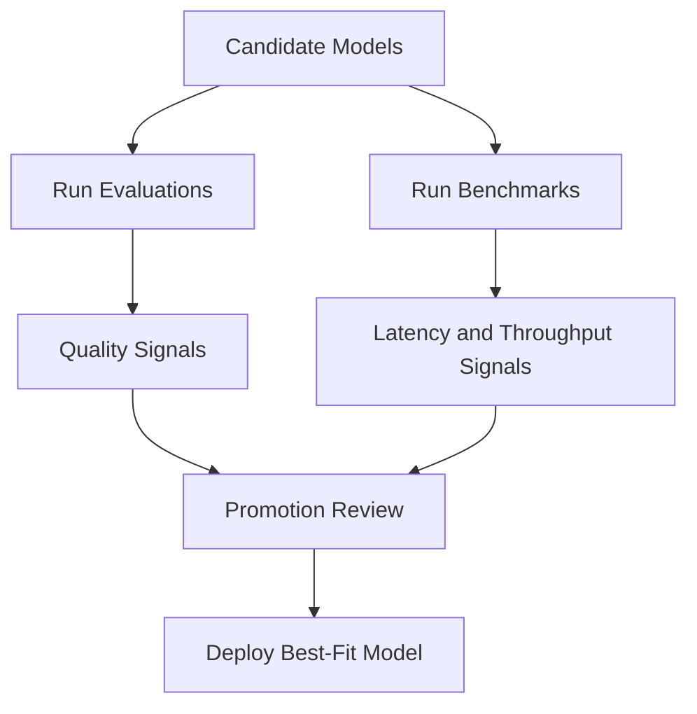

Use benchmark and evaluation workflows to compare candidate models across quality and efficiency metrics.

## Decision framework

## What to measure

- **Quality**: task-level evaluation outcomes.
- **Latency**: response time characteristics.
- **Throughput**: sustained request capacity.
- **Consistency**: behavior across environments and reruns.

## Recommended process

1. Start with 2-3 candidate models.
2. Run the same dataset/configuration for fair comparison.
3. Record benchmark history and status.
4. Review evaluation outcomes with stakeholders.
5. Promote only models that satisfy quality and performance thresholds.

## Practical tips

- Keep benchmark names descriptive for easier audit trails.
- Filter benchmark history by model and status to isolate regressions.
- Re-run checks after model updates or configuration changes.

## Escalation checklist

<Check>Quality threshold passed on target dataset.</Check>
<Check>Latency and throughput meet service objectives.</Check>
<Check>Security/verification signals are green.</Check>
<Check>Approval owner signs off promotion.</Check>

## Related docs

- [Creating Your First Model](/models/creating-first-model)
- [Troubleshooting](/models/troubleshooting)
