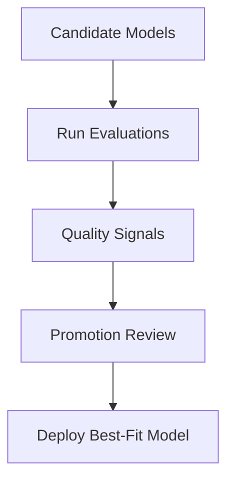

Use model evaluations to compare candidate models on task quality before production rollout.

In the Models experience, evaluation signals complement performance benchmarks so teams can choose the best fit for both quality and runtime goals.

## Evaluation workflow

## What to measure

- **Task quality**: score outcomes for the selected evaluation dataset or criteria.
- **Reliability**: consistency of responses across reruns.
- **Comparative ranking**: relative model quality under the same evaluation setup.
- **Readiness**: whether results satisfy release thresholds for the target use case.

## Recommended process

1. Select 2-3 candidate models for the same task.
2. Run a consistent evaluation setup for all candidates.
3. Review score trends and ranking outcomes.
4. Share findings with product, engineering, and model owners.
5. Approve only models that pass agreed quality thresholds.

## Practical tips

- Keep evaluation names descriptive for easier audits.
- Reuse the same datasets/configuration when comparing models.
- Document acceptance thresholds before starting evaluations.
- Re-run evaluations after model updates, prompt changes, or adapter changes.

## Escalation checklist

<Check>Quality threshold passed on target dataset.</Check>
<Check>Evaluation rerun confirms stable quality.</Check>
<Check>Security and verification checks are green.</Check>
<Check>Approval owner signs off promotion.</Check>

## Related docs

- [Performance Benchmarks](/models/guides/performance-benchmarks)
- [Evaluations module overview](/evaluations/evaluations)
- [Creating Your First Model](/models/creating-first-model)
