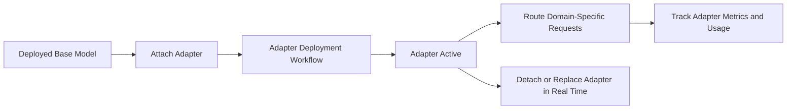

Bud AI Foundry updates to Model Adapters make it easier to run many domain-specific model behaviors on nearly the same infrastructure as one base deployment.

## Key capabilities

- **Dynamic adapter loading**: add or remove adapters while a model stays live, with no service interruption.
- **Multi-domain inference on shared infrastructure**: run legal, finance, support, and document-focused behaviors on shared GPU capacity.
- **Adapter-level monitoring and analytics**: track usage and behavior per adapter for governance and audits.

## Step-by-step guide

1. Open your deployment and navigate to **Adapters**.
2. Start **Add Adapter** flow.
3. Select adapter model and enter adapter details.
4. Deploy adapter and monitor status until completion.
5. Validate adapter behavior with use-case specific prompts.
6. Use adapter-level metrics and logs for ongoing optimization.

## Why this matters

- Launch specialized AI capabilities faster.
- Reduce infrastructure cost by reusing shared base deployments.
- Improve control and visibility with adapter-level governance data.

## Suggested rollout strategy

1. Start with one high-value domain adapter.
2. Compare quality and cost against deploying a separate full model.
3. Expand to additional adapters once baseline SLAs are met.
4. Establish adapter naming, ownership, and review standards.

## Related docs

- [Creating Your First Model](/models/creating-first-model)
- [Troubleshooting](/models/troubleshooting)