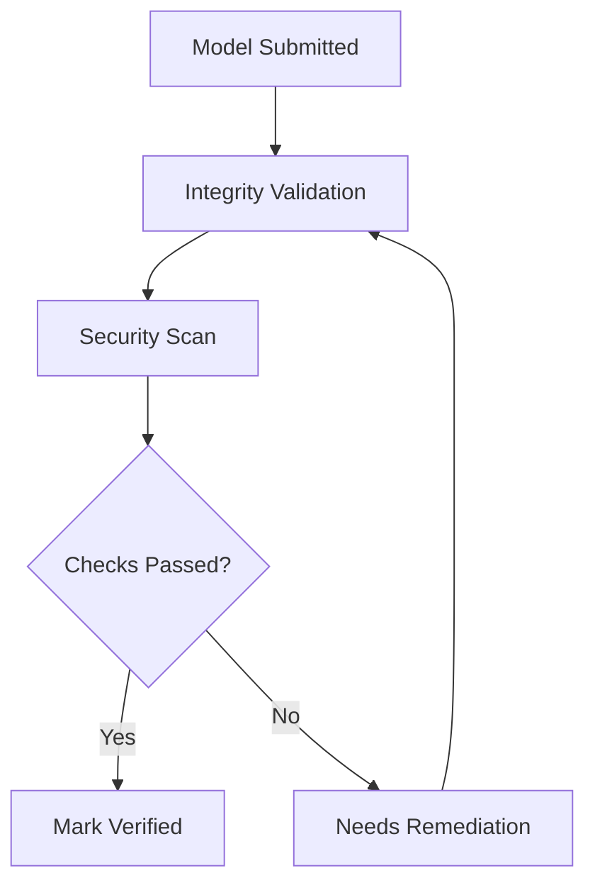

This guide explains how to operationalize trust controls for model onboarding.

## Why this matters

Security and integrity checks reduce production risk from compromised or unverified artifacts.

## Verification workflow

## Recommended controls

1. **Integrity checks**
   - Validate checksum or signature for local artifacts.
2. **Source trust**
   - Restrict URL/disk onboarding to approved origins.
3. **Scan evidence**
   - Review issue severity and impacted files before approval.
4. **Change accountability**
   - Keep ownership and update records current.

## Operational runbook

1. Open model details.
2. Review verification status.
3. Run or review security scan results.
4. Resolve issues with medium/high/critical impact.
5. Re-run checks until model is marked ready.

## Common failure patterns

<AccordionGroup>
  <Accordion title="Scan status remains pending">
    Check ingestion completion and retry scan once artifacts are fully available.
  </Accordion>
  <Accordion title="Verification fails after update">
    Revalidate source path/URI and metadata consistency, then resubmit.
  </Accordion>
  <Accordion title="Model is visible but not approved">
    Confirm governance and evaluation requirements for your team are complete.
  </Accordion>
</AccordionGroup>

## See also

- [Troubleshooting](/models/troubleshooting)
- [Model Operations Reference](/models/reference/model-operations-reference)
