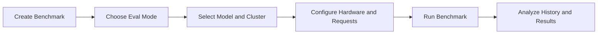

Bud AI Foundry now provides an expanded benchmark workflow with additional controls and a guided sequence, so you can run experiments faster with less setup.

You can benchmark model performance directly on your own clusters and compare results across runs.

## What is new

- Guided benchmark creation flow with step-by-step inputs.
- Support for both dataset-based and configuration-based evaluations.
- Benchmark history views with filters for model and status.

## Demo walkthrough

1. Open **Benchmark History** from the Models area.
2. Click **Run Another Benchmark**.
3. Enter benchmark metadata (name, tags, description, concurrent requests).
4. Choose evaluation mode:
   - Dataset
   - Configuration
5. Select model, target cluster, and runtime settings.
6. Run benchmark and monitor status.
7. Review throughput, latency/TPOT, duration, and completion state.

## Why it matters

- Makes capacity planning more data-driven.
- Helps identify best-fit model/cluster combinations.
- Reduces trial-and-error when preparing production rollouts.

## Best practices

- Keep benchmark runs comparable by standardizing inputs.
- Use tags to group experiments by use case or release.
- Re-run critical scenarios after model or cluster changes.

## Related docs

- [Benchmarking and Evaluations](/models/guides/benchmarking-and-evaluations)
- [Creating Your First Model](/models/creating-first-model)
