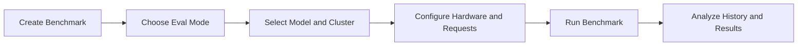

Use the Models benchmarking workflow to measure runtime performance before promoting a model to production.

Bud AI Foundry supports guided benchmark creation, benchmark history filtering, and side-by-side comparison of runs executed on your own clusters.

## Benchmark workflow

## What to measure

- **Latency**: response time characteristics for target traffic patterns.
- **Throughput**: sustained request handling capacity.
- **Duration**: total benchmark completion time.
- **Consistency**: result stability across reruns and environments.

## Demo walkthrough

1. Open **Benchmark History** from the Models area.
2. Click **Run Another Benchmark**.
3. Enter benchmark metadata (name, tags, description, concurrent requests).
4. Choose evaluation mode:
   - Dataset
   - Configuration
5. Select model, target cluster, and runtime settings.
6. Run benchmark and monitor status.
7. Review throughput, latency/TPOT, duration, and completion state.

## Recommended process

1. Start with 2-3 candidate models for the same workload.
2. Run the same setup (dataset/config, hardware profile, concurrency) for fair comparison.
3. Track benchmark history by model and status to identify regressions.
4. Re-run critical scenarios after model, adapter, or infrastructure changes.
5. Promote only configurations that satisfy performance SLOs.

## Best practices

- Use descriptive benchmark names for easy audits.
- Tag runs by project, release, or use case for fast filtering.
- Separate exploratory runs from release-gating runs.
- Capture benchmark context (cluster type, runtime settings, request profile) with each run.

## Escalation checklist

<Check>
  Latency and throughput meet service objectives.
</Check>

<Check>
  Duration is acceptable for recurring validation cycles.
</Check>

<Check>
  No regression versus the previous approved benchmark baseline.
</Check>

<Check>
  Approval owner signs off promotion based on benchmark evidence.
</Check>

## Related docs

- [Evaluations](/models/guides/evaluations)
- [Creating Your First Model](/models/creating-first-model)
- [Troubleshooting](/models/troubleshooting)
