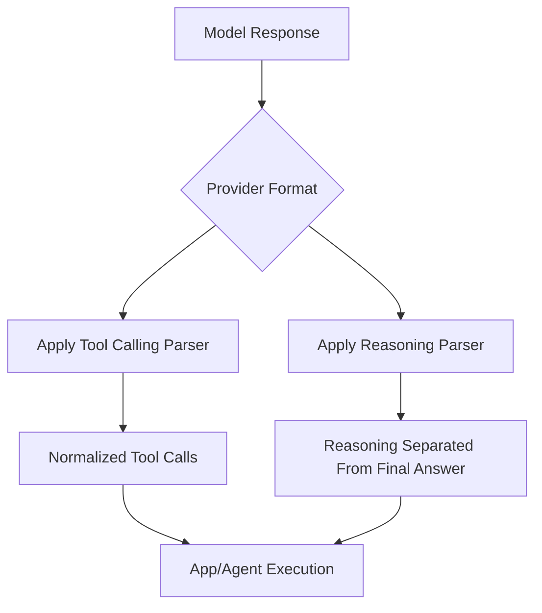

Bud AI Foundry adds two important capabilities for model interoperability:

1. **Tool Calling Parser**
2. **Reasoning Parser**

Together, these features help teams avoid writing provider-specific parsing logic for every model.

## Problem this solves

Different models format tool calls and reasoning traces differently. Without normalization, teams often maintain fragile parser code, templates, and regex rules per model.

Bud automatically applies parser metadata per deployment path, allowing consistent handling across supported models.

## Step-by-step guide

1. Start a model deployment flow.
2. Select a cluster and review deployment feature options.
3. Enable **Tool Calling** and/or **Reasoning** if parser support is available.
4. Complete deployment.
5. Send requests and verify:
   - tool calls are parsed consistently,
   - reasoning is separated from final answer payloads.

## What to validate

- Parser options appear only when available for the selected workflow/cluster metadata.
- Tool invocations are structured consistently across different models.
- Reasoning output is isolated from user-facing answer text.

## Why this matters

- Faster model switching with minimal app changes.
- Less parser maintenance overhead.
- Lower risk of production failures due to model-specific output shape changes.

## Related docs

- [Model Concepts](/models/model-concepts)
- [Model Operations Reference](/models/reference/model-operations-reference)
