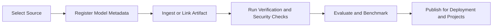

Bud Model Hub is the control plane for discovering, onboarding, validating, and operating AI models across cloud providers and local infrastructure.

It unifies cloud models and local artifacts behind one lifecycle so teams can:

- onboard models from multiple sources,
- apply governance and verification checks,
- compare performance and evaluation outcomes, and
- route workloads to the best fit for cost, latency, and compliance.

## Why the Models module matters

As teams scale GenAI usage, model operations become fragmented across providers, file stores, and environments. The Models module gives you a single operating model for:

- **Catalog consistency**: one inventory for cloud, Hugging Face, URL, and disk-based models.
- **Operational confidence**: scan and verification states tracked per model.
- **Deployment readiness**: model metadata aligned with modality and endpoint capabilities.
- **Decision support**: benchmark and evaluation views to choose the right model for production.

## Core capabilities

<CardGroup cols={2}>
  <Card title="Unified catalog" icon="book-open">
    Keep cloud and local models in one searchable repository with metadata, tags, and ownership context.
  </Card>
  <Card title="Source flexibility" icon="arrow-down-to-bracket">
    Add models from cloud providers, Hugging Face, signed URLs, or mounted disk paths.
  </Card>
  <Card title="Security and trust" icon="shield-check">
    Track scan and verification signals before exposing models for downstream use.
  </Card>
  <Card title="Performance visibility" icon="chart-line">
    Use benchmark history and evaluation outputs to compare throughput, latency, and quality trade-offs.
  </Card>
</CardGroup>

## High-level lifecycle

## Who uses this module

- **Platform teams** to standardize onboarding, safety checks, and governance.
- **ML engineers** to compare variants and move approved versions toward production.
- **Application teams** to pick ready-to-use models with clear capabilities and constraints.

## Next steps

<CardGroup cols={2}>
  <Card title="Quickstart" icon="play" href="/models/quickstart">
    Add your first model in a few minutes.
  </Card>
  <Card title="Model concepts" icon="book" href="/models/model-concepts">
    Learn core entities and lifecycle states.
  </Card>
  <Card title="Create your first model" icon="wand-magic-sparkles" href="/models/creating-first-model">
    Follow a guided onboarding walkthrough.
  </Card>
</CardGroup>
