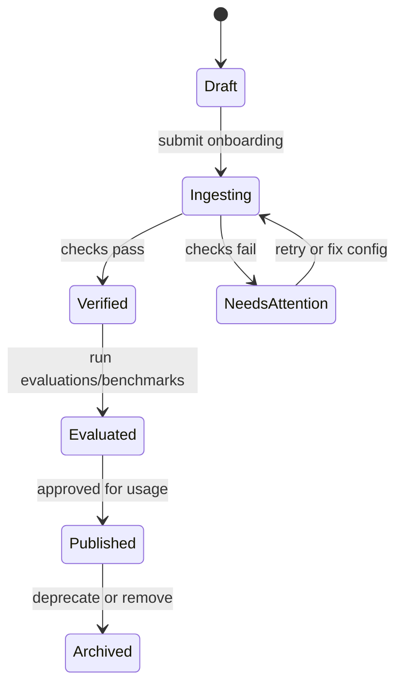
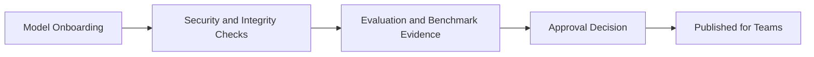

This page defines the core objects and lifecycle states used by the Models module.

## Core entities

### Model

A catalog entry that represents a cloud model or a local model artifact with metadata, source details, and capability indicators.

### Source types

- **Cloud**: managed provider model.
- **Hugging Face**: repository-based import.
- **URL**: signed or approved artifact URL.
- **Disk**: local or mounted path registration.

### Capabilities and modality

Models can expose capabilities across text, image, and audio input/output, with endpoint compatibility tracked for downstream usage.

### Verification signals

Readiness is informed by status indicators such as:

- model verification,
- security scan outcomes,
- evaluation availability.

## Lifecycle states

## Metadata conventions

Strong metadata improves governance and discoverability:

- ownership and project context,
- tags and tasks,
- source URI/provider details,
- modality and endpoint compatibility,
- links (website, GitHub, Hugging Face) where applicable.

## Operational concepts

### Recommended infrastructure

Model cards can include recommended cluster context for deployment planning.

### Benchmark history

Performance runs help compare throughput and latency profiles across model and cluster combinations.

### Evaluations

Evaluation outputs capture quality signals and support go/no-go decisions for promotion.

## Governance model

## Related pages

- [Quickstart](/models/quickstart)
- [Actions Reference](/models/reference/model-operations-reference)
- [Troubleshooting](/models/troubleshooting)