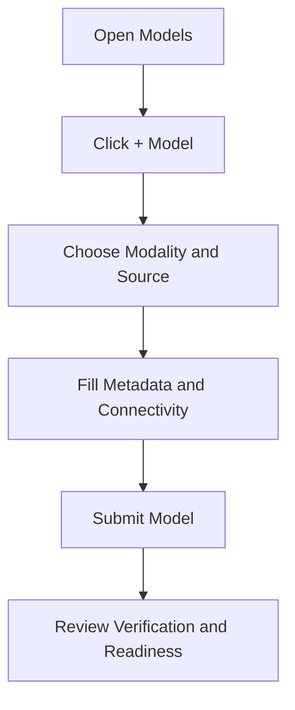

This quickstart walks through adding a model, validating readiness, and confirming it is discoverable for deployment workflows.

## What you'll do

1. Open the Models page.
2. Choose a model source.
3. Submit model details and metadata.
4. Verify ingestion and status.
5. Confirm model visibility in the repository.

## Prerequisites

- Access to Bud AI Foundry.
- Permission to add models.
- One of the following:
  - cloud provider access,
  - Hugging Face model URI,
  - signed URL for model artifact, or
  - disk/server path for local artifact.

## Step 1: Open Models

1. Sign in to Bud AI Foundry.
2. Navigate to **Models** from the left sidebar.
3. Confirm you can view the model repository page.

## Step 2: Start onboarding

1. Click **+ Model**.
2. Select the target **modality**.
3. Select a source type:
   - **Cloud**
   - **Hugging Face**
   - **URL**
   - **Disk**

## Step 3: Configure model details

Provide required fields for the selected source:

- model name,
- URI or provider mapping,
- author/tags,
- modality and endpoint-related metadata.

<Tip>
Use clear naming and tags so teams can find the model quickly in filtered views.
</Tip>

## Step 4: Submit and monitor status

1. Submit the onboarding form.
2. Watch progress for ingestion or linking.
3. Open model details to confirm readiness indicators.

## Step 5: Validate repository presence

1. Return to the model list.
2. Search by name and verify metadata appears as expected.
3. Check recommended cluster and capability context where available.

## Success criteria

<Check>The model appears in the repository list.</Check>
<Check>Metadata (name, tags, source) is correct.</Check>
<Check>Verification/security indicators are visible.</Check>

## Next steps

- Continue with [Creating Your First Model](/models/creating-first-model) for an end-to-end walkthrough.
- Review [Model Concepts](/models/model-concepts) to understand governance and lifecycle states.
