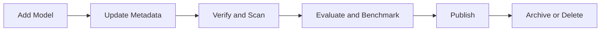

## Overview

This reference summarizes common operations used across the model lifecycle.

## Add model

Create a model entry from cloud or local sources.

**Required inputs:**
- source type,
- model name,
- modality,
- source-specific connectivity fields.

## Update model

Modify metadata and governance context.

**Common updates:**
- tags/tasks,
- descriptions,
- ownership,
- external documentation links.

## Delete model

Remove model from active catalog use.

**Pre-checks:**
- verify no active dependencies,
- confirm replacement path where required.

## Run verification or scan

Validate readiness and integrity before promotion.

**Expected outputs:**
- pass/fail status,
- issue counts by severity,
- remediation notes.

## Run benchmark

Measure runtime performance under defined configuration.

**Typical outputs:**
- throughput,
- mean latency/TPOT,
- duration and run status.

## Run evaluation

Assess model quality on selected datasets/configurations.

**Typical outputs:**
- evaluation result summaries,
- comparative evidence for promotion decisions.

## Related pages

- [Model Concepts](/models/model-concepts)
- [Performance Benchmarks](/models/guides/performance-benchmarks)
- [Evaluations](/models/guides/evaluations)
- [Troubleshooting](/models/troubleshooting)
