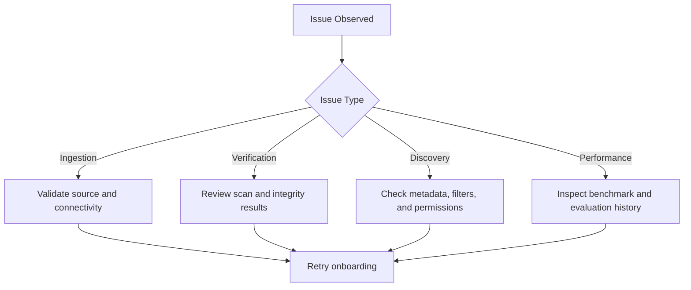

Use this guide to diagnose and resolve frequent model onboarding and readiness issues.

## Troubleshooting flow

## Common issues

<AccordionGroup>
  <Accordion title="Model onboarding fails">
    **Possible causes**: invalid URI/path, expired credentials, unsupported source details.

    **Resolution**: revalidate source configuration, confirm access, and resubmit.
  </Accordion>

  <Accordion title="Model not visible in list">
    **Possible causes**: filters are too restrictive, indexing delay, or insufficient permissions.

    **Resolution**: clear filters, search by exact name, and verify role access.
  </Accordion>

  <Accordion title="Verification or scan remains incomplete">
    **Possible causes**: ingestion still running or scan pipeline interrupted.

    **Resolution**: wait for ingestion completion, then trigger scan again and review logs.
  </Accordion>

  <Accordion title="Poor benchmark results">
    **Possible causes**: unsuitable infrastructure, incorrect configuration, or noisy baseline.

    **Resolution**: rerun with controlled settings, compare against baseline models, and adjust target cluster.
  </Accordion>
</AccordionGroup>

## Fast diagnostic checklist

- Confirm model source details are valid.
- Validate tags/metadata for search discoverability.
- Review verification and scan status.
- Compare latest benchmark run with previous stable run.
- Escalate with run identifiers and timestamps for support.

## Need more help?

- Revisit [Quickstart](/models/quickstart) for baseline setup.
- Use [Model Security and Verification](/models/guides/model-security-and-verification) for trust controls.
