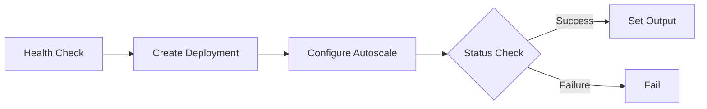

This tutorial guides you through creating a production-ready deployment automation pipeline using the visual editor.

## What You'll Build

A deployment workflow that:
1. Validates cluster health
2. Creates or updates a deployment
3. Configures autoscaling
4. Sets deployment status as output


## Prerequisites

- Access to [Bud AI Foundry](https://admin.dev.bud.studio)
- At least one registered cluster
- A model ready for deployment

## Step 1: Create the Pipeline

1. Navigate to **Pipelines** in the sidebar
2. Click **+ Pipeline**
3. Configure:
   - **Name**: "Deploy Model"
   - **Description**: "Automated model deployment with health check"
4. Click **Create**

The visual editor opens with an empty canvas.

## Step 2: Add Cluster Health Check

Let's start by verifying the cluster is ready:

1. From **Actions** panel → **Cluster Operations**
2. Drag **Cluster Health Check** onto canvas
3. This becomes your trigger node
4. Configure:
   - **Cluster ID**: `params.cluster_id`
   - **Timeout**: 30 seconds
5. Click **Save**

<Tip>
Using `params.cluster_id` makes the pipeline reusable across clusters.
</Tip>

## Step 3: Add Deployment Creation

Now add the deployment step:

1. Drag a **Transform** action onto the canvas
2. Connect **Cluster Health Check** → **Transform**
3. Rename to "Create Deployment"
4. Configure:
   - **Operation**: `deployment_create`
   - **Model ID**: `params.model_id`
   - **Deployment Name**: `params.deployment_name`
   - **Cluster**: `params.cluster_id`
5. Click **Save**

## Step 4: Configure Autoscaling

Add autoscaling configuration:

1. Drag another **Transform** action
2. Connect **Create Deployment** → this new Transform
3. Rename to "Configure Autoscale"
4. Configure:
   - **Operation**: `deployment_autoscale`
   - **Deployment ID**: `steps.create_deployment.output.deployment_id`
   - **Min Replicas**: `params.min_replicas`
   - **Max Replicas**: `params.max_replicas`
5. Click **Save**

## Step 5: Add Conditional Success Check

Let's verify the deployment succeeded:

1. Drag **Conditional Branch** after autoscale
2. Configure condition:
   ```
   steps.configure_autoscale.output.status == "active"
   ```
3. Click **Save**

## Step 6: Set Pipeline Outputs

For the success path:

1. Drag **Set Output** connected to Conditional Branch (true)
2. Configure:
   - **Key**: "deployment_status"
   - **Value**: "success"
   - **Key**: "deployment_id"
   - **Value**: `steps.create_deployment.output.deployment_id`
3. Click **Save**

For the failure path:

1. Drag **Fail** action connected to Conditional Branch (false)
2. Configure:
   - **Message**: "Deployment failed - autoscaling not active"
3. Click **Save**

## Step 7: Add Logging

Add visibility with log actions:

1. Drag **Log** after health check
2. Configure: "Cluster health verified ✓"
3. Repeat after each major step with appropriate messages

Your pipeline should now look like this:



## Step 8: Save and Test

1. Click **Save** in the top-right
2. Click **Execute**
3. Enter test parameters:
   ```json
   {
     "cluster_id": "cluster_abc123",
     "model_id": "model_xyz789",
     "deployment_name": "test-deployment",
     "min_replicas": 1,
     "max_replicas": 3
   }
   ```
4. Click **Run**

## Step 9: Monitor Execution

1. Switch to **Runs** tab
2. Watch your pipeline execute in real-time
3. Click **View** to see detailed logs
4. Verify the output shows deployment status


## Step 10: Set Up Triggers (Optional)

Automate execution:

### Manual Trigger
Already configured - use **Execute** button

### Scheduled Trigger
1. Go to **Triggers** tab
2. Click **Add Schedule**
3. Enter cron: `0 2 * * *` (daily at 2 AM)
4. Click **Save**

### Event Trigger
1. Click **Add Event Trigger**
2. Select event: `model.updated`
3. Add filter: `model_id == params.model_id`
4. Click **Save**

Now your pipeline runs automatically when models are updated!


## Best Practices Applied

<Check>**Health Check First**: Always verify infrastructure before deployment</Check>
<Check>**Parameterized**: Reusable across different models and clusters</Check>
<Check>**Error Handling**: Conditional branching with explicit failure</Check>
<Check>**Observability**: Log actions at key points</Check>
<Check>**Clear Outputs**: Structured outputs for downstream systems</Check>

## Troubleshooting

<AccordionGroup>
  <Accordion title="Health check fails">
    **Cause**: Cluster not ready or ID incorrect

    **Solution**: Verify cluster status in Clusters page, check cluster_id parameter
  </Accordion>

  <Accordion title="Deployment creation fails">
    **Cause**: Invalid model ID or insufficient cluster resources

    **Solution**: Verify model exists, check cluster capacity
  </Accordion>

  <Accordion title="Autoscaling not active">
    **Cause**: Deployment didn't start successfully

    **Solution**: Check deployment logs, verify resource requests
  </Accordion>
</AccordionGroup>

## Next Steps

<CardGroup cols={2}>
  <Card title="Pipeline Concepts" icon="book" href="/pipelines/pipeline-concepts">
    Understand DAGs and actions
  </Card>

  <Card title="Quick Start" icon="play" href="/pipelines/quickstart">
    Build your first pipeline in 5 minutes
  </Card>

  <Card title="Troubleshooting" icon="wrench" href="/pipelines/troubleshooting">
    Common issues and solutions
  </Card>
</CardGroup>
