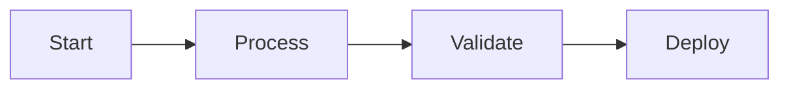
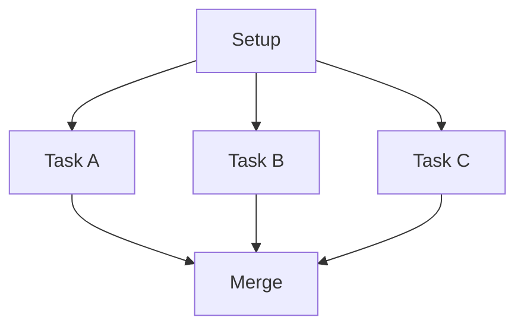

## What is a Pipeline?

A **pipeline** is a directed acyclic graph (DAG) of actions that execute in a defined order. Pipelines automate workflows by orchestrating multiple steps with dependencies, conditions, and error handling.



## Directed Acyclic Graphs (DAGs)

### Directed
Actions connect with arrows showing execution order. Data flows from parent to child actions.

### Acyclic
No circular dependencies - pipelines always progress forward and eventually complete.

### Graph
Multiple paths enable parallel execution and conditional branching.


## Actions

Actions are the building blocks of pipelines. Each action performs a specific operation.

### Available Action Types

| Category | Action | Purpose |
|----------|--------|---------|
| **Control Flow** | Log | Write log messages |
| | Conditional Branch | Execute different paths based on conditions |
| | Transform | Modify data between steps |
| | Aggregate | Combine outputs from multiple actions |
| | Set Output | Define pipeline outputs |
| | Fail | Explicitly fail the pipeline |
| | Wait Until | Pause until a condition is met |
| **Deployment** | Deploy Model | Create model deployment endpoint |
| | Scale Deployment | Adjust replica count |
| | Configure Rate Limiting | Set rate limits for endpoints |
| | Delete Deployment | Remove deployment |
| **Model Operations** | Add Model | Add HuggingFace or URL model |
| | Add Cloud Model | Add OpenAI/Anthropic model |
| | Model Benchmark | Run performance tests |
| | Delete Model | Remove model from registry |
| **Cluster** | Cluster Health Check | Verify cluster status |
| **Integration** | HTTP Request | Make external API calls |
| | Send Notification | Send alerts via email/Slack |

### Action Configuration

Each action can be configured with:
- **Parameters**: Input values and configuration
- **Timeout**: Maximum execution time
- **Retry Logic**: Automatic retry on failure
- **Conditions**: When to execute the action

## Dependencies

Actions execute based on their dependencies:



**Sequential**: Actions run one after another

**Parallel**: Independent actions run concurrently

**Convergent**: Multiple actions feed into a single downstream action

## Parameters and Outputs

### Action Parameters

Each action has its own configuration parameters defined by the action type. For example:
- **Add Model** requires `model_uri`, `model_name`, `model_source`
- **Deploy Model** requires `model_id`, `cluster_id`, `deployment_name`
- **Conditional Branch** requires a `condition` expression

Configure these in the visual editor or reference outputs from previous steps:

```
steps.add_model.output.model_id
```

### Action Outputs

Actions produce outputs that downstream actions can access:

```
steps.previous_action.output.result
```

Use **Set Output** action to define pipeline-level outputs visible after execution completes.

## Execution Flow

1. **Trigger** - Pipeline starts (manual, scheduled, or event-based)
2. **Resolve** - Parameters and dependencies are resolved
3. **Execute** - Actions run in dependency order
4. **Complete** - Pipeline finishes with status (succeeded/failed)

## Conditional Logic

Use **Conditional Branch** to execute different paths based on action outputs:

```
steps.deployment.output.status == "active"
```

Conditions support:
- Equality checks (`==`, `!=`)
- Comparisons (`>`, `<`, `>=`, `<=`)
- Logical operators (`&&`, `||`)
- References to outputs from previous steps

## Error Handling

Pipelines handle failures automatically:

- **Retries**: Actions can retry on transient failures
- **Fail Action**: Explicitly fail with a message
- **Skip Downstream**: Failed actions skip dependent steps
- **Logs**: All errors are captured and logged

## Best Practices

<Check>**Keep It Simple**: Start with small, focused workflows</Check>
<Check>**Use Conditionals**: Branch based on environment or state</Check>
<Check>**Add Logging**: Use Log actions for visibility</Check>
<Check>**Set Outputs**: Capture important results</Check>
<Check>**Test Thoroughly**: Execute with different parameters</Check>

## Next Steps

<CardGroup cols={2}>
  <Card title="Quick Start" icon="play" href="/pipelines/quickstart">
    Build your first pipeline
  </Card>

  <Card title="Detailed Tutorial" icon="graduation-cap" href="/pipelines/creating-first-pipeline">
    Step-by-step workflow creation
  </Card>

  <Card title="Troubleshooting" icon="wrench" href="/pipelines/troubleshooting">
    Common issues and solutions
  </Card>
</CardGroup>
