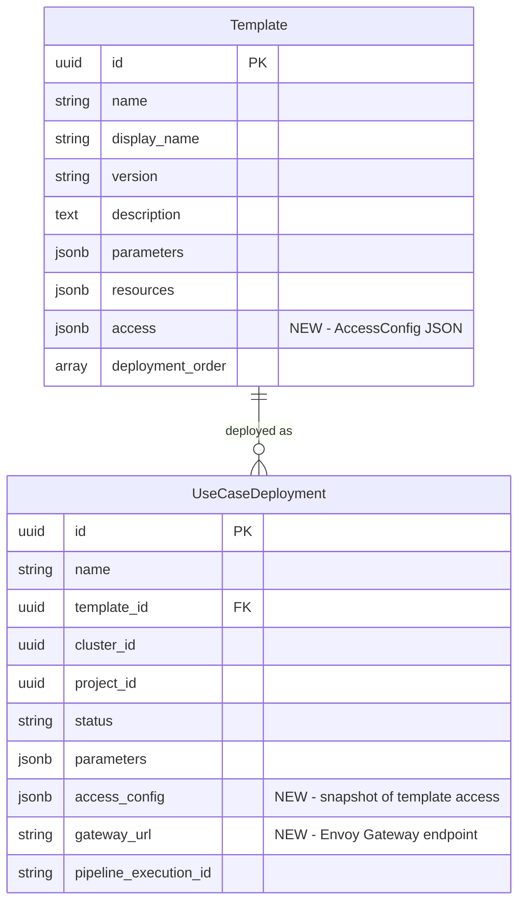

# Use Case Access Modes: UI + API

## Overview

Use case deployments need two access modes declared in the template YAML:

1. **UI Access** — The deployed service's web UI (e.g., RAGFlow dashboard) shown inside budadmin via iframe. Route: `budadmin → budapp (internal proxy) → Envoy Gateway on target cluster → service`.
2. **API Access** — The deployed service's API endpoints exposed externally through budgateway. Route: `external client → budgateway → Envoy Gateway on target cluster → service`.

Both modes use **HTTPRoute** resources on the target cluster routed through the existing Envoy Gateway (`aibrix-eg`) deployed by AIBrix.

## Problem Statement

Currently, deployed use cases have no way to access the running service. The helm chart deploys a ClusterIP service, which is not reachable from outside the cluster. Users cannot:
- View the deployed service's web UI (e.g., RAGFlow dashboard)
- Call the deployed service's API from external clients
- See API documentation for the deployed service

## Proposed Solution

Add an `access` section to template YAML that declares which access modes are supported. After deployment, budcluster creates HTTPRoute/ReferenceGrant K8s resources for path-based routing through Envoy Gateway. budapp provides an internal reverse proxy for UI access; budgateway provides an external proxy for API access.

See [brainstorm document](../brainstorms/2026-02-10-usecase-access-modes-brainstorm.md) for full architecture rationale.

## Technical Approach

### Architecture

```
                                        Target Cluster
                                       +-------------------+
  budadmin (iframe)                    |                   |
       |                               | Envoy Gateway     |
       v                               | (aibrix-eg)       |
  budapp /usecases/{id}/ui/** -------->| aibrix-system ns  |
                                       |                   |
                                       | HTTPRoute:        |
                                       | /usecases/{id}/ui |---> Service UI (:80)
  External API client                  | /usecases/{id}/api|---> Service API (:9380)
       |                               |                   |
       v                               | (same gateway as  |
  budgateway /usecases/{id}/api/** --->|  model endpoints) |
                                       +-------------------+
```

### Implementation Phases

#### Phase 1: Data Model & Template Schema

Add `access` config to templates and deployments across the stack.

##### 1.1 budusecases — Template schema + DB migration

**File: `services/budusecases/budusecases/templates/schemas.py`**

Add access-related Pydantic schemas:

```python
class AccessUIConfig(BaseModel):
    """UI access mode configuration."""
    model_config = ConfigDict(extra="forbid")

    enabled: bool = Field(False, description="Whether UI access is available")
    port: int = Field(80, description="Container port serving the UI")
    path: str = Field("/", description="Root path of the UI on the service")

class ApiEndpointSpec(BaseModel):
    """OpenAPI-style endpoint spec for documentation."""
    model_config = ConfigDict(extra="forbid")

    path: str = Field(..., description="API endpoint path")
    method: str = Field("POST", description="HTTP method")
    description: str = Field("", description="Endpoint description")
    request_body: Optional[dict[str, Any]] = Field(None)
    response: Optional[dict[str, Any]] = Field(None)

class AccessAPIConfig(BaseModel):
    """API access mode configuration."""
    model_config = ConfigDict(extra="forbid")

    enabled: bool = Field(False, description="Whether API access is available")
    port: int = Field(8080, description="Container port serving the API")
    base_path: str = Field("/", description="API base path on the service")
    spec: list[ApiEndpointSpec] = Field(default_factory=list, description="API endpoints for documentation")

class AccessConfig(BaseModel):
    """Access mode configuration for a template."""
    model_config = ConfigDict(extra="forbid")

    ui: AccessUIConfig = Field(default_factory=AccessUIConfig)
    api: AccessAPIConfig = Field(default_factory=AccessAPIConfig)
```

Add `access` field to `TemplateSchema` (line ~131):
```python
access: Optional[AccessConfig] = Field(None, description="Access mode configuration")
```

Add to `TemplateCreateSchema`, `CustomTemplateCreateSchema`, `CustomTemplateUpdateSchema`, `TemplateResponseSchema`.

**File: `services/budusecases/budusecases/templates/models.py`**

Add column to `Template` model:
```python
access: Mapped[Optional[dict[str, Any]]] = mapped_column(JSONB, nullable=True)
```

**DB Migration:** Create Alembic migration `add_access_to_templates.py`:
```python
def upgrade():
    op.add_column("templates", sa.Column("access", JSONB, nullable=True))

def downgrade():
    op.drop_column("templates", "access")
```

**File: `services/budusecases/budusecases/templates/loader.py`**

Update YAML loader to parse the `access` section from template files.

**File: `services/budusecases/budusecases/templates/services.py`**

Update `_create_template_from_yaml()` and `_update_template_from_yaml()` to persist the `access` field.

##### 1.2 budusecases — Deployment model updates

**File: `services/budusecases/budusecases/deployments/models.py`**

Add fields to `UseCaseDeployment`:
```python
access_config: Mapped[Optional[dict[str, Any]]] = mapped_column(JSONB, nullable=True)
gateway_url: Mapped[Optional[str]] = mapped_column(String(500), nullable=True)
```

- `access_config` — snapshot of the template's access config at deployment time (immutable after creation)
- `gateway_url` — the Envoy Gateway external endpoint on the target cluster (set after HTTPRoute creation)

**File: `services/budusecases/budusecases/deployments/schemas.py`**

Add to `DeploymentResponseSchema`:
```python
access_config: Optional[dict[str, Any]] = Field(None, description="Access mode configuration")
access_urls: Optional[dict[str, str]] = Field(None, description="Resolved access URLs when running")
```

**DB Migration:** Create Alembic migration `add_access_to_deployments.py`:
```python
def upgrade():
    op.add_column("usecase_deployments", sa.Column("access_config", JSONB, nullable=True))
    op.add_column("usecase_deployments", sa.Column("gateway_url", sa.String(500), nullable=True))

def downgrade():
    op.drop_column("usecase_deployments", "gateway_url")
    op.drop_column("usecase_deployments", "access_config")
```

##### 1.3 budusecases — Deployment creation copies access config

**File: `services/budusecases/budusecases/deployments/services.py`**

In `create_deployment()`, when creating the `UseCaseDeployment` record:
```python
# Copy access config from template
access_config = template.access if template.access else None
deployment = UseCaseDeployment(
    ...,
    access_config=access_config,
)
```

Validation: if `access_config.api.enabled` and no `project_id` provided, return 400 error.

##### 1.4 Template YAML updates

**File: `services/budusecases/templates/ragflow.yaml`**

Add access section:
```yaml
access:
  ui:
    enabled: true
    port: 80
    path: /
  api:
    enabled: true
    port: 9380
    base_path: /api
    spec:
      - path: /v1/api/new_conversation
        method: POST
        description: "Create a new conversation"
      - path: /v1/api/completion
        method: POST
        description: "Get RAG completion"
        request_body:
          content_type: application/json
          schema:
            conversation_id: { type: string }
            messages: { type: array }
```

**File: `services/budusecases/templates/agent-rag.yaml`**

```yaml
access:
  ui:
    enabled: false
  api:
    enabled: false
# Models accessed individually via their model endpoints
```

**File: `services/budusecases/templates/simple-rag.yaml`**

```yaml
access:
  ui:
    enabled: false
  api:
    enabled: false
# Models accessed individually via their model endpoints
```

##### 1.5 budadmin — Frontend types

**File: `services/budadmin/src/lib/budusecases.ts`**

Add TypeScript interfaces:
```typescript
interface AccessUIConfig {
  enabled: boolean;
  port: number;
  path: string;
}

interface ApiEndpointSpec {
  path: string;
  method: string;
  description: string;
  request_body?: Record<string, any>;
  response?: Record<string, any>;
}

interface AccessAPIConfig {
  enabled: boolean;
  port: number;
  base_path: string;
  spec: ApiEndpointSpec[];
}

interface AccessConfig {
  ui: AccessUIConfig;
  api: AccessAPIConfig;
}
```

Add to `Template` and `Deployment` interfaces:
```typescript
access?: AccessConfig;
access_urls?: { ui?: string; api?: string };
```

---

#### Phase 2: HTTPRoute Creation in budcluster

After helm deploy completes, create Kubernetes Gateway API resources for traffic routing.

##### 2.1 New Ansible playbook — create_httproute.yaml

**File: `services/budcluster/budcluster/playbooks/create_httproute.yaml`** (NEW)

```yaml
---
- name: Create HTTPRoute for Use Case Access
  hosts: localhost
  connection: local
  gather_facts: false

  vars_files:
    - vars/common.yaml

  vars:
    deployment_id: "{{ usecase_deployment_id }}"
    target_namespace: "{{ namespace }}"
    service_name: "{{ helm_service_name }}"
    gateway_name: "{{ envoy_gateway_name | default('aibrix-eg') }}"
    gateway_namespace: "{{ envoy_gateway_namespace | default('aibrix-system') }}"
    ui_enabled: "{{ access_ui_enabled | default(false) }}"
    ui_port: "{{ access_ui_port | default(80) }}"
    ui_path: "{{ access_ui_path | default('/') }}"
    api_enabled: "{{ access_api_enabled | default(false) }}"
    api_port: "{{ access_api_port | default(8080) }}"
    api_base_path: "{{ access_api_base_path | default('/') }}"

  roles:
    - create_kubeconfig

  tasks:
    - name: Create ReferenceGrant for cross-namespace routing
      kubernetes.core.k8s:
        state: present
        kubeconfig: "{{ kubeconfig_path }}"
        validate_certs: "{{ validate_certs }}"
        definition:
          apiVersion: gateway.networking.k8s.io/v1beta1
          kind: ReferenceGrant
          metadata:
            name: "allow-aibrix-gateway"
            namespace: "{{ target_namespace }}"
          spec:
            from:
              - group: gateway.networking.k8s.io
                kind: HTTPRoute
                namespace: "{{ gateway_namespace }}"
            to:
              - group: ""
                kind: Service
      when: ui_enabled | bool or api_enabled | bool

    - name: Build HTTPRoute rules
      ansible.builtin.set_fact:
        httproute_rules: >-
          {{
            (ui_enabled | bool) | ternary(
              [{"matches": [{"path": {"type": "PathPrefix", "value": "/usecases/" + deployment_id + "/ui"}}],
                "filters": [{"type": "URLRewrite", "urlRewrite": {"path": {"type": "ReplacePrefixMatch", "replacePrefixMatch": ui_path}}}],
                "backendRefs": [{"name": service_name, "namespace": target_namespace, "port": ui_port | int}]}],
              []
            )
            +
            (api_enabled | bool) | ternary(
              [{"matches": [{"path": {"type": "PathPrefix", "value": "/usecases/" + deployment_id + "/api"}}],
                "filters": [{"type": "URLRewrite", "urlRewrite": {"path": {"type": "ReplacePrefixMatch", "replacePrefixMatch": api_base_path}}}],
                "backendRefs": [{"name": service_name, "namespace": target_namespace, "port": api_port | int}]}],
              []
            )
          }}

    - name: Create HTTPRoute
      kubernetes.core.k8s:
        state: present
        kubeconfig: "{{ kubeconfig_path }}"
        validate_certs: "{{ validate_certs }}"
        definition:
          apiVersion: gateway.networking.k8s.io/v1
          kind: HTTPRoute
          metadata:
            name: "usecase-{{ deployment_id }}"
            namespace: "{{ gateway_namespace }}"
          spec:
            parentRefs:
              - name: "{{ gateway_name }}"
                namespace: "{{ gateway_namespace }}"
            rules: "{{ httproute_rules }}"
      when: httproute_rules | length > 0

    - name: Discover Envoy Gateway external endpoint
      kubernetes.core.k8s_info:
        kind: Service
        name: "{{ gateway_name }}"
        namespace: "{{ gateway_namespace }}"
        kubeconfig: "{{ kubeconfig_path }}"
        validate_certs: "{{ validate_certs }}"
      register: eg_service

    - name: Extract gateway endpoint
      ansible.builtin.set_fact:
        gateway_endpoint: >-
          {{
            eg_service.resources[0].status.loadBalancer.ingress[0].hostname
            | default(eg_service.resources[0].status.loadBalancer.ingress[0].ip, true)
          }}
      when: eg_service.resources | length > 0
```

##### 2.2 New Ansible playbook — delete_httproute.yaml

**File: `services/budcluster/budcluster/playbooks/delete_httproute.yaml`** (NEW)

```yaml
---
- name: Delete HTTPRoute for Use Case Access
  hosts: localhost
  connection: local
  gather_facts: false

  vars_files:
    - vars/common.yaml

  vars:
    deployment_id: "{{ usecase_deployment_id }}"
    gateway_namespace: "{{ envoy_gateway_namespace | default('aibrix-system') }}"
    target_namespace: "{{ namespace }}"

  roles:
    - create_kubeconfig

  tasks:
    - name: Delete HTTPRoute
      kubernetes.core.k8s:
        state: absent
        kubeconfig: "{{ kubeconfig_path }}"
        validate_certs: "{{ validate_certs }}"
        api_version: gateway.networking.k8s.io/v1
        kind: HTTPRoute
        name: "usecase-{{ deployment_id }}"
        namespace: "{{ gateway_namespace }}"

    - name: Delete ReferenceGrant
      kubernetes.core.k8s:
        state: absent
        kubeconfig: "{{ kubeconfig_path }}"
        validate_certs: "{{ validate_certs }}"
        api_version: gateway.networking.k8s.io/v1beta1
        kind: ReferenceGrant
        name: "allow-aibrix-gateway"
        namespace: "{{ target_namespace }}"
```

##### 2.3 budcluster Python — kubernetes.py methods

**File: `services/budcluster/budcluster/cluster_ops/kubernetes.py`**

Add two methods:

```python
def create_usecase_httproute(
    self,
    deployment_id: str,
    namespace: str,
    service_name: str,
    access_config: dict,
) -> tuple[str, str]:
    """Create HTTPRoute + ReferenceGrant for use case access.

    Returns:
        Tuple of (status, gateway_endpoint_url)
    """
    extra_vars = {
        "kubeconfig_content": self.config,
        "platform": self.platform,
        "usecase_deployment_id": deployment_id,
        "namespace": namespace,
        "helm_service_name": service_name,
        "access_ui_enabled": access_config.get("ui", {}).get("enabled", False),
        "access_ui_port": access_config.get("ui", {}).get("port", 80),
        "access_ui_path": access_config.get("ui", {}).get("path", "/"),
        "access_api_enabled": access_config.get("api", {}).get("enabled", False),
        "access_api_port": access_config.get("api", {}).get("port", 8080),
        "access_api_base_path": access_config.get("api", {}).get("base_path", "/"),
    }
    result = self.ansible_executor.run_playbook(
        playbook="CREATE_HTTPROUTE",
        extra_vars=extra_vars,
    )
    if result["status"] != "successful":
        raise KubernetesException("Failed to create HTTPRoute for use case")

    gateway_endpoint = result.get("gateway_endpoint", "")
    return result["status"], gateway_endpoint


def delete_usecase_httproute(
    self,
    deployment_id: str,
    namespace: str,
) -> str:
    """Delete HTTPRoute + ReferenceGrant for a use case deployment."""
    extra_vars = {
        "kubeconfig_content": self.config,
        "platform": self.platform,
        "usecase_deployment_id": deployment_id,
        "namespace": namespace,
    }
    result = self.ansible_executor.run_playbook(
        playbook="DELETE_HTTPROUTE",
        extra_vars=extra_vars,
    )
    return result["status"]
```

##### 2.4 Register playbooks

**File: `services/budcluster/budcluster/playbooks/__init__.py`**

Add playbook paths:
```python
"CREATE_HTTPROUTE": "playbooks/create_httproute.yaml",
"DELETE_HTTPROUTE": "playbooks/delete_httproute.yaml",
```

##### 2.5 budcluster API — new route for HTTPRoute management

**File: `services/budcluster/budcluster/cluster_ops/routes.py`**

Add endpoints that budusecases/budpipeline can call via Dapr:
```python
@router.post("/clusters/{cluster_id}/httproute")
async def create_httproute(cluster_id: str, body: CreateHTTPRouteRequest):
    """Create HTTPRoute for a use case deployment."""
    ...

@router.delete("/clusters/{cluster_id}/httproute/{deployment_id}")
async def delete_httproute(cluster_id: str, deployment_id: str):
    """Delete HTTPRoute for a use case deployment."""
    ...
```

**File: `services/budcluster/budcluster/cluster_ops/schemas.py`**

Add request schema:
```python
class CreateHTTPRouteRequest(BaseModel):
    deployment_id: str
    namespace: str
    service_name: str
    access_config: dict[str, Any]
```

---

#### Phase 3: Redis Route Publishing (from budapp)

Publish deployment routes to Redis from budapp, following the same pattern as model deployment where `endpoint_ops/services.py` uses `RedisService().set("model_table:{endpoint_id}", ...)` to publish model routes.

**Why budapp (not budpipeline):** budapp manages the deployment workflow orchestration. When the use case deployment workflow succeeds, budapp has all the context needed (deployment ID, project ID, gateway URL) and already has `RedisService` for direct Redis writes. This mirrors how model endpoints are published.

##### 3.1 budapp — Publish deployment route on workflow success

**File: `services/budapp/budapp/workflow_ops/budusecases_service.py`**

Add route publishing methods to `BudUseCasesService`:

```python
import json
from budapp.shared.redis_service import RedisService

class BudUseCasesService(SessionMixin):
    # ... existing methods ...

    async def publish_deployment_route(
        self,
        deployment_id: str,
        project_id: str,
        gateway_url: str,
    ) -> None:
        """Publish deployment route to Redis for budgateway.

        Follows the same pattern as model endpoint publishing:
        endpoint_ops/services.py -> RedisService().set("model_table:{id}", ...)
        """
        route_data = {
            "deployment_id": deployment_id,
            "project_id": project_id,
            "ingress_url": gateway_url,
            "status": "active",
        }
        redis_service = RedisService()
        await redis_service.set(
            f"deployment_route:{deployment_id}",
            json.dumps(route_data),
        )
        logger.info(f"Published deployment route for {deployment_id}")

    async def delete_deployment_route(self, deployment_id: str) -> None:
        """Delete deployment route from Redis.

        Called when deployment is stopped or deleted.
        """
        redis_service = RedisService()
        await redis_service.delete(f"deployment_route:{deployment_id}")
        logger.info(f"Deleted deployment route for {deployment_id}")
```

This is picked up by budgateway's Redis keyspace notification handler (already implemented at `redis_client.rs:747-764` for SET, `redis_client.rs:859-868` for DEL).

##### 3.2 budapp — Wire into deployment lifecycle routes

**File: `services/budapp/budapp/workflow_ops/budusecases_routes.py`**

The deployment workflow callback or status polling detects completion. When the use case deployment status transitions to RUNNING/COMPLETED:

1. Fetch deployment details (includes `gateway_url` and `access_config`)
2. If `access_config.api.enabled`, call `publish_deployment_route()`
3. Non-blocking — don't fail the main operation if Redis publish fails (same as model deploy pattern)

```python
# In the deployment completion handler or sync_deployment_status:
try:
    deployment = result  # deployment response from budusecases
    access_config = deployment.get("access_config", {})
    api_config = access_config.get("api", {})
    if api_config.get("enabled") and deployment.get("gateway_url"):
        await BudUseCasesService(session).publish_deployment_route(
            deployment_id=deployment["id"],
            project_id=deployment.get("project_id", ""),
            gateway_url=deployment["gateway_url"],
        )
except Exception as e:
    logger.error(f"Failed to publish deployment route: {e}")
    # Don't fail the main operation
```

##### 3.3 budapp — Delete route on stop/delete

**File: `services/budapp/budapp/workflow_ops/budusecases_routes.py`**

In `stop_deployment()` and `delete_deployment()` routes, delete the Redis key:

```python
# In stop_deployment / delete_deployment handlers:
try:
    await BudUseCasesService(session).delete_deployment_route(deployment_id)
except Exception as e:
    logger.error(f"Failed to delete deployment route: {e}")
    # Don't fail the main operation
```

##### 3.4 budusecases — Orchestrate HTTPRoute lifecycle

**File: `services/budusecases/budusecases/deployments/services.py`**

budusecases still handles the K8s routing resource lifecycle (HTTPRoute/ReferenceGrant) since it coordinates with budcluster via Dapr:

- On deployment completion: call budcluster to create HTTPRoute, store `gateway_url` on deployment record
- On stop/delete: call budcluster to delete HTTPRoute

The Redis route publishing is NOT done here — budapp handles that.

---

#### Phase 4: budgateway — HTTP Handler for API Proxy

Add the Axum route handler that uses the existing `UseCaseProxyState`.

##### 4.1 New handler module

**File: `services/budgateway/tensorzero-internal/src/endpoints/usecase_proxy.rs`** (NEW)

```rust
use axum::{
    extract::{Path, State},
    http::{Request, StatusCode},
    response::Response,
    body::Body,
};

pub async fn usecase_api_proxy_handler(
    State(app_state): State<Arc<AppStateData>>,
    Path((deployment_id, rest)): Path<(String, String)>,
    headers: HeaderMap,
    request: Request<Body>,
) -> Result<Response<Body>, StatusCode> {
    // 1. Look up DeploymentRoute from UseCaseProxyState
    let routes = app_state.use_case_proxy.deployment_routes.read().await;
    let route = routes.get(&deployment_id)
        .ok_or(StatusCode::NOT_FOUND)?;

    // 2. Validate API key belongs to route's project_id
    // (reuse existing auth middleware pattern)

    // 3. Construct target URL
    let target_url = format!(
        "{}/usecases/{}/api/{}",
        route.ingress_url, deployment_id, rest
    );

    // 4. Proxy the request using reqwest/hyper
    // Forward headers, body, method

    // 5. Return proxied response
}
```

##### 4.2 Register route

**File: `services/budgateway/gateway/src/main.rs`**

Add route:
```rust
.route(
    "/usecases/:deployment_id/api/*rest",
    any(endpoints::usecase_proxy::usecase_api_proxy_handler)
)
```

##### 4.3 Auth integration

The handler must validate the API key against the route's `project_id`. The existing `Auth` struct has methods for API key validation. Add a check that the resolved key's `project_id` matches `route.project_id`.

---

#### Phase 5: budapp — Reverse Proxy for UI Access

Add an HTTP reverse proxy endpoint that authenticated users can access via iframe.

##### 5.1 New proxy route

**File: `services/budapp/budapp/workflow_ops/budusecases_routes.py`**

Add a catch-all proxy route:

```python
@budusecases_router.api_route(
    "/usecases/{deployment_id}/ui/{path:path}",
    methods=["GET", "POST", "PUT", "DELETE", "PATCH", "OPTIONS"],
    description="Reverse proxy to use case UI",
)
async def proxy_usecase_ui(
    deployment_id: str,
    path: str,
    request: Request,
    current_user: Annotated[User, Depends(get_current_active_user)],
    session: Annotated[Session, Depends(get_session)],
):
    """Proxy requests to the deployed use case's UI through Envoy Gateway."""
    # 1. Look up deployment → get cluster_id, gateway_url, access_config
    # 2. Verify access_config.ui.enabled
    # 3. Construct target: {gateway_url}/usecases/{deployment_id}/ui/{path}
    # 4. Proxy the request using httpx (async)
    # 5. Forward response headers + body
    # 6. Handle WebSocket upgrade if present
```

##### 5.2 iframe authentication strategy

The iframe cannot send Bearer tokens from localStorage. Two approaches:

**Option A: Token-in-URL (simpler, used by existing patterns)**
- budadmin constructs iframe src: `/usecases/{id}/ui/?token={jwt_token}`
- budapp extracts token from query param on first request, validates it
- This matches the existing pattern in `AgentIframe.tsx` and `iFrame.tsx`

**Option B: Session cookie handshake**
- budadmin calls `POST /usecases/{id}/ui/auth` with Bearer token
- budapp sets an HttpOnly cookie scoped to `/usecases/{id}/ui/`
- iframe loads with cookie auth

Recommend **Option A** for consistency with existing codebase patterns.

##### 5.3 URL rewriting consideration

Many web UIs serve assets from absolute paths (`/static/main.js`). When proxied under `/usecases/{id}/ui/`, these break. Solutions:

1. **`<base>` tag injection** — budapp intercepts HTML responses and injects `<base href="/usecases/{id}/ui/">` in the `<head>`. This handles most cases.
2. **Service-side base path** — Configure the helm chart with a base path prefix. Not always possible (depends on the service).
3. **Path rewriting in proxy** — Complex and fragile.

Recommend **option 1** (`<base>` tag injection) as the default, with option 2 as a template-level override via `access.ui.path`.

---

#### Phase 6: budadmin — Frontend UI

##### 6.1 Deployment detail — access actions

**File: `services/budadmin/src/flows/UseCases/DeployUseCaseSuccess.tsx`** (MODIFY)

Currently shows minimal success info. Enhance to show:

- **"Open UI" button** (if `access_config.ui.enabled` and status is RUNNING):
  - Opens iframe in a new drawer or a full-screen modal
  - iframe src: `${API_BASE}/usecases/${deployment.id}/ui/?token=${authToken}`
- **"API Endpoint" section** (if `access_config.api.enabled` and status is RUNNING):
  - Base URL with copy button: `https://gateway.bud.studio/usecases/${deployment.id}/api`
  - Auth instructions (same as model endpoints)
  - Collapsible API reference generated from `access_config.api.spec`
  - Copy-paste curl examples for each endpoint

##### 6.2 Deployment list — access mode badges

**File: `services/budadmin/src/pages/home/usecases/index.tsx`** (MODIFY)

On deployment cards, show small badges indicating available access modes (e.g., "UI" tag, "API" tag) when the deployment is running.

##### 6.3 Template cards — access mode indicators

Show which access modes a template supports on template cards (e.g., small icons or badges).

##### 6.4 UseCase iframe component

**File: `services/budadmin/src/components/usecases/UseCaseIframe.tsx`** (NEW)

Reuse pattern from `src/pages/home/playground/iFrame.tsx`:
```tsx
const UseCaseIframe = ({ deploymentId }: { deploymentId: string }) => {
  const token = useAuthToken();
  const src = `${API_BASE}/usecases/${deploymentId}/ui/?token=${token}`;

  return (
    <iframe
      src={src}
      sandbox="allow-scripts allow-same-origin allow-forms allow-popups"
      className="w-full h-full border-0"
    />
  );
};
```

##### 6.5 API reference component

**File: `services/budadmin/src/components/usecases/ApiReference.tsx`** (NEW)

Renders the `access_config.api.spec` array as an interactive API reference:
- Method badge (POST, GET, etc.)
- Path
- Description
- Collapsible request/response schema
- Copy-paste curl example

---

## ERD: New/Modified Fields



## Acceptance Criteria

### Functional Requirements

- [ ] Templates can declare `access.ui` and `access.api` in YAML
- [ ] Template sync persists access config to database
- [ ] Deployment creation copies access config from template
- [ ] Deployment creation validates: `project_id` required when `access.api.enabled`
- [ ] budcluster creates HTTPRoute + ReferenceGrant on target cluster after helm deploy
- [ ] budcluster discovers and returns Envoy Gateway external endpoint
- [ ] budcluster deletes HTTPRoute + ReferenceGrant on deployment deletion
- [ ] Redis `deployment_route:{id}` key is published on deployment completion
- [ ] Redis `deployment_route:{id}` key is deleted on deployment stop/delete
- [ ] budgateway proxies API requests via `/usecases/{id}/api/**` with project-scoped auth
- [ ] budapp proxies UI requests via `/usecases/{id}/ui/**` with user auth
- [ ] budadmin shows "Open UI" button for UI-enabled deployments
- [ ] budadmin shows API endpoint URL + API reference for API-enabled deployments
- [ ] Deployment deletion cleans up all routing resources (K8s + Redis)

### Non-Functional Requirements

- [ ] Proxy latency: budgateway adds <10ms P99 to API proxy
- [ ] Proxy latency: budapp UI proxy adds <50ms P99
- [ ] WebSocket support through budapp UI proxy
- [ ] Path traversal protection in both proxies
- [ ] iframe sandbox attributes prevent cross-origin script access

### Quality Gates

- [ ] TypeScript type check passes: `cd services/budadmin && npx tsc --noEmit`
- [ ] Python lint passes: `ruff check .` for budusecases, budcluster, budapp
- [ ] Rust lint passes: `cargo clippy --all-targets` for budgateway
- [ ] DB migrations up/down both succeed
- [ ] Integration test: template with access → deploy → HTTPRoute created → Redis published → gateway routes → proxy succeeds

## Dependencies & Prerequisites

1. **AIBrix Envoy Gateway** must be deployed on target clusters (already done during cluster onboarding)
2. **Kubernetes Gateway API CRDs** must be available (installed by AIBrix)
3. **Redis keyspace notifications** must be enabled (already configured for budgateway)
4. **Dapr state store** must be configured for Redis (already in place)

## Risk Analysis & Mitigation

| Risk | Impact | Mitigation |
|------|--------|------------|
| URL rewriting breaks complex UIs | High — iframe shows broken UI | `<base>` tag injection + per-template `access.ui.path` override |
| Envoy Gateway not reachable cross-cluster | High — all access fails | Discovery step validates connectivity; error surfaced to user |
| HTTPRoute creation fails silently | Medium — service running but unreachable | Treat HTTPRoute failure as deployment failure; don't mark RUNNING |
| Stale Redis routes after deployment stop | Medium — gateway proxies to dead service | Delete Redis key in stop/delete flow; add TTL as safety net |
| iframe auth token in URL leaks via Referer | Low — tokens are short-lived | Use short-lived tokens; consider cookie approach later |
| Path traversal in proxy | High — security vulnerability | Sanitize path before proxy; reject `..` segments |

## Future Considerations

- **Custom domains**: Allow users to map custom domains to use case APIs
- **Rate limiting per deployment**: Per-deployment rate limits in budgateway
- **Health checks**: budgateway health-checks deployment routes and removes unhealthy ones
- **Access mode editing**: Allow disabling API access on a running deployment
- **URL rewriting improvements**: Content-aware rewriting for complex web UIs
- **AIBrix ext-proc integration**: Smart routing for LLM components within use cases

## References & Research

### Internal References

- Brainstorm: `docs/brainstorms/2026-02-10-usecase-access-modes-brainstorm.md`
- budgateway DeploymentRoute: `services/budgateway/tensorzero-internal/src/gateway_util.rs:34-55`
- budgateway Redis handler: `services/budgateway/tensorzero-internal/src/redis_client.rs:747-764`
- budcluster deploy_helm_chart: `services/budcluster/budcluster/cluster_ops/kubernetes.py:677-749`
- budcluster Ansible playbooks: `services/budcluster/budcluster/playbooks/`
- AIBrix installation: `services/budcluster/budcluster/playbooks/setup_cluster.yaml:410-424`
- budapp proxy routes: `services/budapp/budapp/workflow_ops/budusecases_routes.py`
- budadmin iframe pattern: `services/budadmin/src/pages/home/playground/iFrame.tsx`
- budadmin iframe pattern: `services/budadmin/src/components/agents/AgentIframe.tsx`
- Template schema: `services/budusecases/budusecases/templates/schemas.py`
- Deployment model: `services/budusecases/budusecases/deployments/models.py`

### External References

- Kubernetes Gateway API: HTTPRoute spec
- Envoy Gateway documentation: HTTPRoute configuration
- Kubernetes ReferenceGrant spec
