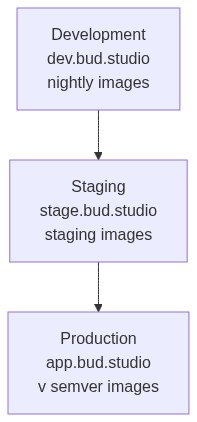
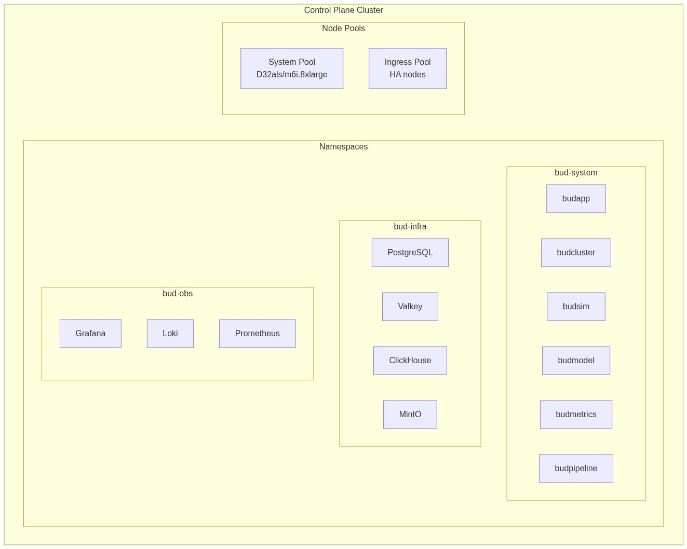
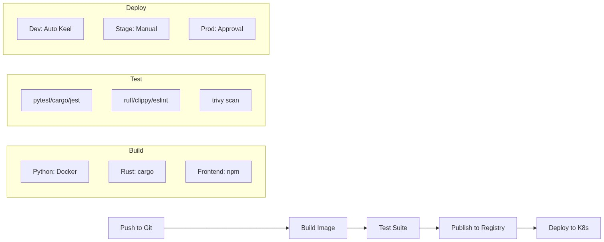
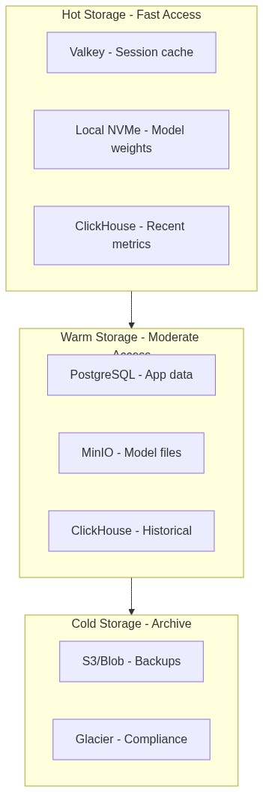
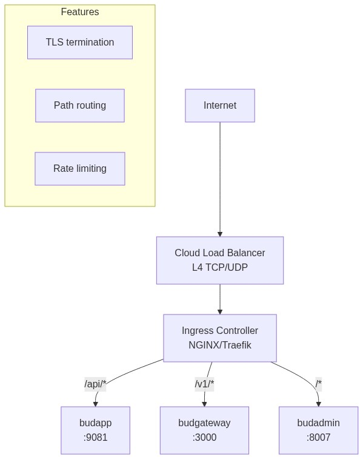

# Bud AI Foundry - Deployment Architecture

---

## Overview

This document describes how Bud AI Foundry is deployed across different environments, including infrastructure topology, environment configurations, and deployment patterns.

---

## Deployment Models

Bud AI Foundry supports three deployment models:

| Model | Control Plane | Workload Clusters | Best For |
|-------|--------------|-------------------|----------|
| **SaaS** | Bud-managed | Bud-managed or customer | Zero-ops teams |
| **Self-Hosted** | Customer infrastructure | Customer infrastructure | Data sovereignty, air-gapped |
| **Hybrid** | Bud-managed | Customer infrastructure | Compliance + flexibility |

---

## Environment Topology

### Standard Environment Layout



**Environment Configuration:**
- **Development** (dev.bud.studio): Nightly builds, auto-deploy via Keel
- **Staging** (stage.bud.studio): Pre-production validation, manual approval
- **Production** (app.bud.studio): Live traffic, HA configuration

### Environment Configuration Matrix

| Aspect | Development | Staging | Production |
|--------|-------------|---------|------------|
| **Domain** | dev.bud.studio | stage.bud.studio | app.bud.studio |
| **Image Tag** | nightly | staging | v{semver} |
| **Replicas** | 1 | 2 | 3+ |
| **Dev Mode** | Enabled | Disabled | Disabled |
| **Log Level** | DEBUG | INFO | INFO |
| **TLS** | Internal (self-signed) | Let's Encrypt | Let's Encrypt |
| **Auto-Deploy** | Yes (Keel) | No | No |
| **DB Backups** | Daily | Daily | Continuous |
| **Monitoring** | Basic | Full | Full + Alerting |

---

## Kubernetes Cluster Architecture

### Control Plane Cluster



**Namespaces:**
- **bud-system**: Core services (budapp, budcluster, budsim, budmodel, etc.)
- **bud-infra**: Databases (PostgreSQL, Valkey, ClickHouse, MinIO)
- **bud-obs**: Observability (Grafana, Loki, Prometheus)
- **bud-auth**: Keycloak identity provider
- **dapr**: Service mesh components

### Workload Clusters (Managed by Bud)

**Components Deployed:**
- **Model Runtimes**: vLLM, SGLang, TensorRT
- **NFD**: Node Feature Discovery for GPU/CPU detection
- **HAMI**: GPU time-slicing (NVIDIA only)
- **GPU Operator**: Drivers, toolkit, device plugin
- **Monitoring**: Prometheus stack
- **Ingress**: NGINX/Traefik

**Node Types:**
| Type | AWS | Azure |
|------|-----|-------|
| GPU | p4d.24xlarge (8x A100) | NC24ads_A100_v4 |
| CPU | c6i.8xlarge (32 vCPU) | D32as_v5 |

---

## Helm Chart Structure

### Chart Dependencies

```
infra/helm/bud/
├── Chart.yaml                 # Main chart definition
├── values.yaml                # Default values
├── values.dev.yaml            # Development overrides
├── values.stage.yaml          # Staging overrides
├── values.pde.yaml            # Production overrides
├── templates/
│   ├── ingress.yaml           # Ingress resources
│   ├── budgateway.yaml        # API gateway deployment
│   ├── microservices/
│   │   ├── common.yaml        # Shared ConfigMaps, PVCs, Secrets
│   │   ├── budapp.yaml
│   │   ├── budcluster.yaml
│   │   ├── budsim.yaml
│   │   ├── budmodel.yaml
│   │   ├── budmetrics.yaml
│   │   ├── budpipeline.yaml
│   │   ├── budeval.yaml
│   │   ├── budnotify.yaml
│   │   ├── askbud.yaml
│   │   ├── budadmin.yaml
│   │   ├── budplayground.yaml
│   │   └── budcustomer.yaml
│   ├── dapr/
│   │   ├── configuration.yaml # Dapr config
│   │   ├── state.yaml         # State store component
│   │   ├── pubsub.yaml        # Pub/sub component
│   │   ├── secretstore.yaml   # Secret store component
│   │   ├── cron.yaml          # Cron bindings
│   │   └── crypto.yaml        # Crypto component
│   └── extra/
│       ├── postgres.yaml      # PostgreSQL overrides
│       ├── clickhouse.yaml    # ClickHouse overrides
│       └── otel-collector.yaml
└── charts/
    ├── novu/                  # Notification service
    └── onyx/                  # Document search
```

### Dependency Versions

| Dependency | Version | Source |
|------------|---------|--------|
| PostgreSQL | 16.7.18 | Bitnami |
| Valkey | 3.0.20 | Bitnami |
| ClickHouse | 9.3.9 | Bitnami |
| MinIO | 17.0.15 | Bitnami |
| Keycloak | 24.7.7 | Bitnami |
| Kafka | 32.3.5 | Bitnami |
| MongoDB | 16.5.31 | Bitnami |
| Prometheus | 25.27.0 | prometheus-community |
| Novu | 0.1.6 | Local chart |
| Onyx | 0.4.4 | Local chart |

---

## Infrastructure as Code

### Terraform/OpenTofu Modules

```
infra/tofu/
├── azure/                     # Azure infrastructure module
│   ├── main.tf               # Resource group, VNet, NSG
│   ├── primary.tf            # Primary node VM
│   ├── worker.tf             # Worker node VMs
│   ├── ingress.tf            # Ingress node VMs
│   ├── nodes.tf              # Node configuration
│   ├── vars.tf               # Input variables
│   ├── output.tf             # Output values
│   └── provider.tf           # Azure provider config
│
├── budk8s/                    # Kubernetes cluster module
│   ├── main.tf               # Cluster setup with NixOS
│   ├── dns.tf                # DNS configuration
│   ├── vars.tf               # Input variables
│   └── output.tf             # Kubeconfig output
│
└── ephemeral/                 # Ephemeral test environments
    ├── main.tf               # Short-lived test clusters
    └── vars.tf
```

### Azure Network Architecture

**Virtual Network:** 10.177.0.0/16 (IPv4), fd12:babe:cafe::/48 (IPv6)

**Subnet:** budk8s-common (10.177.2.0/24)

| Priority | Port | Protocol | Source | Purpose |
|----------|------|----------|--------|---------|
| 100 | 22 | TCP | * | SSH |
| 200 | 51820 | UDP | * | WireGuard |
| 400 | 80 | TCP | * | HTTP |
| 500 | 443 | TCP | * | HTTPS |
| 600 | * | * | 10.177.0.0/16 | Internal |

---

## Deployment Pipelines

### CI/CD Flow



**Pipeline Stages:**
1. **Build**: Docker (Python), cargo (Rust), npm (Frontend)
2. **Test**: Unit tests, lint, type check, security scan
3. **Publish**: Push to Harbor, sign with cosign
4. **Deploy**: Dev (auto), Staging (manual), Production (approval)

### Image Tagging Strategy

| Environment | Tag Pattern | Example | Trigger |
|-------------|-------------|---------|---------|
| Development | nightly | budstudio/budapp:nightly | Every merge to main |
| Staging | staging | budstudio/budapp:staging | Manual promotion |
| Production | v{major}.{minor}.{patch} | budstudio/budapp:v1.2.3 | Release tag |

---

## Storage Architecture

### Persistent Volumes

| PVC Name | Size | Storage Class | Used By |
|----------|------|---------------|---------|
| bud-models-registry | 1Ti | nfs-csi | Model file storage |
| bud-add-dir-budmo | Configurable | nfs-csi | Model uploads |
| postgresql-data | 100Gi | Default | PostgreSQL |
| clickhouse-data | 500Gi | Default | ClickHouse |
| minio-data | 1Ti | Default | MinIO |

### Storage Tiers



---

## Secrets Management

### Secret Types and Storage

| Secret Type | Storage Location | Rotation |
|-------------|------------------|----------|
| RSA Keys | Kubernetes Secret (bud-rsa-keys) | Manual |
| Database Credentials | Kubernetes Secret | 90 days |
| API Keys | Kubernetes Secret | On demand |
| Keycloak Admin | Kubernetes Secret | 90 days |
| Dapr API Token | Kubernetes Secret | 90 days |
| TLS Certificates | Kubernetes Secret (auto via cert-manager) | Auto (60 days) |

### Secrets Configuration

```yaml
# From common.yaml - RSA keys for credential encryption
apiVersion: v1
kind: Secret
metadata:
  name: {{ .Release.Name }}-rsa-keys
type: Opaque
data:
  rsa-private-key.pem: {{ .Values.microservices.rsaKeys.privateKey | b64enc }}
  private-key-password: {{ .Values.microservices.rsaKeys.privateKeyPassword | b64enc }}
  rsa-public-key.pem: {{ .Values.microservices.rsaKeys.publicKey | b64enc }}
```

---

## Ingress Architecture

### Traffic Flow



### Ingress Hosts

| Subdomain | Service | Path | Purpose |
|-----------|---------|------|---------|
| app.{domain} | budadmin | / | Main dashboard |
| api.{domain} | budapp | /api/* | REST API |
| gateway.{domain} | budgateway | /v1/* | Inference API |
| play.{domain} | budplayground | / | Model playground |
| auth.{domain} | keycloak | / | Authentication |
| grafana.{domain} | grafana | / | Monitoring |

---

## High Availability Configuration

### Component Redundancy

| Component | Min Replicas | Strategy | Notes |
|-----------|--------------|----------|-------|
| budgateway | 2 | HPA (CPU 70%) | Critical path for inference |
| budapp | 2 | HPA (CPU 70%) | Core API |
| budadmin | 2 | Fixed | Frontend |
| PostgreSQL | 1 primary + 1 standby | Streaming replication | Automated failover |
| Valkey | 3 | Sentinel | Automatic failover |
| ClickHouse | 2 | Replication | Read replicas |
| Ingress | 2 | Anti-affinity | Spread across nodes |

### Pod Disruption Budgets

```yaml
# Ensure at least 1 replica available during maintenance
apiVersion: policy/v1
kind: PodDisruptionBudget
metadata:
  name: budapp-pdb
spec:
  minAvailable: 1
  selector:
    matchLabels:
      app: budapp
```

---

## Deployment Commands

### Development Deployment

```bash
# Install with dev values
helm install bud infra/helm/bud/ \
  -f infra/helm/bud/values.dev.yaml \
  --namespace bud-system \
  --create-namespace

# Upgrade existing deployment
helm upgrade bud infra/helm/bud/ \
  -f infra/helm/bud/values.dev.yaml \
  --namespace bud-system
```

### Production Deployment

```bash
# Install with production values and secrets
helm install bud infra/helm/bud/ \
  -f infra/helm/bud/values.pde.yaml \
  -f infra/helm/bud/secrets.yaml \
  --namespace bud-system \
  --create-namespace \
  --atomic \
  --timeout 10m

# Rollback if needed
helm rollback bud 1 --namespace bud-system
```

### Infrastructure Provisioning

```bash
# Azure infrastructure
cd infra/tofu/budk8s
tofu init
tofu plan -out=plan.tfplan
tofu apply plan.tfplan

# Get kubeconfig
tofu output -raw kubeconfig > ~/.kube/budk8s.yaml
```
