# Bud AI Foundry - High-Level Architecture

---

## Overview

This document describes the high-level architecture of Bud AI Foundry, including system components, their interactions, data flows, and design decisions.

---

## System Context

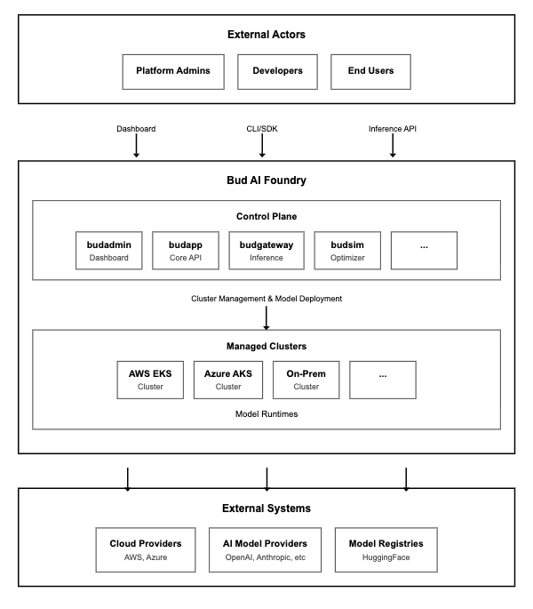
---

## Component Architecture

### Layer 1: Presentation Layer

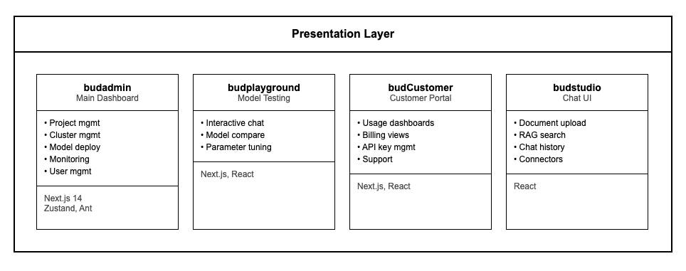

| Component | Technology | Purpose |
|-----------|------------|---------|
| budadmin | Next.js 14, Zustand, Ant Design | Primary admin dashboard for platform management |
| budplayground | Next.js, React | Interactive environment for model testing |
| budCustomer | Next.js, React | Customer-facing portal for usage and billing |
| budchat | Onyx (React) | RAG-powered chat interface with document connectors |

### Layer 2: API Gateway Layer

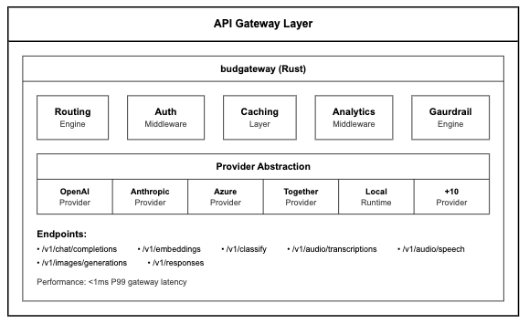

**Key Capabilities:**
- OpenAI-compatible API for all inference endpoints
- Multi-provider routing with fallback chains
- RSA-encrypted API key management
- Request/response streaming
- TOML-based declarative configuration

### Layer 3: Service Mesh Layer

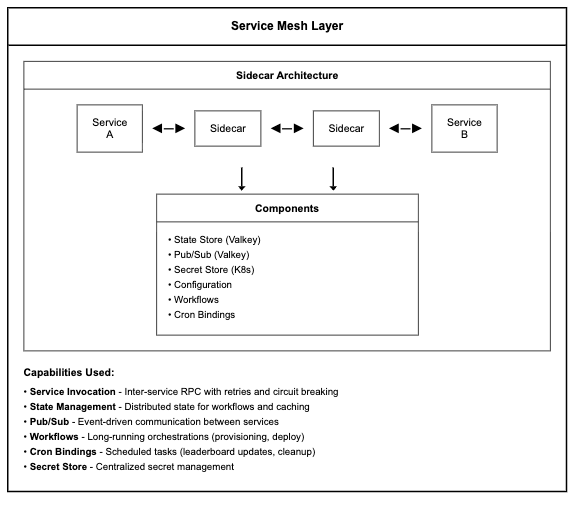

### Layer 4: Microservices Layer

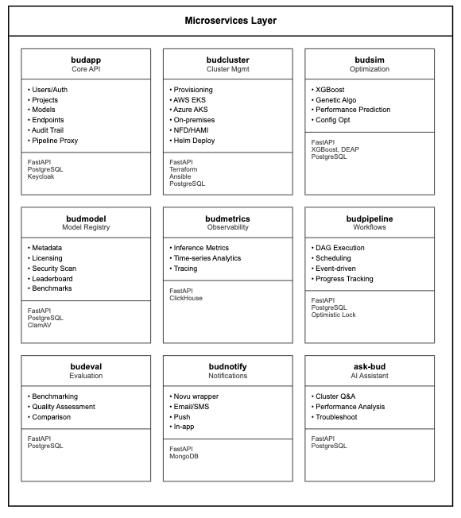

#### Service Responsibilities

| Service | Primary Responsibility | Database | Key Integrations |
|---------|----------------------|----------|------------------|
| **budapp** | Core API, auth, users, projects | PostgreSQL | Keycloak, all services |
| **budcluster** | Cluster lifecycle management | PostgreSQL | Terraform, Ansible, cloud APIs |
| **budsim** | Performance optimization | PostgreSQL | XGBoost, DEAP |
| **budmodel** | Model registry & metadata | PostgreSQL | HuggingFace, ClamAV |
| **budmetrics** | Observability & analytics | ClickHouse | LGTM stack |
| **budpipeline** | Workflow orchestration | PostgreSQL | All services via Dapr |
| **budeval** | Model evaluation | PostgreSQL | budmodel, budcluster |
| **budnotify** | Notifications | MongoDB | Novu |
| **ask-bud** | AI assistant | PostgreSQL | LLM providers |

### Layer 5: Data Layer

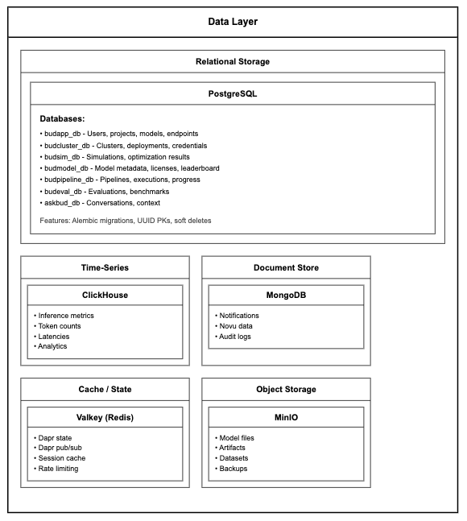

### Layer 6: Infrastructure Layer

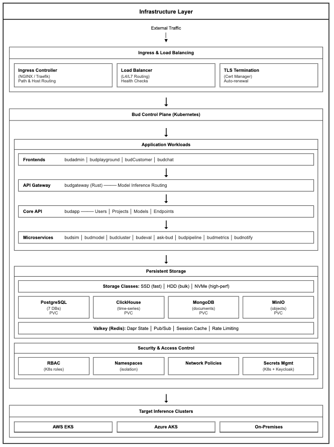

| Category | Capability | Details |
|----------|------------|---------|
| **Compute** | Container Orchestration | Kubernetes-native deployment with auto-scaling, rolling updates, and self-healing |
| | GPU Node Pools | Dedicated GPU nodes with NVIDIA drivers, CUDA support, and resource isolation |
| | Horizontal Pod Autoscaling | CPU/memory and custom metrics-based scaling via Prometheus adapter |
| **Cloud Support** | AWS | Elastic Kubernetes Service (EKS) with managed node groups, VPC networking |
| | Azure | Azure Kubernetes Service (AKS) with virtual network integration |
| | On-Premises | Bare-metal and VM-based Kubernetes clusters with custom provisioning |
| **Networking** | Ingress | NGINX/Traefik ingress controllers with TLS termination, path-based routing |
| | Service Mesh | Dapr sidecar for service-to-service communication, retries, circuit breaking |
| | Load Balancing | L4/L7 load balancing with health checks and session affinity |
| **Storage** | Persistent Volumes | Dynamic provisioning with storage classes (SSD, HDD, NVMe) |
| | Object Storage | S3-compatible storage (MinIO) for models, datasets, artifacts |
| | Distributed Cache | Valkey/Redis for session state, pub/sub, and rate limiting |
| **Security** | RBAC | Kubernetes role-based access control with namespace isolation |
| | Secrets Management | Kubernetes secrets with optional external vault integration |
| | Network Policies | Pod-to-pod traffic control and namespace segmentation |
| | mTLS | Service mesh encryption for inter-service communication |
| **High Availability** | Multi-Zone | Workload distribution across availability zones |
| | Replica Sets | Minimum replica guarantees with pod disruption budgets |
| | Failover | Automatic pod rescheduling and health-based traffic routing |
| **GPU Infrastructure** | NVIDIA GPU Operator | Automated driver installation, device plugin, and monitoring |
| | HAMI | GPU time-slicing for multi-tenant GPU sharing |
| | Node Feature Discovery | Automatic hardware detection (GPU model, memory, capabilities) |
| **Observability** | Metrics | Prometheus for metrics collection and alerting |
| | Dashboards | Grafana for visualization and operational dashboards |
| | Logging | Centralized log aggregation and search |

---

## Data Flows

### 1. Model Deployment Flow

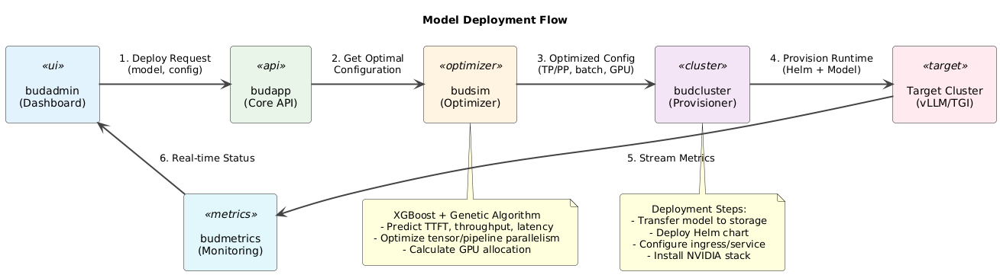

**Deployment Steps:**
1. User initiates deployment from budadmin dashboard
2. budapp validates request and checks permissions
3. budsim runs optimization (XGBoost + genetic algorithm)
   - Predicts TTFT, throughput, latency
   - Optimizes TP/PP, batch size, GPU allocation
4. budcluster provisions runtime on target cluster
   - Transfers model to cluster storage
   - Deploys Helm chart with optimized config
   - Configures ingress/service
5. budmetrics starts collecting inference metrics
6. Dashboard shows real-time deployment status

### 2. Inference Request Flow

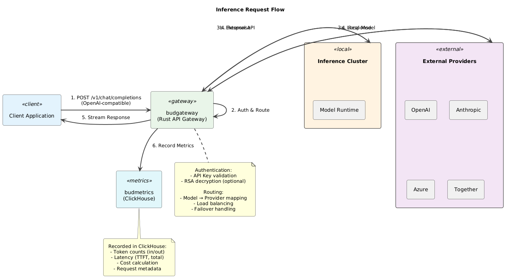

**Inference Steps:**
1. Client sends OpenAI-compatible request to budgateway (`POST /v1/chat/completions`)
2. Gateway authenticates via API key (optional RSA decryption)
3. Gateway resolves model → provider routing
4. Request forwarded to:
   - Inference Cluster: Model runtime on managed GPU cluster
   - External providers: OpenAI, Anthropic, Azure, Together
5. Response streamed back to client
6. Metrics recorded in ClickHouse (token counts, latency, cost)

### 3. Pipeline Execution Flow

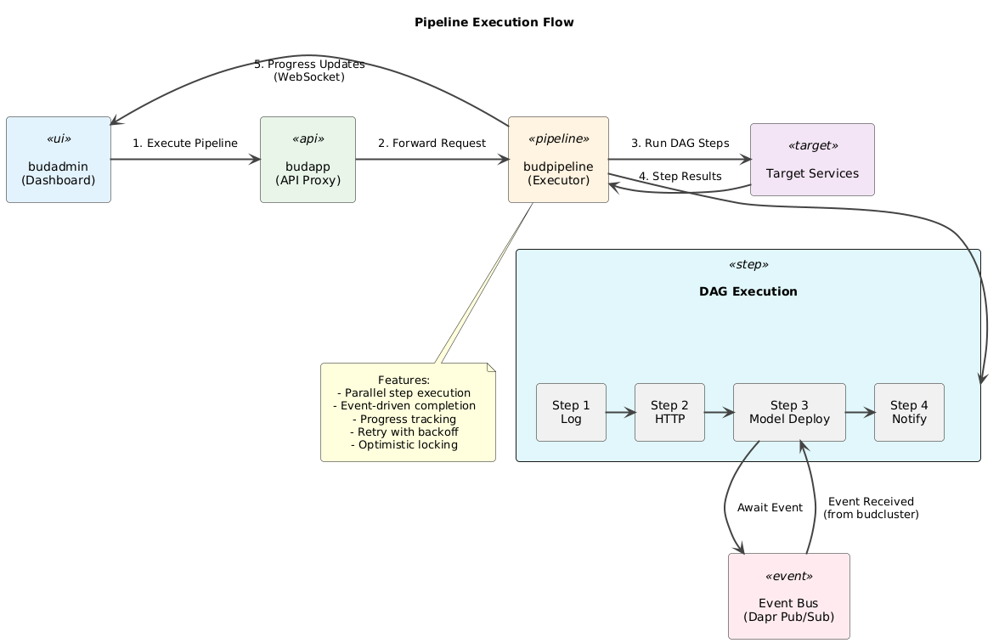

**Pipeline Features:**
- Parallel step execution with DAG-based orchestration
- Event-driven completion for long-running operations (via Dapr Pub/Sub)
- Progress tracking with weighted averaging
- Real-time updates via WebSocket callbacks
- Optimistic locking for concurrent updates
- Retry policies with exponential backoff

---

## Service Communication Patterns

### Synchronous (Dapr Service Invocation)

```
┌──────────┐         ┌──────────┐         ┌──────────┐
│ Service  │ ──────► │   Dapr   │ ──────► │ Service  │
│    A     │         │ Sidecar  │         │    B     │
└──────────┘         └──────────┘         └──────────┘

URL Pattern: {dapr_endpoint}/v1.0/invoke/{app_id}/method/{path}

Examples:
• budapp → budcluster: Get cluster status
• budapp → budpipeline: Execute pipeline
• budpipeline → budcluster: Deploy model
```

### Asynchronous (Dapr Pub/Sub)

```
┌──────────┐         ┌──────────┐         ┌──────────┐
│ Publisher│ ──────► │  Valkey  │ ◄────── │Subscriber│
│          │  topic  │ (Pub/Sub)│  topic  │          │
└──────────┘         └──────────┘         └──────────┘

Topics:
• workflow-events    - Pipeline event completion
• pipeline-notifications - Execution status updates
• {callback_topics}  - Client-specified progress updates
```

### Authentication Layers

| Layer | Mechanism | Purpose |
|-------|-----------|---------|
| External API | Keycloak JWT | User authentication |
| Service Mesh | Dapr API Token | Inter-service auth |
| Internal Endpoints | APP_API_TOKEN | Application-level validation |
| API Gateway | RSA-encrypted keys | Inference auth |

---

## Security Architecture

The platform follows the **4 C's of Cloud Native Security** model (CNCF), providing defense-in-depth where each layer builds on the security of layers below.

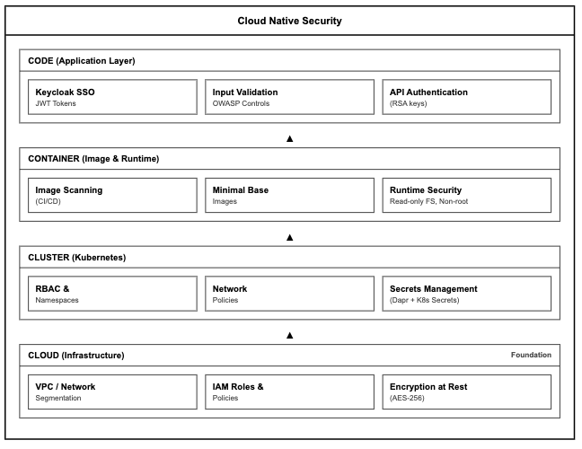


**Key Security Controls:**

| Layer | Controls |
|-------|----------|
| **Code** | Keycloak SSO with SAML 2.0/OIDC, JWT tokens, input validation, API key authentication |
| **Container** | Image scanning in CI/CD, minimal base images, read-only filesystems, non-root execution |
| **Cluster** | RBAC with namespace isolation, network policies, pod security standards, Dapr secrets |
| **Cloud** | VPC segmentation, IAM policies, AES-256 encryption at rest, audit logging |

---

## Scalability Considerations

### Horizontal Scaling

| Component | Scaling Strategy |
|-----------|-----------------|
| API Services | Kubernetes HPA based on CPU/memory |
| budgateway | HPA + load balancer for inference traffic |
| Model Runtimes | Node auto-scaling per cluster |
| Databases | Read replicas, connection pooling |
| Message Queue | Valkey cluster mode |

### Multi-Cluster Architecture

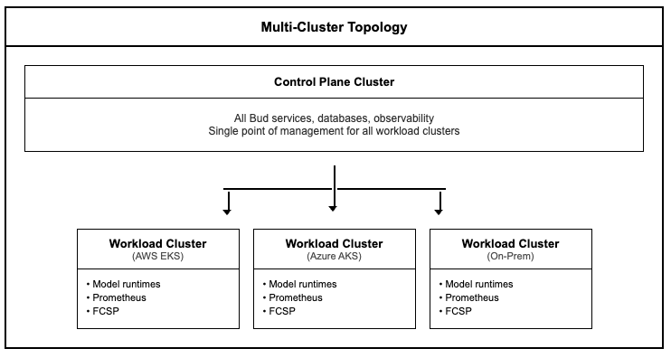

---

## Technology Decisions

| Decision | Choice | Rationale |
|----------|--------|-----------|
| Service Mesh | Dapr | Built-in workflows, state, pub/sub - no custom infrastructure |
| API Gateway | Custom Rust | Sub-ms latency critical for inference; OpenAI compatibility |
| Databases | PostgreSQL + ClickHouse | OLTP for app data, OLAP for time-series metrics |
| State/Cache | Valkey (Redis-compatible) | Dapr integration, performance, open-source |
| IaC | Terraform + Ansible | Terraform for cloud, Ansible for K8s-level config |
| Frontend | Next.js + Zustand | SSR, modern React patterns, lightweight state |

---

## Related Documents

- [Product Overview](./product-overview.md)
- [Low-Level Design](./low-level-design.md)
- [Security Architecture](../security/security-architecture.md)
- [Deployment Architecture](./deployment-architecture.md)
- [Network Topology](./network-topology.md)
