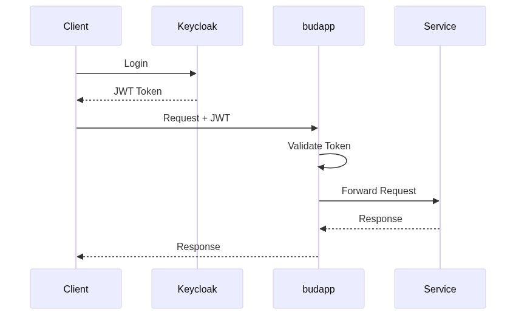

# Bud AI Foundry - Low-Level Design

---

## Overview

This document provides detailed technical design specifications for the Bud AI Foundry platform. It covers cross-cutting concerns, shared patterns, and links to service-specific low-level designs.

For high-level architecture and component interactions, see [High-Level Architecture](./high-level-architecture.md).

---

## Document Structure

| Document | Description |
|----------|-------------|
| **This Document** | Cross-cutting concerns, shared patterns, conventions |
| [budapp](../services/budapp.md) | Core API, users, projects, authentication |
| [budcluster](../services/budcluster.md) | Cluster lifecycle, Terraform/Ansible |
| [budsim](../services/budsim.md) | Performance optimization, XGBoost |
| [budmodel](../services/budmodel.md) | Model registry, metadata |
| [budmetrics](../services/budmetrics.md) | Observability, ClickHouse |
| [budpipeline](../services/budpipeline.md) | Workflow orchestration |
| [budgateway](../services/budgateway.md) | Inference routing (Rust) |
| [budeval](../services/budeval.md) | Model evaluation |
| [budnotify](../services/budnotify.md) | Notifications |
| [ask-bud](../services/ask-bud.md) | AI assistant |
| [budadmin](../services/budadmin.md) | Main dashboard (Next.js) |
| [budplayground](../services/budplayground.md) | Model testing interface |
| [budCustomer](../services/budCustomer.md) | Customer portal |

---

## Service Dependency Graph

---

## Cross-Cutting Technical Concerns

### 1. Authentication & Authorization

#### External Authentication (Keycloak)

All user-facing requests authenticate via Keycloak:

**JWT Token Structure:**

**Role Hierarchy:**
| Role | Permissions |
|------|-------------|
| `super_admin` | Full platform access, all organizations |
| `org_admin` | Organization management, all projects |
| `project_admin` | Project management, deployments |
| `user` | Read access, limited deployments |

#### Inter-Service Authentication (Dapr)

Services communicate via Dapr sidecars with API token authentication:

#### Application-Level Authentication

Internal endpoints use `APP_API_TOKEN` for service-to-service calls:

---

### 2. Database Conventions

#### PostgreSQL Standards

All Python services using PostgreSQL follow these conventions:

**Table Naming:**
- Snake_case for table names: `user_projects`, `model_endpoints`
- Plural form for collections: `users`, `clusters`, `deployments`

**Column Standards:**

**Index Conventions:**

**SQLAlchemy Base Model:**

#### ClickHouse Standards (budmetrics)

Time-series data uses MergeTree engine with partitioning:

---

### 3. API Design Standards

#### REST Conventions

All FastAPI services follow consistent patterns:

**URL Structure:**

**HTTP Methods:**
| Method | Purpose | Idempotent |
|--------|---------|------------|
| GET | Retrieve resource(s) | Yes |
| POST | Create resource | No |
| PUT | Full update | Yes |
| PATCH | Partial update | Yes |
| DELETE | Remove resource | Yes |

**Response Envelope:**

**Error Response:**

#### Pydantic Schema Conventions

---

### 4. Dapr Integration Patterns

#### Service Invocation

#### Pub/Sub Events

**Publisher:**

**Subscriber:**

#### State Management

#### Workflows (Long-Running Operations)

---

### 5. Error Handling

#### Exception Hierarchy

#### Global Exception Handler

---

### 6. Logging Standards

#### Structured Logging (structlog)

#### Log Levels

| Level | Usage |
|-------|-------|
| `DEBUG` | Detailed diagnostic information |
| `INFO` | General operational events |
| `WARNING` | Unexpected but handled situations |
| `ERROR` | Errors that need attention |
| `CRITICAL` | System failures requiring immediate action |

#### Required Log Fields

Every log entry includes:
- `timestamp`: ISO 8601 format
- `level`: Log level
- `service`: Service name (e.g., `budapp`)
- `request_id`: Correlation ID for request tracing
- `message`: Human-readable message

---

### 7. Configuration Management

#### Environment Variables

All services use environment variables with consistent naming:

#### Pydantic Settings

---

### 8. Testing Patterns

#### Unit Tests

#### Integration Tests

---

### 9. Security Patterns

#### Input Validation

All inputs are validated at API boundary:

#### Credential Encryption

Sensitive data (cloud credentials, API keys) is encrypted at rest:

#### SQL Injection Prevention

All database queries use parameterized statements via SQLAlchemy:

---

### 10. Deployment Patterns

#### Container Standards

All services follow consistent container practices:

#### Kubernetes Resources

---

## Service-Specific LLDs

Each service has a dedicated LLD document with:
- Database schema (tables, relationships, indexes)
- API endpoint specifications
- Internal architecture (modules, classes)
- Integration details
- Configuration reference

See the [Document Structure](#document-structure) section for links to each service LLD.
