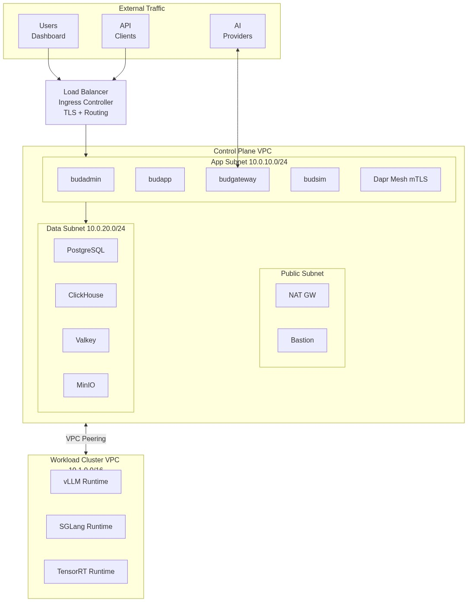
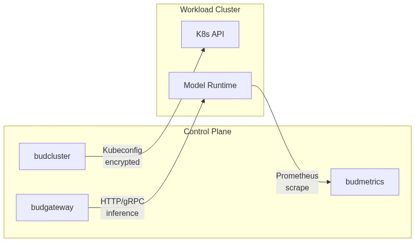

# Bud AI Foundry - Network Topology

---

## Overview

This document describes the network architecture for Bud AI Foundry deployments, including VPC design, subnet layout, security groups, ingress/egress patterns, and network policies.

---

## Network Architecture

**Subnets:**
- **Public Subnet (10.0.1.0/24)**: NAT Gateway, Bastion, Load Balancer
- **App Subnet (10.0.10.0/24)**: Application services with Dapr mTLS
- **Data Subnet (10.0.20.0/24)**: Databases (PostgreSQL, ClickHouse, Valkey, MinIO)
- **Workload Cluster (10.1.0.0/16)**: GPU runtimes (vLLM, SGLang, TensorRT)

---

## Subnet Design

### Control Plane VPC

| Subnet | CIDR | Purpose | Resources |
|--------|------|---------|-----------|
| **Public** | 10.0.1.0/24 | Internet-facing | Load balancer, NAT Gateway, Bastion |
| **Private - Apps** | 10.0.10.0/24 | Application workloads | All Bud services |
| **Private - Data** | 10.0.20.0/24 | Database tier | PostgreSQL, ClickHouse, Valkey, MinIO |
| **Private - Management** | 10.0.30.0/24 | Observability | Grafana, Loki, Tempo, Mimir |

### Workload Cluster VPC

| Subnet | CIDR | Purpose | Resources |
|--------|------|---------|-----------|
| **Public** | 10.1.1.0/24 | Internet-facing (if needed) | Load balancer for inference endpoints |
| **Private - Workloads** | 10.1.10.0/24 | GPU workloads | Model runtimes (vLLM, SGLang) |
| **Private - System** | 10.1.20.0/24 | System components | Prometheus, NFD, HAMI |

---

---

---

## Cross-Cluster Connectivity

### Control Plane to Workload Clusters

| Method | Use Case | Configuration |
|--------|----------|---------------|
| **VPC Peering** | Same region, same cloud | Non-overlapping CIDRs |
| **AWS PrivateLink** | Cross-region AWS | Endpoint services |
| **Azure Private Link** | Cross-region Azure | Private endpoints |
| **VPN** | Cross-cloud or on-prem | Site-to-site or client VPN |
| **Public Internet** | When private not possible | TLS + API authentication |

### Communication Pattern

---

## DNS Configuration

### Internal DNS

| Record | Target | Purpose |
|--------|--------|---------|
| `budapp.bud-system.svc.cluster.local` | Service ClusterIP | Internal service discovery |
| `postgresql.bud-system.svc.cluster.local` | Service ClusterIP | Database access |
| `valkey.bud-system.svc.cluster.local` | Service ClusterIP | Cache access |

### External DNS

| Record | Target | Purpose |
|--------|--------|---------|
| `admin.example.com` | Load Balancer | Dashboard access |
| `api.example.com` | Load Balancer | Management API |
| `inference.example.com` | Load Balancer | Inference gateway |

---

## Egress Requirements

### Required Outbound Access

| Destination | Port | Purpose |
|-------------|------|---------|
| Cloud Provider APIs | 443 | Cluster provisioning |
| Container Registries | 443 | Image pulls |
| HuggingFace | 443 | Model downloads |
| AI Provider APIs | 443 | External inference |
| Keycloak (if external) | 443 | Authentication |
| NTP servers | 123 | Time sync |

### Air-Gapped Deployment

For air-gapped environments:
- Internal container registry mirror required
- Model artifacts pre-staged to internal storage
- No external AI provider access
- All dependencies bundled in deployment

---

## TLS Configuration

### Certificate Management

| Layer | Certificate | Issuer |
|-------|-------------|--------|
| **Ingress** | Wildcard for domain | Let's Encrypt / Internal CA |
| **Service Mesh** | Per-pod certificates | Dapr Sentry (auto-rotated) |
| **Database** | Server certificates | Internal CA |

### TLS Versions

| Connection | Minimum Version | Cipher Suites |
|------------|-----------------|---------------|
| External | TLS 1.2 | ECDHE-RSA-AES256-GCM-SHA384 |
| Internal (Dapr) | TLS 1.3 | Managed by Dapr |
| Database | TLS 1.2 | AES256-GCM-SHA384 |
