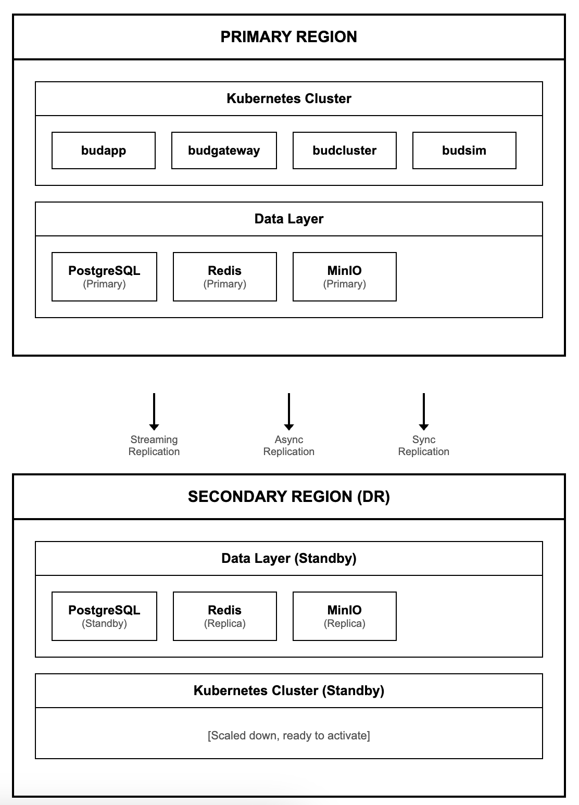
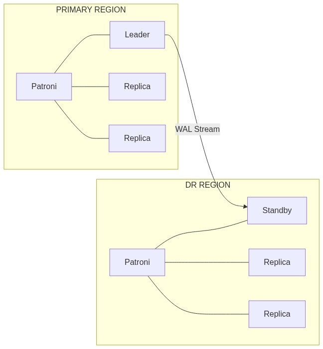
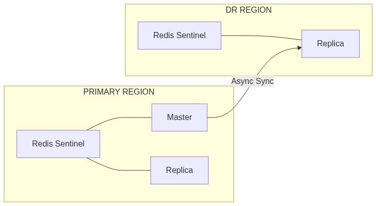
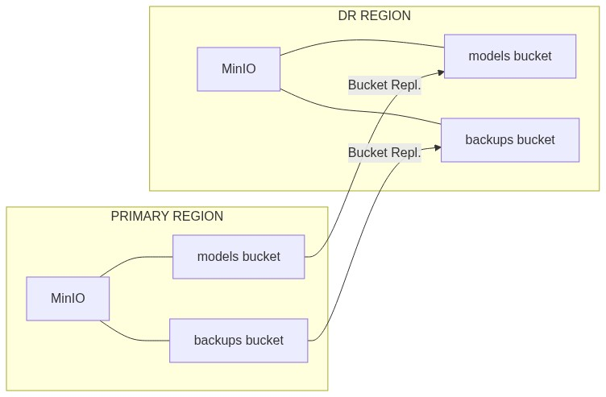
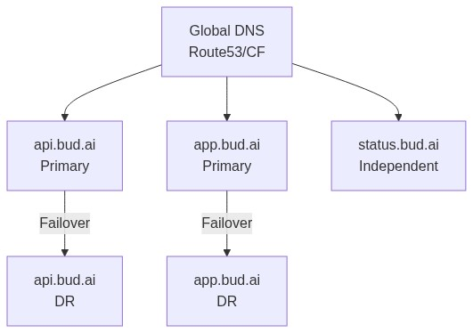
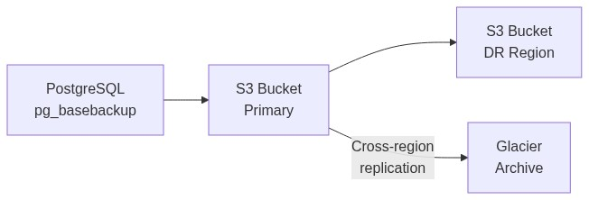
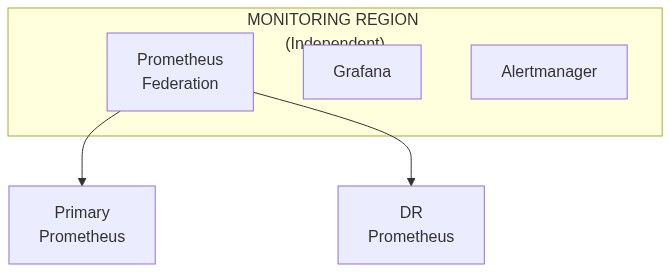

# Disaster Recovery Architecture

---

## 1. Overview

This document describes the disaster recovery architecture for Bud AI Foundry, including infrastructure design, data replication, and failover mechanisms.

For operational procedures, see [DR Strategy](./dr-strategy.md) and [Failover Runbook](./failover-runbook.md).

---

## 2. DR Architecture Overview

---

## 3. Component Architecture

### 3.1 Compute Layer

| Component | Primary | DR | Failover Method |
|-----------|---------|-----|-----------------|
| Kubernetes control plane | 3 nodes | 3 nodes | Independent clusters |
| Worker nodes | 10 nodes | 5 nodes (scale up) | Deploy from images |
| GPU nodes | 8x A100 | 4x A100 (scale up) | On-demand provisioning |

### 3.2 Data Layer

| Component | Primary | DR | Replication |
|-----------|---------|-----|-------------|
| PostgreSQL | 3-node Patroni | 3-node Patroni | Streaming (async) |
| Redis | 3-node Sentinel | 3-node Sentinel | Async replication |
| ClickHouse | 3-node cluster | 2-node cluster | Async replication |
| MinIO | 4-node cluster | 4-node cluster | Bucket replication |

### 3.3 Network Layer

| Component | Primary | DR | Notes |
|-----------|---------|-----|-------|
| Load Balancer | Active | Standby | DNS failover |
| Ingress | Active | Standby | Same config |
| VPN/PrivateLink | Active | Active | Both regions connected |

---

## 4. Data Replication Architecture

### 4.1 PostgreSQL Replication

- **Replication Mode:** Asynchronous
- **Target Lag:** < 1 minute
- **Failover:** Manual promotion via patronictl

### 4.2 Redis Replication

- **Replication Mode:** Asynchronous
- **Target Lag:** < 5 minutes
- **Failover:** Sentinel promotion

### 4.3 Object Storage Replication

- **Replication Mode:** Active-Active
- **Target Lag:** < 15 minutes

---

## 5. DNS and Traffic Management

### 5.1 DNS Architecture

### 5.2 DNS Configuration

| Record | Primary Value | DR Value | TTL | Failover |
|--------|---------------|----------|-----|----------|
| api.bud.ai | primary-lb.region1 | dr-lb.region2 | 60s | Manual |
| app.bud.ai | primary-lb.region1 | dr-lb.region2 | 60s | Manual |
| status.bud.ai | status-lb.region3 | - | 300s | N/A |

---

## 6. Backup Architecture

### 6.1 Backup Flow

### 6.2 Backup Schedule

| Component | Type | Frequency | Retention | Location |
|-----------|------|-----------|-----------|----------|
| PostgreSQL | Full | Daily | 30 days | S3 (both regions) |
| PostgreSQL | WAL | Continuous | 7 days | S3 (both regions) |
| Redis | RDB | Hourly | 24 hours | S3 |
| Kubernetes | Velero | Daily | 30 days | S3 (both regions) |
| Configs | Git | Continuous | Indefinite | Git repo |

---

## 7. Monitoring Architecture

### 7.1 Cross-Region Monitoring

### 7.2 Health Checks

| Check | Interval | Timeout | Threshold |
|-------|----------|---------|-----------|
| API health | 10s | 5s | 3 failures |
| Database connectivity | 30s | 10s | 2 failures |
| Replication lag | 60s | - | > 5 min |
| Certificate expiry | 1h | - | < 14 days |

---

## 8. Security Considerations

### 8.1 Cross-Region Security

| Aspect | Implementation |
|--------|----------------|
| Data in transit | TLS 1.3 for all replication |
| Network isolation | VPC peering with encryption |
| Credentials | HashiCorp Vault (replicated) |
| Secrets rotation | Automatic, 30-day cycle |

### 8.2 DR-Specific Access

| Role | Primary Access | DR Access |
|------|----------------|-----------|
| On-call SRE | Full | Full |
| Developer | Standard | Read-only |
| Automated systems | Full | Promotion only |

---

## 9. Capacity Planning

### 9.1 DR Site Sizing

| Resource | Primary | DR (Standby) | DR (Active) |
|----------|---------|--------------|-------------|
| K8s nodes | 10 | 5 | 10 |
| GPU nodes | 8 | 4 | 8 |
| Database storage | 1 TB | 1 TB | 1 TB |
| Object storage | 10 TB | 10 TB | 10 TB |

### 9.2 Scale-Up Automation
