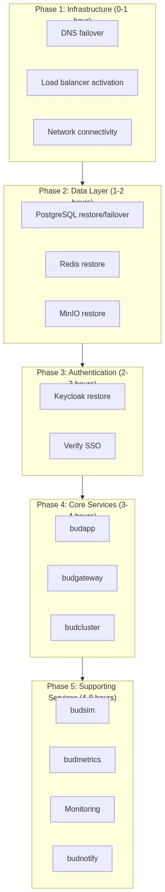

# Disaster Recovery Strategy

---

## 1. Executive Summary

This document defines the disaster recovery (DR) strategy for Bud AI Foundry, including recovery objectives, architecture, and procedures for maintaining business continuity.

**Key Objectives:**
- RTO (Recovery Time Objective): 4 hours for critical services
- RPO (Recovery Point Objective): 1 hour for data
- Automated failover for infrastructure components
- Regular DR testing quarterly

---

## 2. Scope

### 2.1 In Scope

| Component | Recovery Priority |
|-----------|-------------------|
| budapp (API) | Critical |
| budgateway (Inference) | Critical |
| PostgreSQL (Data) | Critical |
| Keycloak (Auth) | Critical |
| budcluster (Cluster Mgmt) | High |
| budsim (Optimization) | Medium |
| budmetrics (Analytics) | Medium |
| Monitoring (LGTM) | High |

### 2.2 Out of Scope

- Customer-managed compute clusters
- External AI provider APIs (OpenAI, etc.)

---

## 3. Recovery Objectives

### 3.1 RTO/RPO by Tier

| Tier | Components | RTO | RPO |
|------|------------|-----|-----|
| **Tier 1** (Critical) | budapp, budgateway, PostgreSQL, Keycloak | 4 hours | 1 hour |
| **Tier 2** (High) | budcluster, Redis, Monitoring | 8 hours | 4 hours |
| **Tier 3** (Medium) | budsim, budmetrics, budnotify | 24 hours | 24 hours |
| **Tier 4** (Low) | Development tools, docs | 72 hours | 1 week |

### 3.2 Recovery Order

---

## 4. Backup Strategy

### 4.1 Backup Schedule

| Component | Type | Frequency | Retention |
|-----------|------|-----------|-----------|
| PostgreSQL | Full | Daily | 30 days |
| PostgreSQL | WAL | Continuous | 7 days |
| PostgreSQL | Snapshot | Weekly | 90 days |
| Redis | RDB | Hourly | 24 hours |
| Redis | AOF | Continuous | 7 days |
| MinIO | Sync | Continuous | N/A |
| Kubernetes | Velero | Daily | 30 days |
| Configs | Git | Every change | Indefinite |

### 4.2 Backup Locations

| Backup | Primary Storage | Secondary Storage |
|--------|-----------------|-------------------|
| PostgreSQL | S3 (primary region) | S3 (DR region) |
| Redis | Local + S3 | S3 (DR region) |
| MinIO | S3 (DR region) | - |
| Kubernetes | S3 (primary region) | S3 (DR region) |

### 4.3 Backup Verification

| Verification | Frequency | Procedure |
|--------------|-----------|-----------|
| Backup completion | Daily | Automated alert |
| Restore test | Weekly | Automated script |
| Full DR drill | Quarterly | Manual exercise |

---

## 5. Failover Procedures

### 5.1 Failover Types

| Type | Trigger | Automation | Downtime |
|------|---------|------------|----------|
| **Automatic** | Health check failure | Full | < 5 min |
| **Planned** | Maintenance, upgrades | Scripted | < 30 min |
| **Unplanned** | Disaster, region failure | Scripted | < 4 hours |

### 5.2 Automatic Failover (Component Level)

**PostgreSQL:**
- Patroni manages automatic leader election
- Application connections via HAProxy
- Failover time: < 30 seconds

**Redis:**
- Redis Sentinel monitors master
- Automatic promotion of replica
- Failover time: < 30 seconds

### 5.3 Regional Failover (Full DR)

See [Failover Runbook](./failover-runbook.md) for detailed steps.

**High-Level Process:**
1. Declare disaster
2. Update DNS to DR region
3. Promote standby databases
4. Scale up DR application tier
5. Verify services
6. Notify stakeholders

---

## 6. DR Site Requirements

### 6.1 Infrastructure Parity

| Resource | Primary | DR | Notes |
|----------|---------|-----|-------|
| Kubernetes nodes | 10 | 5 | Scale up during failover |
| CPU cores | 64 | 32 | Scale up during failover |
| Memory | 400 GB | 200 GB | Scale up during failover |
| Storage | 10 TB | 10 TB | Full parity |

**NOTE - this depends on the deployment scale

### 6.2 Network Requirements

| Requirement | Specification |
|-------------|---------------|
| Bandwidth (replication) | 1 Gbps minimum |
| Latency (between regions) | < 100ms |
| DNS TTL | 60 seconds |
| VPN/PrivateLink | Required |

---

## 7. Testing Strategy

### 7.1 Test Types

| Test | Frequency | Scope | Duration |
|------|-----------|-------|----------|
| **Backup verification** | Weekly | Restore to test env | 2 hours |
| **Component failover** | Monthly | Single component | 1 hour |
| **Tabletop exercise** | Quarterly | Full team walkthrough | 4 hours |
| **Full DR drill** | Annually | Regional failover | 8 hours |

### 7.2 Success Criteria

| Metric | Target |
|--------|--------|
| RTO achieved | < 4 hours |
| RPO achieved | < 1 hour data loss |
| Data integrity | 100% verified |
| All services operational | Yes |
| Customer impact | Minimal |

### 7.3 Test Documentation

Each test must document:
- Test date and participants
- Scenario and scope
- Actual RTO/RPO achieved
- Issues encountered
- Remediation actions

---

## 8. Communication Plan

### 8.1 Internal Notification

| Event | Notify | Channel | Template |
|-------|--------|---------|----------|
| DR declared | All engineering | Slack, PagerDuty | DR-DECLARED |
| Failover starting | Leadership | Email, Slack | FAILOVER-START |
| Failover complete | All | Email, Slack | FAILOVER-COMPLETE |
| Failback starting | Engineering | Slack | FAILBACK-START |

### 8.2 External Notification

| Event | Notify | Channel | Timing |
|-------|--------|---------|--------|
| Service degradation | Customers | Status page | Immediate |
| DR in progress | Customers | Status page, email | Within 15 min |
| Service restored | Customers | Status page, email | On resolution |

---

## 9. Roles and Responsibilities

| Role | Primary | Backup | Responsibility |
|------|---------|--------|----------------|
| DR Commander | [Name] | [Name] | Overall DR decision |
| Technical Lead | [Name] | [Name] | Execute failover |
| Communications | [Name] | [Name] | Internal/external comms |
| Database Admin | [Name] | [Name] | Data recovery |
| Network Admin | [Name] | [Name] | Network/DNS changes |
