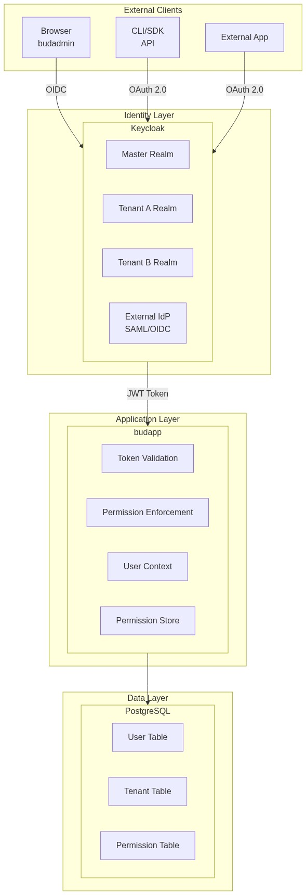
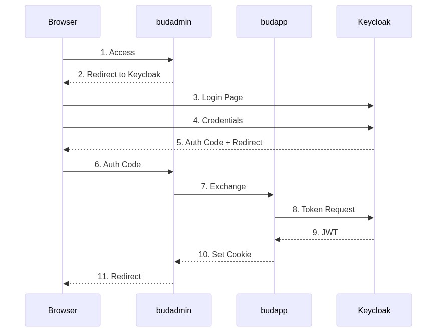
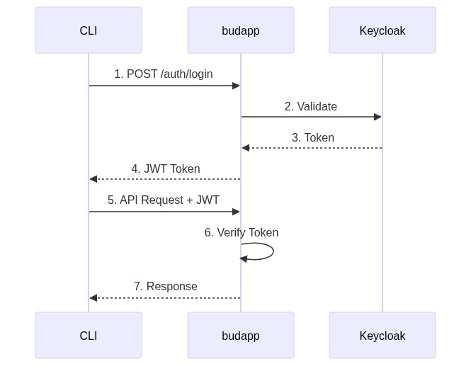

# IAM Architecture

---

## 1. Overview

Bud AI Foundry uses Keycloak as its identity provider with a multi-tenant architecture supporting:
- JWT-based authentication
- Role-based access control (RBAC)
- OAuth 2.0 / OpenID Connect protocols
- External IdP federation (Keycloak capability, not configured)
- Service-to-service authentication

---

## 2. Architecture Diagram

**Components:**
- **External Clients**: Browser (budadmin), CLI/SDK, External Apps
- **Identity Layer**: Keycloak with multi-tenant realms, External IdP federation
- **Application Layer**: budapp with token validation, permission enforcement
- **Data Layer**: PostgreSQL storing users, tenants, permissions

---

## 3. Identity Management

### 3.1 User Model

**Location:** `budapp/user_ops/models.py`

> **Note:** The Keycloak user ID is stored in the `auth_id` field (not `keycloak_id`).

### 3.2 Tenant Model

**Multi-tenancy Architecture:**

### 3.3 Role Definitions

**Location:** `budapp/commons/constants.py` - `UserRoleEnum`

| Role | Scope | Capabilities |
|------|-------|--------------|
| `SUPER_ADMIN` | Platform | Full platform access, tenant management |
| `ADMIN` | Tenant | Tenant settings, user management, all projects |
| `DEVELOPER` | Project | Project development, model deployment, API usage |
| `DEVOPS` | Tenant | Cluster management, infrastructure, deployments |
| `TESTER` | Project | Testing, benchmarks, model evaluation |

---

## 4. Authentication Flows

### 4.1 Web UI Authentication (Authorization Code Flow)

### 4.2 API Authentication (Direct Grant / Client Credentials)

### 4.3 Token Exchange (Cross-Tenant)

**Implementation:** `budapp/auth/token_exchange_service.py`

Used when a user needs to access resources in a different tenant:

---

## 5. Token Management

### 5.2 Token Validation

**Location:** `budapp/commons/dependencies.py`

### 5.3 Token Blacklisting

**Location:** `budapp/shared/jwt_blacklist_service.py`

### 5.4 Token Lifecycle

| Event | Access Token | Refresh Token | Blacklist |
|-------|--------------|---------------|-----------|
| Login | Created (5 min) | Created (30 min) | - |
| API Request | Validated | - | Checked |
| Refresh | New token | Rotated | Old added |
| Logout | - | - | Both added |
| Password Change | - | - | All user tokens |

---

## 6. Authorization

### 6.1 Permission Model

**Location:** `budapp/commons/constants.py` - `PermissionEnum`

The permission system uses a `resource:action` format with two primary scopes:

**Permission Scopes:**

| Scope | Description |
|-------|-------------|
| `view` | Read-only access to the resource |
| `manage` | Full control (create, update, delete) |
| `benchmark` | Execute benchmarks (model-specific) |
| `access` | Client API access |

### 6.2 Permission Enforcement

**Location:** `budapp/commons/permission_handler.py`

---

## 7. Service-to-Service Authentication

### 7.2 Internal API Token

**Location:** `budapp/commons/internal_auth.py`

---

## 8. External IdP Integration

### 8.1 SAML 2.0 (NOT CONFIGURED)

Keycloak supports SAML 2.0 identity provider federation:

| Setting | Value |
|---------|-------|
| Entity ID | `https://keycloak.example.com/realms/{realm}` |
| SSO URL | `https://keycloak.example.com/realms/{realm}/protocol/saml` |
| SLO URL | `https://keycloak.example.com/realms/{realm}/protocol/saml` |
| Certificate | Download from Keycloak admin |

### 8.2 OIDC Federation (NOT CONFIGURED)

For OIDC IdP integration:

### 8.3 User Attribute Mapping

| IdP Claim | Keycloak Attribute | User Field |
|-----------|-------------------|------------|
| email | email | email |
| given_name | firstName | first_name |
| family_name | lastName | last_name |
| groups | groups | role (mapped) |

---

## 9. Session Management

### 9.1 Session Configuration

| Parameter | Default | Description |
|-----------|---------|-------------|
| SSO Session Idle | 30 minutes | Idle timeout |
| SSO Session Max | 10 hours | Maximum session |
| Access Token Lifespan | 5 minutes | JWT validity |
| Refresh Token Lifespan | 30 minutes | Refresh validity |

### 9.2 Session Events

| Event | Action |
|-------|--------|
| Login | Create session, issue tokens |
| Idle Timeout | Require re-authentication |
| Max Lifetime | Force logout |
| Password Change | Invalidate all sessions |
| Admin Logout | Invalidate specific session |

---

## 10. Security Considerations

### 10.1 Implemented Controls

| Control | Implementation |
|---------|----------------|
| Token signature | RS256 with Keycloak keys |
| Token expiration | Short-lived access tokens |
| Token revocation | Blacklist via Dapr state |
| Credential encryption | AES-256 for client secrets |
| Session binding | JWT bound to session |

### 10.2 Known Limitations

| Gap | Risk | Mitigation |
|-----|------|------------|
| No MFA enforcement | Weak authentication | Enable MFA in Keycloak |
| No account lockout | Brute force | Configure in Keycloak |
| No session limits | Session hijacking | Add concurrent session limit |
| No IP binding | Token theft | Implement IP validation |

See `TECH_DEBT.md` for detailed tracking.
