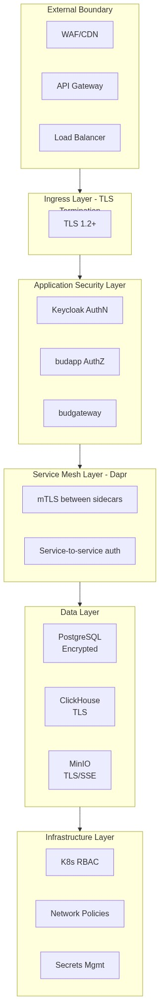
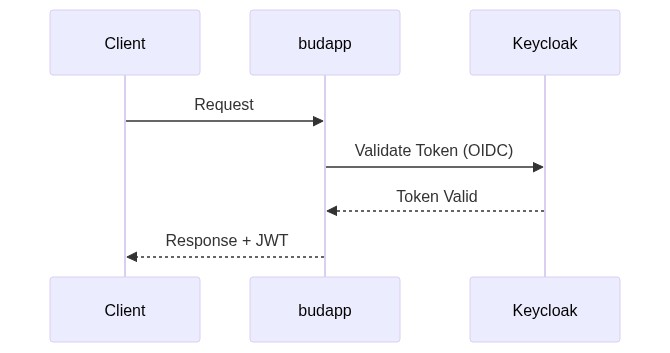
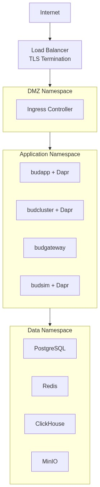

# Security Architecture Document

---

## 1. Executive Summary

Bud AI Foundry implements a defense-in-depth security architecture to protect AI/ML workloads across multi-cloud and on-premises deployments. This document describes the current security controls, authentication mechanisms, encryption standards, and security boundaries implemented in the platform.

**Key Security Capabilities:**
- Keycloak-based identity management with JWT authentication
- RSA/AES hybrid encryption for credential storage
- Role-based access control (RBAC) with tenant isolation
- Audit logging with record hashing (no hash chain)
- Network segmentation via Kubernetes namespaces (policies not enforced)
- TLS encryption for all service communication

---

## 2. Security Architecture Overview

### 2.1 Security Layers

### 2.2 Trust Boundaries

| Boundary | Description | Controls |
|----------|-------------|----------|
| External-to-Platform | Internet to platform ingress | TLS 1.2+, WAF, rate limiting |
| Service-to-Service | Inter-service communication | Dapr mTLS, service tokens |
| Platform-to-Cluster | Control plane to managed clusters | Kubeconfig encryption, mTLS |
| Service-to-Database | Application to data store | Connection encryption, credential rotation |

---

## 3. Identity and Access Management

### 3.1 Authentication Architecture

**Identity Provider:** Keycloak (self-hosted)

**Authentication Flows:**

| Flow | Use Case | Protocol |
|------|----------|----------|
| Authorization Code | Web UI login | OIDC/OAuth 2.0 |
| Direct Access Grant | API authentication | OAuth 2.0 Resource Owner |
| Client Credentials | Service-to-service | OAuth 2.0 Client Credentials |
| Token Exchange | Cross-tenant access | OAuth 2.0 Token Exchange |

**Token Configuration:**

| Parameter | Value | Location |
|-----------|-------|----------|
| Algorithm | RS256 | Keycloak realm settings |
| Access Token TTL | 5 minutes | Default, configurable |
| Refresh Token TTL | 30 minutes | Default, configurable |
| Token Validation | Signature + Claims | budapp/auth |

### 3.3 Token Blacklisting

**Implementation:** `budapp/shared/jwt_blacklist_service.py`

- Blacklisted tokens stored in Redis via Dapr state store
- TTL matches token expiration
- Checked on every authenticated request

### 3.4 Multi-Tenant Isolation

| Level | Implementation |
|-------|----------------|
| Authentication | Separate Keycloak realms per tenant |
| Authorization | Tenant ID in JWT claims, validated on all requests |
| Data | tenant_id foreign key on all tables |
| Resources | Namespace isolation in Kubernetes |

---

## 4. Authorization Model

### 4.1 Role-Based Access Control

**Implementation:** `budapp/permissions/`

**Built-in Roles:**

| Role | Scope | Capabilities |
|------|-------|--------------|
| SUPER_ADMIN | Platform | Full platform access |
| ADMIN | Tenant | Tenant management, all projects |
| DEVELOPER | Project | Project development, model deployment |
| DEVOPS | Tenant | Cluster management, infrastructure |
| TESTER | Project | Testing, benchmarks, model evaluation |

**Permission Model:**

### 4.2 Permission Enforcement

**Enforcement Points:**
1. API route decorators
2. Service layer checks
3. Database query filters (tenant scoping)

---

## 5. Encryption Architecture

### 5.1 Encryption at Rest

**Credentials Encryption (budapp):**

| Layer | Algorithm | Key Size | Implementation |
|-------|-----------|----------|----------------|
| Asymmetric | RSA-OAEP | 4096-bit | `budapp/commons/security.py:RSAHandler` |
| Symmetric | AES-256 (Fernet) | 256-bit | `budapp/commons/security.py:AESHandler` |
| Password Hashing | bcrypt | - | `budapp/commons/security.py:HashManager` |

**RSA Encryption Implementation:**

**Cluster Credentials (budcluster):**

| Data | Encryption | Storage |
|------|------------|---------|
| Kubeconfig | Dapr crypto component | PostgreSQL (encrypted blob) |
| Cloud credentials | Dapr crypto component | PostgreSQL (encrypted blob) |
| Secrets | Kubernetes Secrets | etcd (encrypted at rest) |

**Database Encryption:**

| Database | Encryption Method | Configuration |
|----------|-------------------|---------------|
| PostgreSQL | TDE (cloud) or pgcrypto | Provider-managed or self-managed |
| ClickHouse | Disk encryption | Configured in storage policy |
| MongoDB | Field-level encryption | Driver-side encryption |
| MinIO | Server-side encryption (SSE) | AES-256-GCM |

### 5.2 Encryption in Transit

| Connection | Protocol | Certificate |
|------------|----------|-------------|
| External → Ingress | TLS 1.2+ | Let's Encrypt or enterprise CA |
| Ingress → Services | TLS 1.2+ | Internal CA |
| Service → Service | mTLS (Dapr) | Auto-generated |
| Service → Database | TLS 1.2+ | Internal CA |

**Dapr mTLS Configuration:**

> **Implementation Note:** The configuration below shows the recommended mTLS settings. However, actual enablement has NOT been verified in the Helm chart deployments. The Dapr Configuration CRD exists but the `enabled: true` setting may not be deployed.

### 5.3 Key Management

**Current Implementation:**

| Key Type | Storage | Rotation |
|----------|---------|----------|
| RSA Private Key | File: `crypto-keys/rsa-private-key.pem` | Manual |
| AES Symmetric Key | File: `crypto-keys/symmetric-key-256` | Manual |
| Dapr Crypto Keys | Dapr component configuration | Manual |
| Database Credentials | Environment variables | Manual |

**Key Generation:**

---

## 6. Audit Logging

### 6.1 Audit Architecture

**Implementation:** `budapp/audit_ops/`

> **Note:** The model does NOT include `previous_hash` field. Each record is hashed individually, but there is no cryptographic chain linking records.

### 6.2 Record Hashing

> **Implementation Note:** Individual records are hashed for integrity verification, but there is NO hash chain mechanism. This means deletions cannot be detected cryptographically. See TECH_DEBT.md SEC-016, SEC-017.

### 6.3 Audited Events

| Category | Events |
|----------|--------|
| Authentication | LOGIN, LOGOUT, LOGIN_FAILED, TOKEN_REFRESH |
| User Management | CREATE_USER, UPDATE_USER, DELETE_USER |
| Project | CREATE_PROJECT, UPDATE_PROJECT, DELETE_PROJECT |
| Endpoint | CREATE_ENDPOINT, DEPLOY, UNDEPLOY, DELETE_ENDPOINT |
| Cluster | REGISTER_CLUSTER, UPDATE_CLUSTER, DELETE_CLUSTER |
| Model | ADD_MODEL, DEPLOY_MODEL, DELETE_MODEL |
| Permissions | GRANT_PERMISSION, REVOKE_PERMISSION |

### 6.4 Audit Log Protection

| Control | Implementation | **Status** |
|---------|----------------|------------|
| Immutability | SQLAlchemy event listener prevents UPDATE | **Partial** - DELETE not prevented |
| Integrity | SHA-256 record hashing | **Partial** - no hash chain |
| Availability | Database replication | Depends on deployment |
| Retention | Indefinite (no automated deletion) | Implemented |

> **Gap:** Records can be deleted at the database level. There is no hash chain to detect missing records. See TECH_DEBT.md SEC-016, SEC-017.

---

## 7. Network Security

### 7.1 Network Architecture

### 7.2 Service Communication Ports

| Service | Internal Port | External Access |
|---------|---------------|-----------------|
| budapp | 9081 | Via Ingress |
| budadmin | 8007 | Via Ingress |
| budgateway | 3333 | Via Ingress |
| budcluster | 9082 | Internal only |
| budsim | 9083 | Internal only |
| budmodel | 9084 | Internal only |
| budmetrics | 9085 | Internal only |
| Keycloak | 8080 | Via Ingress |
| PostgreSQL | 5432 | Internal only |
| Redis | 6379 | Internal only |
| ClickHouse | 8123/9000 | Internal only |

### 7.3 Network Policies

**Current State:** Network policies are **documented but not enforced**.

**Recommended Policy (not implemented):**

---

## 8. AI/ML Security

### 8.1 Model Security

| Control | Status | Implementation |
|---------|--------|----------------|
| Model provenance | Metadata only | budmodel stores source/version |
| Model integrity | Not implemented | No cryptographic verification |
| Model access control | Implemented | Via project permissions |
| Model scanning | Partial | Picklescanner for pickle files |

### 8.2 Inference Security

| Control | Status | Implementation |
|---------|--------|----------------|
| Input validation | Basic | JSON schema validation |
| Prompt injection protection | Not implemented | - |
| Output filtering | Not implemented | - |
| Rate limiting | Implemented | budgateway/src/rate_limit (Token Bucket, Sliding Window, Fixed Window algorithms) |
| Usage limits | Implemented | budgateway/src/usage_limit (token quota, cost-based limits) |
| Token quotas | Implemented | budapp/billing_ops |

### 8.3 Guardrails

**Implementation:** `budapp/guardrails/`

| Guardrail Type | Status |
|----------------|--------|
| Jailbreak detection | Configurable |
| PII detection | Configurable |
| Toxicity detection | Configurable |
| Custom rules | Configurable |

---

## 9. Secrets Management

### 9.1 Current Secret Types

| Secret | Storage | Access Method |
|--------|---------|---------------|
| Database credentials | Environment variables | Application config |
| API keys | PostgreSQL (encrypted) | budapp credential_ops |
| Service tokens | Dapr state store | Service invocation |
| TLS certificates | Kubernetes Secrets | Volume mounts |
| Encryption keys | File system | Application startup |

### 9.2 Secret Handling

**Application Secrets:**

**User Credentials:**

---

## 10. Security Monitoring

### 10.1 Security Events

| Event Type | Source | Destination |
|------------|--------|-------------|
| Authentication failures | budapp | Audit log |
| Permission denials | budapp | Audit log |
| API errors | All services | Loki |
| Network anomalies | Kubernetes | Prometheus |

### 10.2 Security Metrics

| Metric | Description | Alert Threshold |
|--------|-------------|-----------------|
| auth_failures_total | Failed login attempts | >10/min per user |
| permission_denied_total | Authorization failures | >50/min |
| api_errors_5xx | Server errors | >1% of requests |
| token_blacklist_size | Blacklisted tokens | Informational |

---

## 11. Compliance Considerations

### 11.1 Data Protection

| Requirement | Current Status |
|-------------|----------------|
| Encryption at rest | Implemented (credentials, configs) |
| Encryption in transit | Implemented (TLS, mTLS) |
| Data minimization | Not enforced |
| Right to deletion | Not automated |
| Data residency | Not enforced |

### 11.2 Access Controls

| Requirement | Current Status |
|-------------|----------------|
| Least privilege | Implemented via RBAC |
| Separation of duties | Partial (role-based) |
| Access logging | Implemented (audit trail) |
| Access reviews | Not automated |

---

## 12. Known Security Gaps

The following security controls are **not yet implemented** and tracked in TECH_DEBT.md:

| Gap | Risk | Reference |
|-----|------|-----------|
| No prompt injection protection | LLM attacks | SEC-001 |
| No secrets rotation | Credential compromise | SEC-003 |
| No network policy enforcement | Lateral movement | SEC-005 |
| No MFA option | Weak authentication | (Keycloak capability, not configured) |
| No vulnerability scanning in CI | Unpatched CVEs | SEC-009 |
| Audit hash chain not implemented | Deletion detection | SEC-016 |
| Audit DELETE not prevented | Record tampering | SEC-017 |
| Container security contexts not enforced | Privilege escalation | SEC-018 |
| Dapr mTLS not verified as enabled | Service auth uncertain | (Verify deployment) |

**Implemented:**
- Rate limiting: Implemented in budgateway (Token Bucket, Sliding Window, Fixed Window)
- Usage limits: Implemented in budgateway (token quota, cost-based limits)

See `docs/product/TECH_DEBT.md` for complete security debt tracking.
