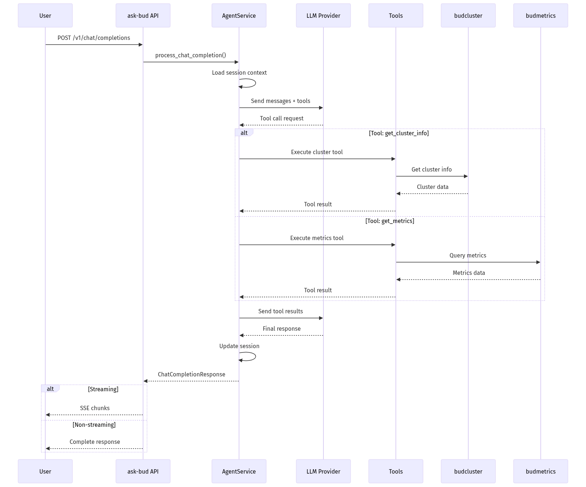

# ask-bud - Low-Level Design
---

## 1. Document Overview

### 1.1 Purpose

This LLD provides build-ready technical specifications for ask-bud, the AI assistant service of Bud AI Foundry. It enables natural language interaction for cluster analysis, performance troubleshooting, and platform guidance.

### 1.2 Scope

**In Scope:**
- Chat completion API (OpenAI-compatible)
- Cluster analysis and Q&A
- Performance troubleshooting
- Session management
- Tool integration (kubectl, cluster info)

**Out of Scope:**
- Cluster management operations (handled by budcluster)
- Model inference (handled by budgateway)
- Metrics collection (handled by budmetrics)

### 1.3 Intended Audience

| Audience | What They Need |
|----------|----------------|
| Developers | Chat API, tool integration |
| Operations | Troubleshooting capabilities |
| Users | Natural language interface |

---

## 2. System Context & Assumptions

### 2.1 Business Assumptions

- Users prefer natural language for cluster queries
- AI assistant augments but doesn't replace manual tools
- Context awareness improves response quality
- Integration with platform data enhances answers

### 2.2 Technical Assumptions

- LLM provider available (OpenAI, Anthropic, or local)
- PostgreSQL for session persistence
- Dapr for service invocation to other services
- Tool calling capability in LLM

### 2.3 External Dependencies

| Dependency | Type | Failure Impact | Fallback Strategy |
|------------|------|----------------|-------------------|
| LLM Provider | Required | No responses | Return error |
| PostgreSQL | Required | No sessions | Stateless mode |
| budcluster | Optional | Limited cluster info | Cache data |
| budmetrics | Optional | No live metrics | Historical data |

---

## 3. Detailed Architecture

### 3.1 Component Overview


### 3.2 Agent Capabilities

| Capability | Description | Tools Used |
|------------|-------------|------------|
| Cluster Status | Current cluster health | cluster_info |
| Node Analysis | Node resource usage | kubectl, metrics |
| Deployment Status | Model deployment info | cluster_info |
| Performance | Latency, throughput | metrics_query |
| Troubleshooting | Error diagnosis | logs, events |

---

## 4. Data Design

### 4.1 Chat Schemas

```python
class ChatMessage(BaseModel):
    role: Literal["system", "user", "assistant", "tool"]
    content: str

class ChatCompletionRequest(BaseModel):
    session_id: Optional[str] = None
    model: str
    messages: List[ChatMessage]
    stream: bool = False
    temperature: Optional[float] = Field(None, ge=0, le=2)

class ChatCompletionResponse(BaseModel):
    id: str
    object: Literal["chat.completion"] = "chat.completion"
    created: int
    model: str
    choices: List[Choice]
    usage: Optional[Dict[str, int]] = None

class Choice(BaseModel):
    index: int
    message: ChatMessage
    finish_reason: Literal["stop", "error"]
```

### 4.2 Session Context

```python
class SessionContext(BaseModel):
    registry: Any
    active_cluster: Optional[str] = None
```

---

## 5. API & Interface Design

### 5.1 POST /v1/chat/completions

**Purpose:** Process chat completion (OpenAI-compatible)

**Request:**
```json
{
  "session_id": "session-123",
  "model": "k8s-assistant",
  "messages": [
    {"role": "system", "content": "You are a helpful assistant."},
    {"role": "user", "content": "What's the status of cluster prod-west?"}
  ],
  "stream": false,
  "temperature": 0.7
}
```

**Response:**
```json
{
  "id": "chatcmpl-abc123",
  "object": "chat.completion",
  "created": 1705312800,
  "model": "k8s-assistant",
  "choices": [{
    "index": 0,
    "message": {
      "role": "assistant",
      "content": "Cluster prod-west is healthy with 5 nodes..."
    },
    "finish_reason": "stop"
  }],
  "usage": {
    "prompt_tokens": 50,
    "completion_tokens": 100,
    "total_tokens": 150
  }
}
```

### 5.2 Streaming Response

When `stream: true`, returns Server-Sent Events (SSE):
```
data: {"id":"chatcmpl-abc123","object":"chat.completion.chunk","created":1705312800,"model":"k8s-assistant","choices":[{"index":0,"delta":{"content":"Cluster"},"finish_reason":null}]}

data: {"id":"chatcmpl-abc123","object":"chat.completion.chunk","created":1705312800,"model":"k8s-assistant","choices":[{"index":0,"delta":{"content":" prod-west"},"finish_reason":null}]}

data: [DONE]
```

---

## 6. Logic & Algorithm Details

### 6.1 Chat Processing Flow



### 6.2 Tool Calling Pattern

```python
AVAILABLE_TOOLS = [
    {
        "name": "get_cluster_info",
        "description": "Get information about a cluster",
        "parameters": {
            "type": "object",
            "properties": {
                "cluster_id": {"type": "string"}
            }
        }
    },
    {
        "name": "get_metrics",
        "description": "Query performance metrics",
        "parameters": {
            "type": "object",
            "properties": {
                "cluster_id": {"type": "string"},
                "metric_name": {"type": "string"},
                "time_range": {"type": "string"}
            }
        }
    }
]
```

---

## 7. GenAI-Specific Design

### 7.1 LLM Integration

| Provider | Model | Use Case |
|----------|-------|----------|
| OpenAI | gpt-4 | Complex reasoning |
| Anthropic | claude-3 | Alternative |
| Local | llama-3 | Privacy-sensitive |

### 7.2 Context Management

- Max 20 messages in context window
- System prompt includes platform context
- Tool results appended to conversation

---

## 8. Configuration & Environment

### 8.1 Environment Variables

| Variable | Required | Default | Description |
|----------|----------|---------|-------------|
| DATABASE_URL | Yes | - | PostgreSQL connection |
| LLM_PROVIDER | Yes | openai | AI provider |
| LLM_MODEL | No | gpt-4 | Model to use |
| OPENAI_API_KEY | Conditional | - | If using OpenAI |
| MAX_CONTEXT_MESSAGES | No | 20 | History limit |
| STREAM_TIMEOUT | No | 60 | Streaming timeout |

---

## 9. Security Design

- API keys for LLM providers stored securely
- User messages not logged in detail
- Cluster credentials passed via session context

---

## 10. Performance & Scalability

### 10.1 Response Time

- Non-streaming: 2-10s depending on tool calls
- Streaming: First token <500ms

### 10.2 Scaling

- Horizontal: Multiple instances
- Session affinity for context

---

## 11. Error Handling & Logging

| Error | HTTP Code | Handling |
|-------|-----------|----------|
| No messages | 400 | Validation error |
| LLM timeout | 504 | Retry or error |
| Tool error | 200 | Include in response |

---

## 12. Deployment & Infrastructure

### 12.1 Resource Requirements

| Component | CPU | Memory |
|-----------|-----|--------|
| ask-bud | 500m-1 | 512Mi-1Gi |

---

## 13. Testing Strategy

- Unit tests for tool functions
- Integration tests with mock LLM
- E2E tests for chat flows

---

## 14. Limitations & Future Enhancements

### 14.1 Current Limitations

- Single LLM provider at a time
- Limited to text-based interaction
- No RAG integration yet

### 14.2 Planned Improvements

1. RAG for documentation lookup
2. Multi-modal support (images)
3. Proactive alerting
4. Voice interface

---

## 15. Appendix

### 15.1 Supported Models

```python
SUPPORTED_MODELS = [
    "k8s-assistant",
    "performance-analyzer",
    "troubleshooter"
]
```
