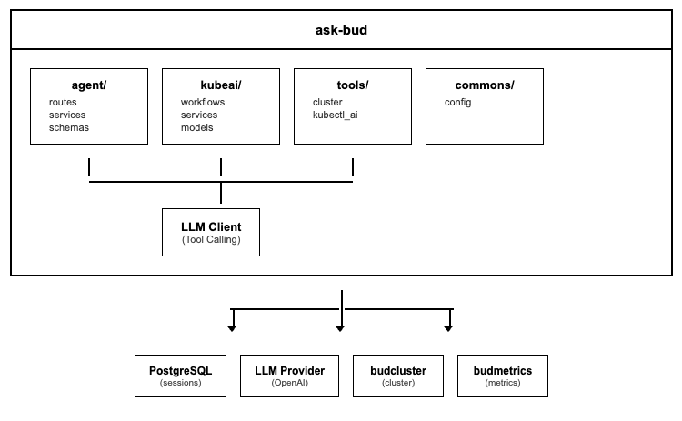

# ask-bud - Low-Level Design
---

## 1. Document Overview

### 1.1 Purpose

This LLD provides build-ready technical specifications for ask-bud, the AI assistant service of Bud AI Foundry. It enables natural language interaction for cluster analysis, performance troubleshooting, and platform guidance.

### 1.2 Scope

**In Scope:**
- Chat completion API (OpenAI-compatible)
- Cluster analysis and Q&A
- Performance troubleshooting
- Session management
- Tool integration (kubectl, cluster info)

**Out of Scope:**
- Cluster management operations (handled by budcluster)
- Model inference (handled by budgateway)
- Metrics collection (handled by budmetrics)

---

## 2. System Context & Assumptions

### 2.1 Business Assumptions

- Users prefer natural language for cluster queries
- AI assistant augments but doesn't replace manual tools
- Context awareness improves response quality
- Integration with platform data enhances answers

### 2.2 Technical Assumptions

- LLM provider available (OpenAI, Anthropic, or local)
- PostgreSQL for session persistence
- Dapr for service invocation to other services
- Tool calling capability in LLM

### 2.3 External Dependencies

| Dependency | Type | Failure Impact | Fallback Strategy |
|------------|------|----------------|-------------------|
| LLM Provider | Required | No responses | Return error |
| PostgreSQL | Required | No sessions | Stateless mode |
| budcluster | Optional | Limited cluster info | Cache data |
| budmetrics | Optional | No live metrics | Historical data |

---

## 3. Detailed Architecture

### 3.1 Component Overview

### 3.2 Agent Capabilities

| Capability | Description | Tools Used |
|------------|-------------|------------|
| Cluster Status | Current cluster health | cluster_info |
| Node Analysis | Node resource usage | kubectl, metrics |
| Deployment Status | Model deployment info | cluster_info |
| Performance | Latency, throughput | metrics_query |
| Troubleshooting | Error diagnosis | logs, events |

---

---

## 5. API & Interface Design

### 5.1 POST /v1/chat/completions

**Purpose:** Process chat completion (OpenAI-compatible)

### 5.2 Streaming Response

When `stream: true`, returns Server-Sent Events (SSE):

---

## 6. GenAI-Specific Design

### 6.1 LLM Integration

| Provider | Model | Use Case |
|----------|-------|----------|
| OpenAI | gpt-4 | Complex reasoning |
| Anthropic | claude-3 | Alternative |
| Local | llama-3 | Privacy-sensitive |

### 6.2 Context Management

- Max 20 messages in context window
- System prompt includes platform context
- Tool results appended to conversation

---

## 7. Configuration & Environment

### 7.1 Environment Variables

| Variable | Required | Default | Description |
|----------|----------|---------|-------------|
| DATABASE_URL | Yes | - | PostgreSQL connection |
| LLM_PROVIDER | Yes | openai | AI provider |
| LLM_MODEL | No | gpt-4 | Model to use |
| OPENAI_API_KEY | Conditional | - | If using OpenAI |
| MAX_CONTEXT_MESSAGES | No | 20 | History limit |
| STREAM_TIMEOUT | No | 60 | Streaming timeout |

---

## 8. Security Design

- API keys for LLM providers stored securely
- User messages not logged in detail
- Cluster credentials passed via session context

---

## 9. Performance & Scalability

### 9.1 Response Time

- Non-streaming: 2-10s depending on tool calls
- Streaming: First token <500ms

### 9.2 Scaling

- Horizontal: Multiple instances
- Session affinity for context

---

## 10. Deployment & Infrastructure

### 11.1 Resource Requirements

| Component | CPU | Memory |
|-----------|-----|--------|
| ask-bud | 500m-1 | 512Mi-1Gi |
