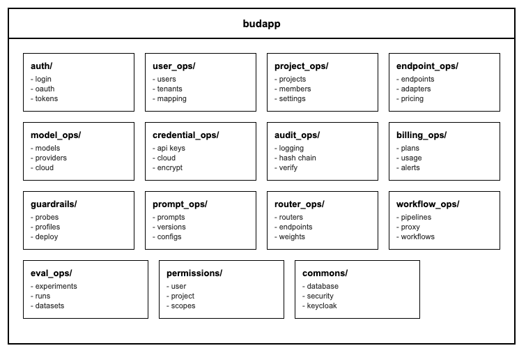
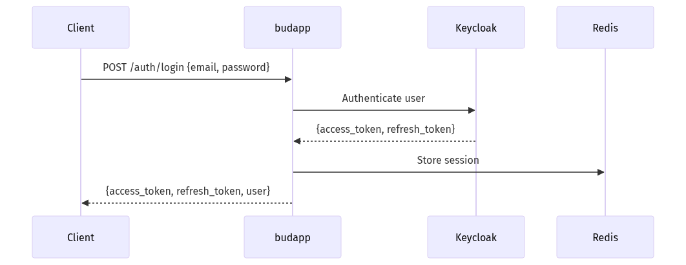
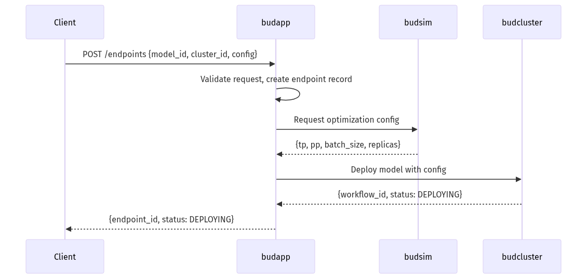
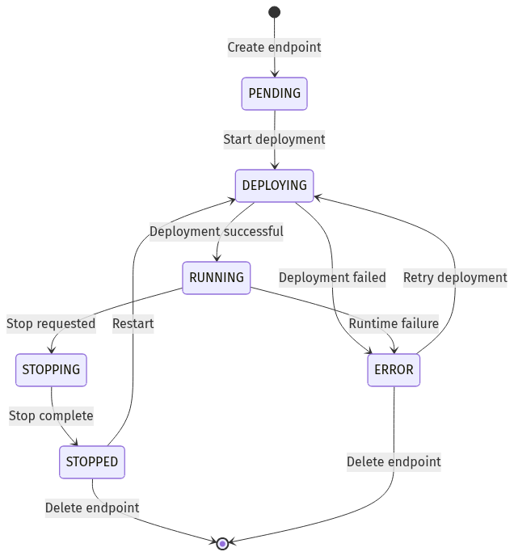
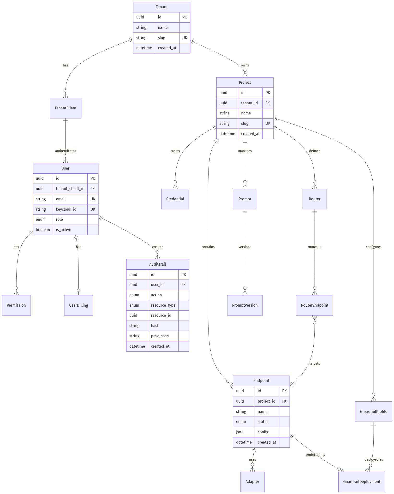

# budapp - Low-Level Design
---

## 1. Document Overview

### 1.1 Purpose

This LLD provides build-ready technical specifications for budapp, the core API service of Bud AI Foundry. Developers should be able to implement new features, debug issues, and extend functionality directly from this document with minimal assumptions.

### 1.2 Scope

**In Scope:**
- User authentication and session management via Keycloak
- Multi-tenant organization and project management
- Model endpoint lifecycle (create, configure, deploy, delete)
- Credential storage for cloud and proprietary providers
- Audit trail with tamper-proof hash chain
- Billing plan management and usage tracking
- Guardrail profile configuration and deployment
- Prompt versioning and management
- Request routing configuration
- Proxy routes to specialized services (budcluster, budpipeline, budeval)

**Out of Scope:**
- Actual model inference (handled by budgateway)
- Cluster provisioning logic (handled by budcluster)
- Performance optimization algorithms (handled by budsim)
- Time-series metrics storage (handled by budmetrics)

---

## 2. System Context & Assumptions

### 2.1 Business Assumptions

- Users operate within multi-tenant organizations with project-based isolation
- Each user belongs to one primary tenant but may have access to multiple
- Billing is user-centric with plan-based quotas (tokens, cost limits)
- Audit records must be immutable and verifiable for compliance

### 2.2 Technical Assumptions

- Keycloak is always available for authentication (critical dependency)
- PostgreSQL provides ACID guarantees for all transactional data
- Dapr sidecar is co-located with every budapp instance
- Redis/Valkey is available for session caching and pub/sub
- All inter-service communication uses Dapr service invocation

### 2.3 Constraints

| Constraint Type | Description | Impact |
|-----------------|-------------|--------|
| Latency | API responses < 500ms for CRUD operations | Use caching for frequently accessed data |
| Memory | Service runs in 256MB-1GB pods | Limit in-memory caching, stream large responses |
| Security | Credentials must be encrypted at rest | RSA/AES encryption for all sensitive data |
| Compliance | Audit records must be tamper-evident | SHA256 hash chain for audit trail |

### 2.4 External Dependencies

| Dependency | Type | Failure Impact | Fallback Strategy |
|------------|------|----------------|-------------------|
| Keycloak | Required | No authentication, all requests fail | Return 503, queue requests |
| PostgreSQL | Required | No data persistence | Return 503, no fallback |
| Redis/Valkey | Optional | No session cache, slower auth | Fall back to DB for sessions |
| budcluster | Optional | Cannot deploy/manage clusters | Return partial data, queue operations |
| budsim | Optional | Cannot optimize deployments | Use default configurations |
| budpipeline | Optional | Cannot execute workflows | Return error, manual retry |
| budmodel | Optional | Cannot fetch model metadata | Use cached data |
| budmetrics | Optional | No usage sync | Queue sync operations |
| budnotify | Optional | No notifications sent | Queue notifications |

---

## 3. Detailed Architecture

### 3.1 Component Overview

#### 3.2.1 Authentication Module (`auth/`)

| Property | Value |
|----------|-------|
| **Responsibility** | Handle user authentication, OAuth flows, and JWT token management |
| **Owner Module** | `budapp/auth/` |

**Inputs:**

| Input | Source | Format | Validation |
|-------|--------|--------|------------|
| Login credentials | HTTP POST `/auth/login` | `{email, password}` | Email format, password min length |
| OAuth callback | HTTP GET `/auth/oauth/callback` | Query params `code`, `state` | State token verification |
| Refresh token | HTTP POST `/auth/refresh` | `{refresh_token}` | Token signature, expiry |

**Outputs:**

| Output | Destination | Format | Guarantees |
|--------|-------------|--------|------------|
| Access token | HTTP response | JWT | Valid for 15 minutes |
| Refresh token | HTTP response | JWT | Valid for 7 days |
| User session | Redis via Dapr | JSON | TTL matches token expiry |

**Internal Sub-modules:**
- `auth_routes.py` - Login, logout, session endpoints
- `oauth_routes.py` - OAuth 2.0 / OIDC flows
- `token.py` - JWT creation and validation
- `services.py` - User authentication logic

**Error Handling:**

| Error Condition | Response | Recovery |
|-----------------|----------|----------|
| Invalid credentials | 401 Unauthorized | User retries with correct credentials |
| Expired token | 401 Unauthorized | Client uses refresh token |
| Keycloak unavailable | 503 Service Unavailable | Retry with exponential backoff |

**Scalability:**
- Horizontal: Yes, stateless with Redis session store
- Vertical: Low memory footprint, CPU-bound during token validation
- Bottlenecks: Keycloak JWKS endpoint calls (mitigated by caching public keys)

#### 3.2.2 Audit Module (`audit_ops/`)

| Property | Value |
|----------|-------|
| **Responsibility** | Create immutable audit records with hash chain for tamper detection |
| **Owner Module** | `budapp/audit_ops/` |

**Inputs:**

| Input | Source | Format | Validation |
|-------|--------|--------|------------|
| Audit event | Internal service calls | `AuditRecordCreate` schema | Required fields present |
| Query filters | HTTP GET `/audit` | Query params | Date range, resource type |

**Outputs:**

| Output | Destination | Format | Guarantees |
|--------|-------------|--------|------------|
| Audit record | PostgreSQL | `audit_trail` table | Immutable, hash-chained |
| Verification result | HTTP response | Boolean + details | Cryptographic verification |

**Internal Sub-modules:**
- `audit_routes.py` - Audit record retrieval, export, verify
- `audit_logger.py` - Async audit logging service
- `hash_utils.py` - SHA256 hash chain implementation
- `models.py` - AuditTrail SQLAlchemy model

**Error Handling:**

| Error Condition | Response | Recovery |
|-----------------|----------|----------|
| Hash chain broken | Verification returns tampered records | Manual investigation required |
| Write failure | 500 Internal Error | Retry with same record |

**Scalability:**
- Horizontal: Yes, audit writes are append-only
- Vertical: Memory increases with batch verification
- Bottlenecks: Hash verification of large audit ranges

#### 3.2.3 Billing Module (`billing_ops/`)

| Property | Value |
|----------|-------|
| **Responsibility** | Manage billing plans, track usage, enforce quotas, trigger alerts |
| **Owner Module** | `budapp/billing_ops/` |

**Inputs:**

| Input | Source | Format | Validation |
|-------|--------|--------|------------|
| Usage data | budmetrics via Dapr | Token counts | Positive integers |
| Plan assignment | HTTP POST `/billing/assign` | `{user_id, plan_id}` | Valid UUIDs |
| Alert thresholds | HTTP POST `/billing/alerts` | Percentage values | 0-100 range |

**Outputs:**

| Output | Destination | Format | Guarantees |
|--------|-------------|--------|------------|
| Usage summary | HTTP response | JSON with totals | Eventually consistent |
| Alert notifications | budnotify via Dapr | Event payload | At-least-once delivery |
| Suspension status | User record | Boolean flag | Immediate enforcement |

**Internal Sub-modules:**
- `routes.py` - Billing endpoints
- `usage_sync.py` - Periodic sync from budmetrics
- `services.py` - Quota enforcement, alert triggering

**Error Handling:**

| Error Condition | Response | Recovery |
|-----------------|----------|----------|
| Usage sync failure | Log warning, retry | Background job retries |
| Over-quota request | 429 Too Many Requests | User upgrades plan or waits |

**Scalability:**
- Horizontal: Yes, usage counters in Redis
- Vertical: Memory for batch usage aggregation
- Bottlenecks: High-frequency usage updates
#### 3.3.1 User Authentication - Happy Path

#### 3.3.2 User Authentication - Failure Path

#### 3.3.3 Endpoint Deployment Flow

#### 3.3.4 Endpoint State Diagram

---

## 4. Data Design
#### 4.1.1 Tenant

**Table:** `tenant`

| Column | Type | Constraints | Description |
|--------|------|-------------|-------------|
| `id` | UUID | PK, NOT NULL | Primary identifier |
| `name` | VARCHAR(255) | NOT NULL | Tenant display name |
| `alias` | VARCHAR(100) | UNIQUE, NOT NULL | URL-safe alias |
| `type` | ENUM | NOT NULL | ENTERPRISE, TEAM, INDIVIDUAL |
| `status` | ENUM | NOT NULL | ACTIVE, INACTIVE |
| `settings` | JSONB | NULL | Configuration options |
| `created_at` | TIMESTAMP(tz) | NOT NULL | Creation timestamp |
| `updated_at` | TIMESTAMP(tz) | NOT NULL | Last modification |

**Indexes:**

| Index Name | Columns | Type | Purpose |
|------------|---------|------|---------|
| `ix_tenant_alias` | `alias` | B-tree | Fast lookup by alias |
| `ix_tenant_status` | `status` | B-tree | Filter active tenants |

#### 4.1.2 User

**Table:** `user`

| Column | Type | Constraints | Description |
|--------|------|-------------|-------------|
| `id` | UUID | PK, NOT NULL | Primary identifier |
| `auth_id` | UUID | UNIQUE, NOT NULL | Keycloak user ID |
| `tenant_id` | UUID | FK, NOT NULL | Parent tenant |
| `client_id` | UUID | FK, NOT NULL | OAuth client |
| `name` | VARCHAR(255) | NOT NULL | Display name |
| `email` | VARCHAR(255) | UNIQUE, NOT NULL | Email address |
| `status` | ENUM | NOT NULL | ACTIVE, PENDING, INACTIVE |
| `is_admin` | BOOLEAN | NOT NULL, DEFAULT FALSE | Admin flag |
| `email_verified` | BOOLEAN | NOT NULL | Email verified |
| `created_at` | TIMESTAMP(tz) | NOT NULL | Creation timestamp |
| `updated_at` | TIMESTAMP(tz) | NOT NULL | Last modification |

**Indexes:**

| Index Name | Columns | Type | Purpose |
|------------|---------|------|---------|
| `ix_user_email` | `email` | B-tree | Fast lookup by email |
| `ix_user_auth_id` | `auth_id` | B-tree | Keycloak ID lookup |
| `ix_user_tenant_id` | `tenant_id` | B-tree | List users by tenant |

#### 4.1.3 Project

**Table:** `project`

| Column | Type | Constraints | Description |
|--------|------|-------------|-------------|
| `id` | UUID | PK, NOT NULL | Primary identifier |
| `name` | VARCHAR(255) | NOT NULL | Project name |
| `tenant_id` | UUID | FK, NOT NULL | Parent tenant |
| `description` | TEXT | NULL | Project description |
| `status` | ENUM | NOT NULL | ACTIVE, DELETED |
| `tags` | JSONB | NULL | Metadata tags |
| `created_at` | TIMESTAMP(tz) | NOT NULL | Creation timestamp |
| `updated_at` | TIMESTAMP(tz) | NOT NULL | Last modification |

**Indexes:**

| Index Name | Columns | Type | Purpose |
|------------|---------|------|---------|
| `ix_project_tenant_id` | `tenant_id` | B-tree | List projects by tenant |
| `ix_project_status` | `status` | B-tree | Filter active projects |

#### 4.1.4 Endpoint

**Table:** `endpoint`

| Column | Type | Constraints | Description |
|--------|------|-------------|-------------|
| `id` | UUID | PK, NOT NULL | Primary identifier |
| `name` | VARCHAR(255) | NOT NULL | Endpoint name |
| `project_id` | UUID | FK, NOT NULL | Parent project |
| `model_id` | UUID | FK, NOT NULL | Model reference |
| `cloud_model_id` | UUID | FK, NULL | Cloud model (if cloud-hosted) |
| `cluster_id` | UUID | FK, NULL | Target cluster (if self-hosted) |
| `credential_id` | UUID | FK, NULL | Provider credential |
| `user_id` | UUID | FK, NOT NULL | Creator |
| `status` | ENUM | NOT NULL | PENDING, DEPLOYING, RUNNING, ERROR, STOPPED |
| `endpoint_type` | ENUM | NOT NULL | SELF_HOSTED, CLOUD_HOSTED |
| `inference_config` | JSONB | NULL | Runtime config (TP, PP, batch) |
| `pricing` | JSONB | NULL | Pricing configuration |
| `tags` | JSONB | NULL | Metadata tags |
| `created_at` | TIMESTAMP(tz) | NOT NULL | Creation timestamp |
| `updated_at` | TIMESTAMP(tz) | NOT NULL | Last modification |

**Indexes:**

| Index Name | Columns | Type | Purpose |
|------------|---------|------|---------|
| `ix_endpoint_project_id` | `project_id` | B-tree | List endpoints by project |
| `ix_endpoint_status` | `status` | B-tree | Filter by status |
| `ix_endpoint_user_id` | `user_id` | B-tree | List user's endpoints |

#### 4.1.5 AuditTrail

**Table:** `audit_trail`

| Column | Type | Constraints | Description |
|--------|------|-------------|-------------|
| `id` | UUID | PK, NOT NULL | Primary identifier |
| `user_id` | UUID | FK, NULL | Acting user (null for system) |
| `actioned_by` | UUID | FK, NULL | Admin acting on behalf |
| `action` | VARCHAR(50) | NOT NULL | CREATE, UPDATE, DELETE, etc. |
| `resource_type` | VARCHAR(50) | NOT NULL | PROJECT, ENDPOINT, USER, etc. |
| `resource_id` | UUID | NOT NULL | Affected resource ID |
| `resource_name` | VARCHAR(255) | NULL | Human-readable name |
| `timestamp` | TIMESTAMP(tz) | NOT NULL | Event timestamp |
| `details` | JSONB | NULL | Additional context |
| `ip_address` | VARCHAR(45) | NULL | Client IP |
| `previous_state` | JSONB | NULL | State before change |
| `new_state` | JSONB | NULL | State after change |
| `record_hash` | VARCHAR(64) | NOT NULL | SHA256 hash for integrity |
| `created_at` | TIMESTAMP(tz) | NOT NULL | Record creation time |

**Indexes:**

| Index Name | Columns | Type | Purpose |
|------------|---------|------|---------|
| `ix_audit_user_id` | `user_id` | B-tree | Filter by user |
| `ix_audit_resource` | `resource_type, resource_id` | B-tree | Filter by resource |
| `ix_audit_timestamp` | `timestamp` | B-tree | Time-based queries |

**Note:** SQLAlchemy event listener prevents UPDATE/DELETE operations on this table.

#### 4.1.6 Entity Relationship Diagram

#### 4.2.1 Data Lifecycle

| Stage | Location | Retention | Transition Trigger |
|-------|----------|-----------|-------------------|
| Created | PostgreSQL | Indefinite | User/system action |
| Active | PostgreSQL | While in use | Status change |
| Soft-deleted | PostgreSQL (status=DELETED) | 30 days | User deletion |
| Archived | PostgreSQL | Per compliance policy | Age > retention period |
| Purged | Removed | N/A | Retention policy expiry |

#### 4.2.2 Read/Write Paths

**Write Path:**

**Read Path:**

#### 4.2.3 Caching Strategy

| Cache Layer | Technology | TTL | Invalidation Strategy |
|-------------|------------|-----|----------------------|
| Session cache | Redis (via Dapr) | Token lifetime | On logout, token refresh |
| User profile | Redis | 5 minutes | On user update |
| Model metadata | Redis | 1 hour | On model registry sync |
| Billing quotas | Redis | 1 minute | On usage update |

---

## 5. API & Interface Design
#### 5.1.1 Authentication

**`POST /auth/login`**

| Property | Value |
|----------|-------|
| **Description** | Authenticate user with email and password |
| **Authentication** | None (public endpoint) |
| **Rate Limit** | 10 requests/minute per IP |
| **Timeout** | 10 seconds |

**Response (Error):**

| Status Code | Error Code | Description | Retry? |
|-------------|------------|-------------|--------|
| 400 | `VALIDATION_ERROR` | Invalid email format | No |
| 401 | `INVALID_CREDENTIALS` | Wrong email or password | No |
| 429 | `RATE_LIMITED` | Too many attempts | Yes, after cooldown |
| 503 | `SERVICE_UNAVAILABLE` | Keycloak unavailable | Yes |

#### 5.1.2 Endpoints

**`POST /endpoints`**

| Property | Value |
|----------|-------|
| **Description** | Create and deploy a new model endpoint |
| **Authentication** | JWT Bearer token |
| **Rate Limit** | 10 requests/minute per user |
| **Timeout** | 30 seconds |

**Response (Error):**

| Status Code | Error Code | Description | Retry? |
|-------------|------------|-------------|--------|
| 400 | `VALIDATION_ERROR` | Invalid configuration | No |
| 404 | `NOT_FOUND` | Project, model, or cluster not found | No |
| 409 | `CONFLICT` | Endpoint name already exists | No |
| 500 | `INTERNAL_ERROR` | Deployment failed to start | Yes |
#### 5.2.1 Keycloak

| Property | Value |
|----------|-------|
| **Purpose** | User authentication, token validation, SSO |
| **Auth Mechanism** | OIDC / OAuth 2.0 |
| **Rate Limits** | 100 requests/second |
| **SLA** | 99.9% availability |

**Failure Fallback:**
- Cache JWKS public keys for up to 1 hour
- Return 503 for login attempts
- Existing sessions remain valid until token expiry

#### 5.2.2 budcluster

| Property | Value |
|----------|-------|
| **Purpose** | Cluster management, model deployment |
| **Auth Mechanism** | Dapr API token |
| **Rate Limits** | No limit (internal service) |
| **SLA** | Best effort |

**Failure Fallback:**
- Queue deployment requests
- Return partial endpoint data
- Poll for status recovery

---

## 6. Security Design

### 6.1 Authentication

| Flow | Mechanism | Token Lifetime | Refresh Strategy |
|------|-----------|----------------|------------------|
| User login | JWT via Keycloak | 15 minutes | Refresh token (7 days) |
| Service-to-service | Dapr API token | Indefinite | Manual rotation |
| Internal API | APP_API_TOKEN header | Indefinite | Manual rotation |

### 6.2 Authorization

| Resource | Permission Model | Enforcement Point |
|----------|------------------|-------------------|
| Projects | RBAC (owner, member) | Route middleware |
| Endpoints | Project membership | Route middleware |
| Audit records | Admin only | Route middleware |
| Billing | Self + admin | Route middleware |

### 6.3 Encryption

| Data Type | At Rest | In Transit | Key Management |
|-----------|---------|------------|----------------|
| Passwords | Keycloak managed (bcrypt) | TLS 1.3 | Keycloak internal |
| API credentials | AES-256-GCM | TLS 1.3 | Dapr secret store |
| Cloud credentials | RSA + AES hybrid | TLS 1.3 | budcluster crypto-keys |
| Session data | Plaintext in Redis | TLS 1.3 | N/A |

### 6.4 Input Validation

| Input | Validation Rules | Sanitization |
|-------|------------------|--------------|
| Email | RFC 5322 format | Lowercase, trim |
| UUID | UUID v4 format | None |
| Names | 1-255 chars, no special chars | Trim whitespace |
| JSON config | Schema validation | None |

### 6.5 Threat Model (Basic)

| Threat | Likelihood | Impact | Mitigation |
|--------|------------|--------|------------|
| Credential stuffing | High | High | Rate limiting, MFA via Keycloak |
| SQL injection | Low | Critical | Parameterized queries (SQLAlchemy) |
| XSS | Medium | Medium | JSON-only responses, no HTML |
| Audit tampering | Low | High | Hash chain, immutable records |
| Token theft | Medium | High | Short-lived tokens, HTTPS only |

---

## 7. Performance & Scalability

### 7.1 Expected Load

| Metric | Normal | Peak | Burst |
|--------|--------|------|-------|
| Requests/sec | 50 | 200 | 500 |
| Concurrent users | 100 | 500 | 1000 |
| Database connections | 10 | 50 | 100 |

### 7.2 Bottlenecks

| Bottleneck | Trigger Condition | Symptom | Mitigation |
|------------|-------------------|---------|------------|
| Database connections | > 80% pool used | Slow queries, timeouts | Increase pool, add replicas |
| Keycloak latency | Token validation spike | Auth delays | Cache JWKS, reduce validation |
| Audit writes | High activity burst | Write queue grows | Batch inserts, async processing |

### 7.3 Caching Strategy

| Cache | Hit Rate Target | Eviction Policy | Warming Strategy |
|-------|-----------------|-----------------|------------------|
| Session | 99% | TTL (token expiry) | On login |
| User profile | 90% | TTL (5 min) | On first access |
| JWKS public keys | 99% | TTL (1 hour) | On startup |

### 7.4 Concurrency Handling

| Resource | Concurrency Model | Lock Strategy | Deadlock Prevention |
|----------|-------------------|---------------|---------------------|
| Database | Connection pool | Row-level locks | Timeout + retry |
| Redis | Single-threaded | Atomic operations | N/A |
| Audit chain | Sequential writes | Advisory lock | Single writer |

### 7.5 Scaling Strategy

| Dimension | Trigger | Target | Cooldown |
|-----------|---------|--------|----------|
| Horizontal (pods) | CPU > 70% for 2 min | 2-10 replicas | 5 minutes |
| Database read replicas | Read latency > 100ms | 1-3 replicas | Manual |

---

## 8. Deployment & Infrastructure

### 9.2 Container Specification

| Property | Value |
|----------|-------|
| Base Image | `python:3.11-slim` |
| Resource Requests | CPU: 100m, Memory: 256Mi |
| Resource Limits | CPU: 500m, Memory: 512Mi |
| Health Checks | Liveness: `/health`, Readiness: `/ready` |

### 9.3 CI/CD Pipeline

| Stage | Trigger | Actions | Rollback |
|-------|---------|---------|----------|
| Build | Push to branch | Lint, test, build image | N/A |
| Test | PR created | Integration tests | N/A |
| Deploy (staging) | Merge to main | Helm upgrade | `helm rollback` |
| Deploy (prod) | Manual approval | Blue-green deploy | Switch to blue |

### 9.4 Rollback Strategy

| Scenario | Detection | Rollback Method | Recovery Time |
|----------|-----------|-----------------|---------------|
| Failed deployment | Health checks fail | Kubernetes rollback | < 2 minutes |
| Performance degradation | P99 > threshold | Manual rollback | < 5 minutes |
| Data corruption | Monitoring alerts | Restore from backup | < 30 minutes |
