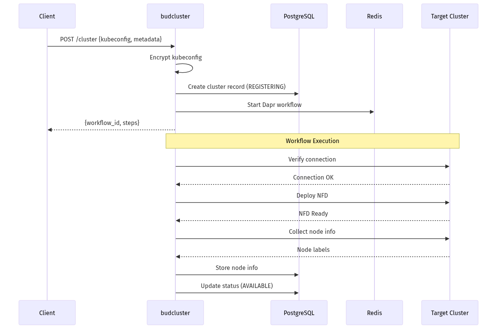
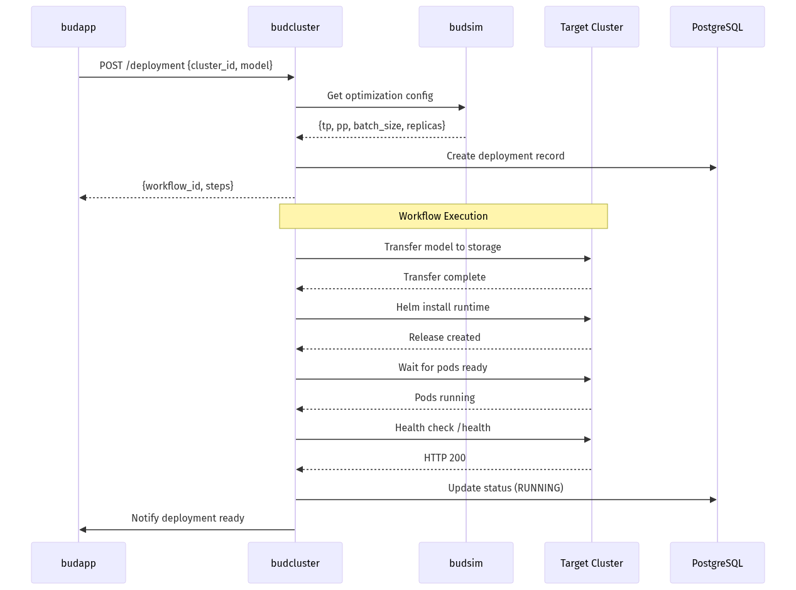
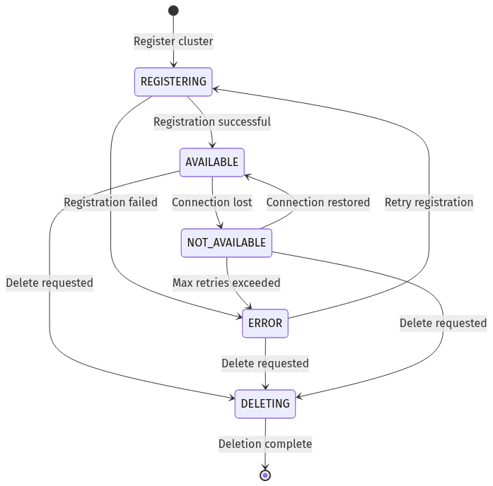
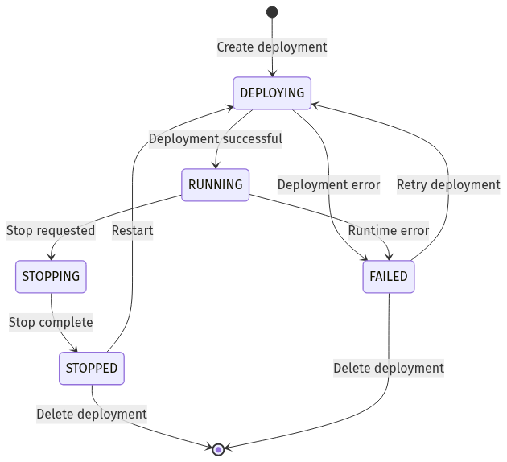
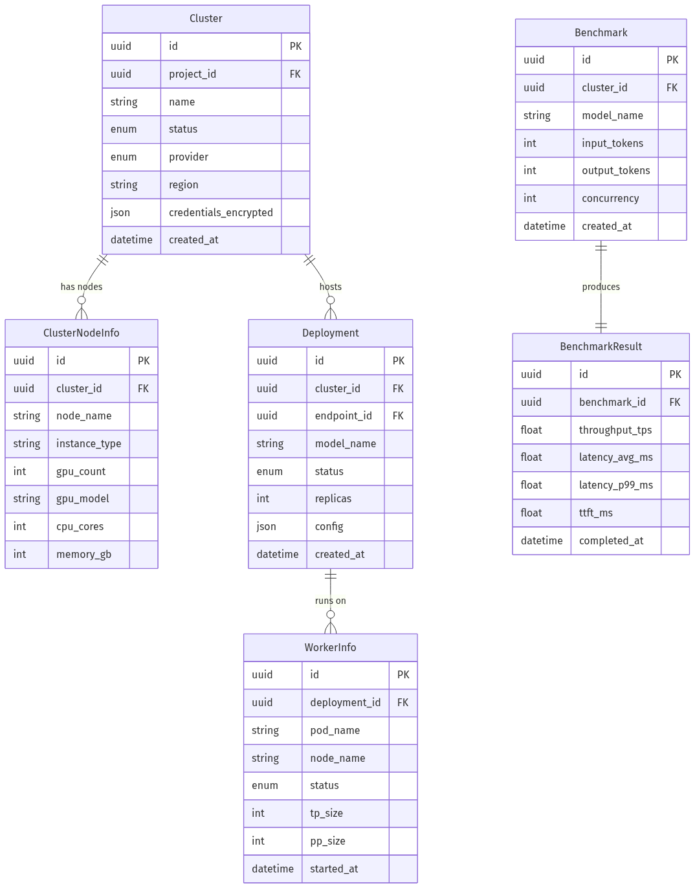

# budcluster - Low-Level Design
---

## 1. Document Overview

### 1.1 Purpose

This LLD provides build-ready technical specifications for budcluster, the cluster lifecycle and model deployment service of Bud AI Foundry. Developers should be able to implement cluster provisioning, model deployment, and infrastructure management features directly from this document.

### 1.2 Scope

**In Scope:**
- Kubernetes/OpenShift cluster registration and lifecycle management
- Multi-cloud cluster provisioning (AWS EKS, Azure AKS, on-premises)
- AI model deployment orchestration to clusters
- Node Feature Discovery (NFD) for hardware detection
- GPU time-slicing integration
- Worker/pod lifecycle management
- Performance benchmarking
- Cluster health monitoring
- Credential encryption and secure storage

**Out of Scope:**
- Model inference execution (handled by budgateway)
- Performance optimization algorithms (handled by budsim)
- Model registry metadata (handled by budmodel)
- User authentication (handled by budapp)

---

## 2. System Context & Assumptions

### 2.1 Business Assumptions

- Users deploy AI models ranging from 7B to 1T+ parameters
- Clusters can be managed (cloud-provisioned) or unmanaged (on-premises)
- Hardware varies: NVIDIA GPUs, Intel Gaudi HPUs, CPU-only
- Multiple deployments per cluster are common
- Benchmark data is critical for optimization decisions

### 2.2 Technical Assumptions

- Kubernetes clusters have API server accessible from budcluster
- NFD can be deployed to all clusters for hardware detection
- Helm is available for all Kubernetes deployments
- Dapr sidecar is co-located with budcluster pods
- Redis/Valkey is available for workflow state management

### 2.3 Constraints

| Constraint Type | Description | Impact |
|-----------------|-------------|--------|
| Network | Cluster API must be reachable | VPN/tunnel may be required |
| Timeout | NFD detection timeout: 30s default | Configurable via env var |
| Security | Credentials encrypted at rest | RSA/AES encryption required |
| Hardware | GPU availability varies | NFD detection required |

### 2.4 External Dependencies

| Dependency | Type | Failure Impact | Fallback Strategy |
|------------|------|----------------|-------------------|
| Target Clusters | Required | Cannot deploy/manage | Return error, retry later |
| PostgreSQL | Required | No data persistence | Return 503 |
| Redis/Valkey | Required | No workflow state | Workflows fail |
| budsim | Optional | No optimization | Use default configs |
| budapp | Optional | No endpoint updates | Queue status updates |
| budnotify | Optional | No notifications | Log warnings |
| budmodel | Optional | No model metadata | Use cached data |

---

## 3. Detailed Architecture

### 3.1 Component Overview

#### 3.2.1 Cluster Operations Module (`cluster_ops/`)

| Property | Value |
|----------|-------|
| **Responsibility** | Manage cluster lifecycle: registration, deletion, health checks, node status |
| **Owner Module** | `budcluster/cluster_ops/` |

**Inputs:**

| Input | Source | Format | Validation |
|-------|--------|--------|------------|
| Cluster config | HTTP POST `/cluster` | YAML kubeconfig + JSON metadata | Valid YAML, reachable API |
| Cluster ID | HTTP requests | UUID | Exists in database |
| Health checks | HTTP GET `/cluster/{id}/health` | Query params | Valid check types |

**Outputs:**

| Output | Destination | Format | Guarantees |
|--------|-------------|--------|------------|
| Workflow ID | HTTP response | UUID | Workflow trackable |
| Cluster status | PostgreSQL | Enum | Persisted |
| Node info | PostgreSQL | JSONB | Updated periodically |

**Internal Sub-modules:**
- `routes.py` - Cluster CRUD endpoints
- `services.py` - Business logic for cluster operations
- `workflows.py` - Dapr workflows for cluster provisioning
- `crud.py` - Database operations
- `models.py` - SQLAlchemy models (Cluster, ClusterNodeInfo)
- `nfd_handler.py` - NFD deployment and parsing

**Error Handling:**

| Error Condition | Response | Recovery |
|-----------------|----------|----------|
| Cluster unreachable | 503, mark ERROR status | Retry with backoff |
| Invalid kubeconfig | 400 Bad Request | User corrects config |
| NFD timeout | Warning, continue | Use fallback detection |
| Workflow failure | 500, log details | Manual retry |

**Scalability:**
- Horizontal: Yes, stateless with workflow state in Redis
- Vertical: Memory for large cluster node lists
- Bottlenecks: Concurrent cluster operations limited by Kubernetes API

#### 3.2.2 Deployment Module (`deployment/`)

| Property | Value |
|----------|-------|
| **Responsibility** | Deploy AI models to clusters, manage workers, handle autoscaling |
| **Owner Module** | `budcluster/deployment/` |

**Inputs:**

| Input | Source | Format | Validation |
|-------|--------|--------|------------|
| Deployment request | HTTP POST `/deployment` | DeploymentCreateRequest | Valid cluster, model |
| Worker filters | HTTP GET `/deployment/worker-info` | Query params | Valid cluster, namespace |
| Autoscale config | HTTP PUT `/deployment/autoscale` | UpdateAutoscaleRequest | Valid ranges |

**Outputs:**

| Output | Destination | Format | Guarantees |
|--------|-------------|--------|------------|
| Workflow ID | HTTP response | UUID | Workflow trackable |
| Worker info | HTTP response | WorkerInfoResponse | Paginated |
| Deployment status | PostgreSQL | Enum | Updated via periodic job |

**Internal Sub-modules:**
- `routes.py` - Deployment and worker endpoints
- `services.py` - Deployment orchestration logic
- `models.py` - WorkerInfo, Deployment models
- `utils.py` - Helm operations, resource calculations
- `quantization_workflows.py` - Model quantization handling

**Error Handling:**

| Error Condition | Response | Recovery |
|-----------------|----------|----------|
| Insufficient resources | 400, resource details | User scales cluster |
| Deployment failed | 500, pod logs | Check logs, retry |
| Worker unhealthy | Status update | Automatic pod restart |

**Scalability:**
- Horizontal: Yes, workflows are distributed
- Vertical: Memory for worker info aggregation
- Bottlenecks: Helm operations, model transfer

#### 3.2.3 Benchmark Operations Module (`benchmark_ops/`)

| Property | Value |
|----------|-------|
| **Responsibility** | Execute performance benchmarks, store results, compare configurations |
| **Owner Module** | `budcluster/benchmark_ops/` |

**Inputs:**

| Input | Source | Format | Validation |
|-------|--------|--------|------------|
| Benchmark request | Internal workflow | BenchmarkSchema | Valid cluster, model |
| Query filters | HTTP GET `/benchmark` | Query params | Valid ranges |

**Outputs:**

| Output | Destination | Format | Guarantees |
|--------|-------------|--------|------------|
| Benchmark results | PostgreSQL | BenchmarkResultSchema | Persisted |
| TTFT/TPOT metrics | HTTP response | Float values | Calculated |
#### 3.3.1 Cluster Registration - Happy Path

#### 3.3.2 Model Deployment Flow

#### 3.3.3 Cluster State Diagram

#### 3.3.4 Deployment State Diagram

---

## 4. Data Design
#### 4.1.1 Cluster

**Table:** `cluster`

| Column | Type | Constraints | Description |
|--------|------|-------------|-------------|
| `id` | UUID | PK, NOT NULL | Primary identifier |
| `platform` | ENUM | NOT NULL | ON_PREM, EKS, AKS |
| `configuration` | STRING | NOT NULL | Encrypted kubeconfig |
| `ingress_url` | STRING | NOT NULL | Cluster ingress URL |
| `host` | STRING | NOT NULL | Cluster hostname |
| `server_url` | STRING | NOT NULL | Kubernetes API URL |
| `enable_master_node` | BOOLEAN | DEFAULT FALSE | Allow scheduling on master |
| `status` | ENUM | NOT NULL | REGISTERING, AVAILABLE, NOT_AVAILABLE, ERROR, DELETING |
| `reason` | STRING | NULL | Status reason/error message |
| `last_metrics_collection` | TIMESTAMP | NULL | Last metrics sync time |
| `metrics_collection_status` | STRING(50) | NULL | Metrics collection status |
| `not_available_since` | TIMESTAMP | NULL | When cluster became unavailable |
| `last_retry_time` | TIMESTAMP | NULL | Last connection retry |
| `created_at` | TIMESTAMP(tz) | NOT NULL | Creation timestamp |
| `updated_at` | TIMESTAMP(tz) | NOT NULL | Last modification |

**Indexes:**

| Index Name | Columns | Type | Purpose |
|------------|---------|------|---------|
| `ix_cluster_status` | `status` | B-tree | Filter by status |
| `ix_cluster_platform` | `platform` | B-tree | Filter by platform |

#### 4.1.2 ClusterNodeInfo

**Table:** `cluster_node_info`

| Column | Type | Constraints | Description |
|--------|------|-------------|-------------|
| `id` | UUID | PK, NOT NULL | Primary identifier |
| `cluster_id` | UUID | FK, NOT NULL | Parent cluster |
| `name` | STRING | NOT NULL | Node hostname |
| `internal_ip` | STRING | NULL | Internal IP address |
| `type` | ENUM | NOT NULL | MASTER, WORKER, GPU, HPU |
| `total_workers` | INTEGER | DEFAULT 0 | Total worker capacity |
| `available_workers` | INTEGER | DEFAULT 0 | Available workers |
| `used_workers` | INTEGER | DEFAULT 0 | Currently used workers |
| `threads_per_core` | INTEGER | NULL | CPU threads per core |
| `core_count` | INTEGER | NULL | Total CPU cores |
| `hardware_info` | JSONB | NOT NULL | Detected hardware details |
| `status` | BOOLEAN | NOT NULL | Node ready status |
| `status_sync_at` | TIMESTAMP | NOT NULL | Last status sync |
| `schedulable` | BOOLEAN | DEFAULT TRUE | Can schedule pods |
| `unschedulable` | BOOLEAN | DEFAULT FALSE | Cordoned status |
| `taints` | JSONB | NULL | Node taints |
| `conditions` | JSONB | NULL | Node conditions |
| `nfd_detected` | BOOLEAN | DEFAULT FALSE | NFD labels detected |
| `nfd_labels` | JSONB | NULL | NFD hardware labels |
| `detection_method` | STRING | DEFAULT 'configmap' | How hardware was detected |
| `kernel_info` | JSONB | NULL | Kernel version info |
| `driver_info` | JSONB | NULL | GPU/HPU driver info |
| `created_at` | TIMESTAMP(tz) | NOT NULL | Creation timestamp |
| `updated_at` | TIMESTAMP(tz) | NOT NULL | Last modification |

**Indexes:**

| Index Name | Columns | Type | Purpose |
|------------|---------|------|---------|
| `uq_cluster_node_info_cluster_id_name` | `cluster_id, name` | Unique | Prevent duplicate nodes |
| `ix_cluster_node_info_cluster_id` | `cluster_id` | B-tree | List nodes by cluster |

#### 4.1.3 WorkerInfo

**Table:** `worker_info`

| Column | Type | Constraints | Description |
|--------|------|-------------|-------------|
| `id` | UUID | PK, NOT NULL | Primary identifier |
| `cluster_id` | UUID | FK, NOT NULL | Parent cluster |
| `deployment_id` | UUID | FK, NULL | Parent deployment |
| `deployment_name` | STRING | NOT NULL | Deployment name |
| `namespace` | STRING | NOT NULL | Kubernetes namespace |
| `name` | STRING | NOT NULL | Pod name |
| `node_ip` | STRING | NOT NULL | Node IP address |
| `node_name` | STRING | NOT NULL | Node hostname |
| `device_name` | STRING | NOT NULL | GPU/HPU device name |
| `utilization` | STRING | NULL | Resource utilization |
| `hardware` | STRING | NOT NULL | Hardware type |
| `uptime` | STRING | NOT NULL | Pod uptime |
| `status` | ENUM | NOT NULL | RUNNING, PENDING, ERROR, TERMINATED |
| `reason` | STRING | NULL | Status reason |
| `cores` | INTEGER | NOT NULL | Allocated CPU cores |
| `memory` | STRING | NOT NULL | Allocated memory |
| `deployment_status` | ENUM | NOT NULL | RUNNING, STOPPED, FAILED, etc. |
| `concurrency` | INTEGER | NOT NULL | Max concurrent requests |
| `created_datetime` | TIMESTAMP(tz) | NOT NULL | Pod creation time |
| `last_restart_datetime` | TIMESTAMP(tz) | NOT NULL | Last restart time |
| `last_updated_datetime` | TIMESTAMP(tz) | NOT NULL | Last status update |

**Indexes:**

| Index Name | Columns | Type | Purpose |
|------------|---------|------|---------|
| `ix_worker_info_cluster_id` | `cluster_id` | B-tree | List workers by cluster |
| `ix_worker_info_deployment_id` | `deployment_id` | B-tree | List workers by deployment |
| `ix_worker_info_namespace` | `namespace` | B-tree | Filter by namespace |

#### 4.1.4 Deployment

**Table:** `deployment`

| Column | Type | Constraints | Description |
|--------|------|-------------|-------------|
| `id` | UUID | PK, NOT NULL | Primary identifier |
| `cluster_id` | UUID | FK, NOT NULL | Target cluster |
| `namespace` | STRING | UNIQUE, NOT NULL | Kubernetes namespace |
| `deployment_name` | STRING | NOT NULL | Helm release name |
| `endpoint_name` | STRING | NOT NULL | Associated endpoint name |
| `model` | STRING | NOT NULL | Model name/path |
| `deployment_url` | STRING | NULL | Inference endpoint URL |
| `supported_endpoints` | ARRAY(STRING) | NULL | Supported API endpoints |
| `concurrency` | INTEGER | NOT NULL | Max concurrent requests |
| `number_of_replicas` | INTEGER | DEFAULT 1 | Replica count |
| `deploy_config` | JSONB | NULL | Full deployment config |
| `status` | ENUM | NOT NULL | DEPLOYING, RUNNING, STOPPED, FAILED |
| `workflow_id` | UUID | NULL | Associated workflow |
| `simulator_id` | UUID | NULL | Optimization config source |
| `credential_id` | UUID | NULL | Model registry credential |
| `last_status_check` | TIMESTAMP(tz) | NULL | Last health check |

#### 4.1.5 Benchmark Tables

**Table:** `benchmark`

| Column | Type | Constraints | Description |
|--------|------|-------------|-------------|
| `id` | UUID | PK, NOT NULL | Primary identifier |
| `benchmark_id` | UUID | NOT NULL | Benchmark run ID |
| `cluster_id` | UUID | FK, NULL | Target cluster |
| `user_id` | UUID | NOT NULL | Requesting user |
| `model_id` | UUID | NOT NULL | Model being benchmarked |
| `model` | STRING | NOT NULL | Model name |
| `nodes` | JSONB | NULL | Nodes used |
| `num_of_users` | INTEGER | NOT NULL | Concurrent users |
| `max_input_tokens` | INTEGER | NULL | Max input tokens |
| `max_output_tokens` | INTEGER | NULL | Max output tokens |
| `datasets` | JSONB | NULL | Benchmark datasets |
| `status` | ENUM | NOT NULL | PENDING, RUNNING, COMPLETED, FAILED, CANCELLED |
| `reason` | STRING | NULL | Status reason |

**Table:** `benchmark_result`

| Column | Type | Constraints | Description |
|--------|------|-------------|-------------|
| `id` | UUID | PK, NOT NULL | Primary identifier |
| `benchmark_id` | UUID | FK, NOT NULL | Parent benchmark |
| `duration` | FLOAT | NOT NULL | Total duration |
| `successful_requests` | INTEGER | NOT NULL | Successful request count |
| `total_input_tokens` | INTEGER | NOT NULL | Total input tokens |
| `total_output_tokens` | INTEGER | NOT NULL | Total output tokens |
| `request_throughput` | FLOAT | NULL | Requests/second |
| `input_throughput` | FLOAT | NULL | Input tokens/second |
| `output_throughput` | FLOAT | NULL | Output tokens/second |
| `mean_ttft_ms` | FLOAT | NULL | Mean time to first token |
| `p99_ttft_ms` | FLOAT | NULL | P99 TTFT |
| `mean_tpot_ms` | FLOAT | NULL | Mean time per output token |
| `p99_tpot_ms` | FLOAT | NULL | P99 TPOT |
| `mean_itl_ms` | FLOAT | NULL | Mean inter-token latency |
| `mean_e2el_ms` | FLOAT | NULL | Mean end-to-end latency |

#### 4.1.6 Entity Relationship Diagram

#### 4.2.1 Data Lifecycle

| Stage | Location | Retention | Transition Trigger |
|-------|----------|-----------|-------------------|
| Created | PostgreSQL | Indefinite | Cluster registration |
| Active | PostgreSQL | While cluster exists | Status changes |
| Error | PostgreSQL | Until recovered | Health check failure |
| Deleted | Removed | N/A | User deletion |

#### 4.2.2 Read/Write Paths

**Write Path (Cluster Registration):**

**Read Path (Worker Info):**

#### 4.2.3 Caching Strategy

| Cache Layer | Technology | TTL | Invalidation Strategy |
|-------------|------------|-----|----------------------|
| Workflow state | Redis (Dapr) | Workflow lifetime | On completion/failure |
| Node info | PostgreSQL | 3 minutes | Periodic sync job |
| Worker info | PostgreSQL | 3 minutes | Periodic sync job |

---

## 5. API & Interface Design
#### 5.1.1 Cluster Operations

**`POST /cluster`**

| Property | Value |
|----------|-------|
| **Description** | Register a new cluster |
| **Authentication** | Dapr API token |
| **Rate Limit** | 10 requests/minute |
| **Timeout** | 60 seconds |

**`POST /deployment`**

| Property | Value |
|----------|-------|
| **Description** | Deploy a model to a cluster |
| **Authentication** | Dapr API token |
| **Rate Limit** | 5 requests/minute |
| **Timeout** | 120 seconds |

**`GET /deployment/worker-info`**

| Property | Value |
|----------|-------|
| **Description** | Get workers for a deployment |
| **Authentication** | Dapr API token |
| **Rate Limit** | 100 requests/minute |
| **Timeout** | 30 seconds |

**Query Parameters:**
- `cluster_id` (required): UUID
- `namespace` (required): string
- `refresh` (optional): boolean
- `page` (optional): integer
- `limit` (optional): integer
#### 5.2.1 Kubernetes Clusters

| Property | Value |
|----------|-------|
| **Purpose** | Manage cluster resources, deploy workloads |
| **Auth Mechanism** | Kubeconfig (encrypted) |
| **Rate Limits** | Kubernetes API QPS limits |
| **SLA** | Cluster-dependent |

**Failure Fallback:**
- Mark cluster as NOT_AVAILABLE
- Retry with exponential backoff
- Notify user via budnotify

#### 5.2.2 budsim

| Property | Value |
|----------|-------|
| **Purpose** | Get optimized deployment configurations |
| **Auth Mechanism** | Dapr service invocation |
| **Rate Limits** | None (internal) |
| **SLA** | Best effort |

**Failure Fallback:**
- Use default deployment configurations
- Log warning, continue deployment

---

## 6. Security Design

### 6.1 Authentication

| Flow | Mechanism | Token Lifetime | Refresh Strategy |
|------|-----------|----------------|------------------|
| Service-to-service | Dapr API token | Indefinite | Manual rotation |
| Cluster access | Kubeconfig | Varies | Re-register cluster |

### 6.2 Authorization

| Resource | Permission Model | Enforcement Point |
|----------|------------------|-------------------|
| Clusters | Project membership | budapp proxy |
| Deployments | Cluster access | budapp proxy |
| Workers | Deployment access | budapp proxy |

### 6.3 Encryption

| Data Type | At Rest | In Transit | Key Management |
|-----------|---------|------------|----------------|
| Kubeconfigs | RSA + AES-256-GCM | TLS 1.3 | File-based keys |
| Credentials | RSA + AES-256-GCM | TLS 1.3 | File-based keys |
| Workflow state | Plaintext in Redis | TLS 1.3 | N/A |

### 6.4 Threat Model (Basic)

| Threat | Likelihood | Impact | Mitigation |
|--------|------------|--------|------------|
| Kubeconfig exposure | Medium | Critical | RSA/AES encryption |
| Cluster credential theft | Low | Critical | Short-lived tokens where possible |
| Man-in-the-middle | Low | High | TLS for all connections |
| Workflow state tampering | Low | Medium | Redis authentication |

---

## 7. Performance & Scalability

### 7.1 Expected Load

| Metric | Normal | Peak | Burst |
|--------|--------|------|-------|
| Cluster operations/hour | 10 | 50 | 100 |
| Deployments/hour | 20 | 100 | 200 |
| Worker info queries/min | 100 | 500 | 1000 |

### 7.2 Bottlenecks

| Bottleneck | Trigger Condition | Symptom | Mitigation |
|------------|-------------------|---------|------------|
| Kubernetes API | Many concurrent cluster ops | Timeouts | Rate limiting |
| Helm operations | Many deployments | Slow deployments | Queue operations |
| Model transfer | Large models | Long deploy times | Parallel transfers |

### 7.3 Scaling Strategy

| Dimension | Trigger | Target | Cooldown |
|-----------|---------|--------|----------|
| Horizontal (pods) | CPU > 70% | 2-5 replicas | 5 minutes |
| Workflow workers | Queue depth | Auto-scale | 2 minutes |

---

## 8. Deployment & Infrastructure

### 9.2 Container Specification

| Property | Value |
|----------|-------|
| Base Image | `python:3.11-slim` |
| Resource Requests | CPU: 200m, Memory: 512Mi |
| Resource Limits | CPU: 1000m, Memory: 2Gi |
| Health Checks | Liveness: `/health`, Readiness: `/ready` |

### 9.3 Rollback Strategy

| Scenario | Detection | Rollback Method | Recovery Time |
|----------|-----------|-----------------|---------------|
| Failed deployment | Health checks fail | Kubernetes rollback | < 2 minutes |
| Workflow corruption | State inconsistency | Clear Redis state | < 5 minutes |
