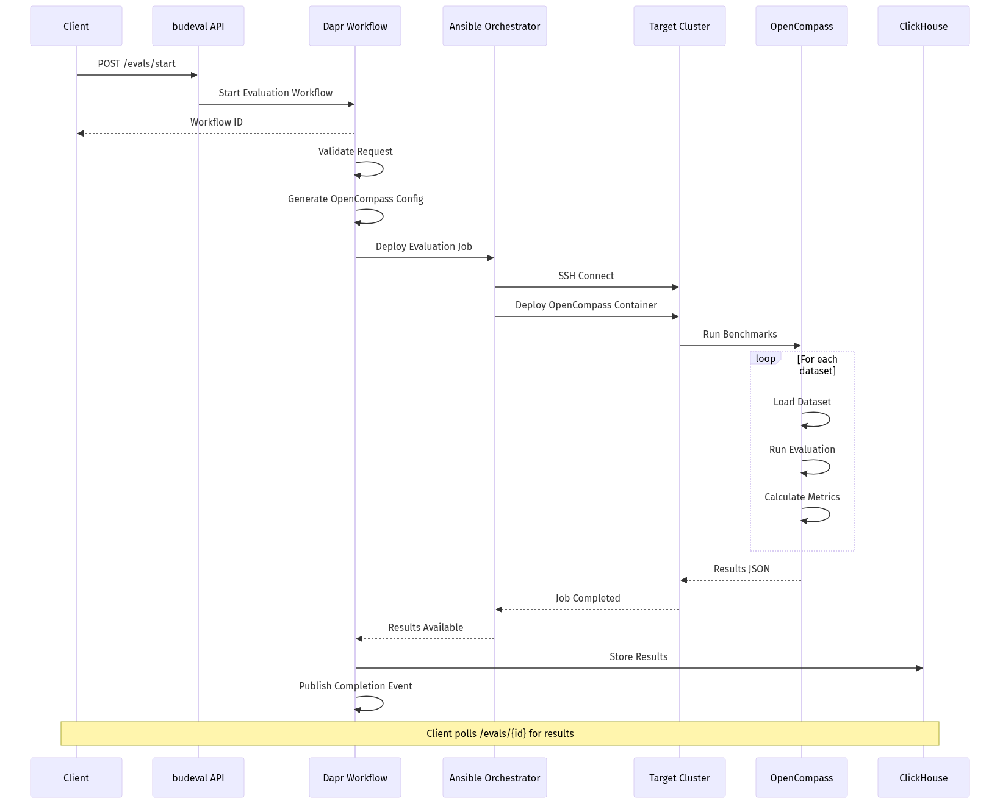

# budeval - Low-Level Design
---

## 1. Document Overview

### 1.1 Purpose

This LLD provides build-ready technical specifications for budeval, the model evaluation and benchmarking service of Bud AI Foundry. Developers should be able to implement evaluation jobs, benchmark execution, and performance analysis directly from this document.

### 1.2 Scope

**In Scope:**
- Model evaluation job orchestration
- Standardized benchmark execution (MMLU, HellaSwag, ARC, GSM8K)
- OpenCompass integration for benchmark runs
- Performance metrics calculation
- Evaluation result storage and analysis
- Ansible-based evaluation orchestration on clusters
- ClickHouse integration for results storage

**Out of Scope:**
- Model inference execution (handled by budgateway)
- Cluster management (handled by budcluster)
- Model registry (handled by budmodel)
- User authentication (handled by budapp)

### 1.3 Intended Audience

| Audience | What They Need |
|----------|----------------|
| Developers | Evaluation workflow, benchmark implementation |
| Data Scientists | Benchmark selection, metrics interpretation |
| Operations | Job monitoring, cluster resource management |
| Product | Evaluation capabilities, comparison features |

### 1.4 References

| Document | Description |
|----------|-------------|
| [High-Level Architecture](../architecture/high-level-architecture.md) | System overview |
| [Main LLD Index](../architecture/low-level-design.md) | Cross-cutting concerns |
| [OpenCompass Documentation](https://opencompass.org.cn/doc) | Evaluation framework |

---

## 2. System Context & Assumptions

### 2.1 Business Assumptions

- Users evaluate models before production deployment
- Standard benchmarks provide comparable metrics
- Evaluations may run for hours on large datasets
- Results need persistence for historical comparison
- Multiple models may be compared side-by-side

### 2.2 Technical Assumptions

- OpenCompass is the primary evaluation engine
- Ansible orchestrates evaluation jobs on clusters
- PostgreSQL stores job metadata
- ClickHouse stores evaluation results
- Dapr workflows manage long-running jobs

### 2.3 Constraints

| Constraint Type | Description | Impact |
|-----------------|-------------|--------|
| Timeout | 1 hour default evaluation timeout | Large datasets may need extension |
| Concurrency | 5 concurrent evaluations default | Queuing for high load |
| GPU | GPU may be required for large models | Resource scheduling needed |
| Storage | Large benchmark datasets | Pre-download or streaming required |

### 2.4 External Dependencies

| Dependency | Type | Failure Impact | Fallback Strategy |
|------------|------|----------------|-------------------|
| PostgreSQL | Required | No job persistence | Return 503 |
| ClickHouse | Required | No results storage | Buffer locally |
| Target Cluster | Required | Cannot run evaluation | Return error |
| OpenCompass | Required | No benchmark execution | Return error |
| budgateway | Optional | Cannot evaluate via API | Direct model access |
| budcluster | Optional | No cluster info | Manual config |

---

## 3. Detailed Architecture

### 3.1 Component Overview


### 3.2 Component Breakdown

#### 3.2.1 Evaluation Service

**Purpose:** Orchestrates evaluation job execution

**Key Responsibilities:**
- Accept evaluation requests
- Validate evaluation configuration
- Start Dapr workflow for long-running jobs
- Return workflow metadata for tracking

#### 3.2.2 Evaluation Workflow

**Purpose:** Long-running workflow for evaluation execution

**Workflow Steps:**
1. Validate evaluation request
2. Prepare OpenCompass configuration
3. Deploy evaluation job via Ansible
4. Monitor job progress
5. Collect results from ClickHouse
6. Publish completion event

#### 3.2.3 Ansible Orchestrator

**Purpose:** Deploy and manage evaluation jobs on clusters

**Capabilities:**
- Generate Ansible playbooks for evaluation
- Deploy OpenCompass container to cluster
- Monitor job status
- Clean up after completion

#### 3.2.4 OpenCompass Transformer

**Purpose:** Transform evaluation requests to OpenCompass format

**Responsibilities:**
- Map datasets to OpenCompass dataset IDs
- Generate OpenCompass config files
- Handle model endpoint configuration
- Parse OpenCompass results

---

## 4. Data Design

### 4.1 Evaluation Request Schema

```python
class EvaluationRequest(CloudEventBase):
    eval_id: UUID
    experiment_id: UUID
    eval_model_info: EvalModelInfo
    eval_datasets: List[EvalDataset]
    eval_configs: List[EvalConfig]
    engine: EvaluationEngine = EvaluationEngine.OPENCOMPASS
    kubeconfig: Optional[str] = None

class EvalModelInfo(BaseModel):
    model_name: str
    endpoint: str
    api_key: str
    extra_args: Dict[str, Any] = {}

class EvalDataset(BaseModel):
    dataset_id: str
    run_id: str

class EvalConfig(BaseModel):
    config_name: str
    config_value: Dict[str, Any]
```

### 4.2 Evaluation Results (ClickHouse)

```sql
CREATE TABLE evaluation_results (
    eval_id UUID,
    experiment_id UUID,
    model_name String,
    dataset_id String,
    benchmark_name String,
    metric_name String,
    metric_value Float64,
    sample_count UInt32,
    correct_count UInt32,
    accuracy Float64,
    latency_avg_ms Float64,
    latency_p99_ms Float64,
    timestamp DateTime64(3),
    metadata String
) ENGINE = MergeTree()
PARTITION BY toYYYYMM(timestamp)
ORDER BY (experiment_id, eval_id, dataset_id)
```

### 4.3 Supported Benchmark Suites

| Benchmark | Type | Description |
|-----------|------|-------------|
| MMLU | Knowledge | Massive Multitask Language Understanding |
| HellaSwag | Reasoning | Commonsense reasoning |
| ARC | Reasoning | AI2 Reasoning Challenge |
| GSM8K | Math | Grade school math problems |
| TruthfulQA | Safety | Truthfulness benchmark |
| HumanEval | Coding | Code generation |

---

## 5. API & Interface Design

### 5.1 POST /evals/start

**Purpose:** Start a new evaluation job

**Request:**
```json
{
  "eval_id": "uuid",
  "experiment_id": "uuid",
  "eval_model_info": {
    "model_name": "llama-3.1-70b",
    "endpoint": "http://vllm:8000/v1",
    "api_key": "api-key",
    "extra_args": {}
  },
  "eval_datasets": [
    {"dataset_id": "mmlu", "run_id": "run-1"},
    {"dataset_id": "hellaswag", "run_id": "run-1"}
  ],
  "eval_configs": [
    {"config_name": "batch_size", "config_value": {"value": 32}}
  ],
  "engine": "opencompass"
}
```

**Response:**
```json
{
  "workflow_id": "uuid",
  "status": "started",
  "message": "Evaluation workflow started",
  "created_at": "2024-01-15T10:00:00Z"
}
```

### 5.2 GET /evals/{eval_id}

**Purpose:** Get evaluation status and results

**Response:**
```json
{
  "eval_id": "uuid",
  "status": "completed",
  "progress_percentage": 100.0,
  "results": {
    "mmlu": {
      "accuracy": 0.78,
      "sample_count": 14042,
      "correct_count": 10953
    },
    "hellaswag": {
      "accuracy": 0.85,
      "sample_count": 10042,
      "correct_count": 8536
    }
  },
  "started_at": "2024-01-15T10:00:00Z",
  "completed_at": "2024-01-15T11:30:00Z"
}
```

---

## 6. Logic & Algorithm Details

### 6.1 Evaluation Workflow

```
┌─────────────┐     ┌─────────────┐     ┌─────────────┐
│   Start     │────▶│  Validate   │────▶│   Prepare   │
│  Workflow   │     │   Request   │     │  OpenCompass │
└─────────────┘     └─────────────┘     └──────┬──────┘
                                               │
                    ┌──────────────────────────┘
                    │
                    ▼
              ┌─────────────┐     ┌─────────────┐
              │   Deploy    │────▶│   Monitor   │
              │  via Ansible│     │   Progress  │
              └─────────────┘     └──────┬──────┘
                                         │
                    ┌────────────────────┘
                    │
                    ▼
              ┌─────────────┐     ┌─────────────┐
              │   Collect   │────▶│   Publish   │
              │   Results   │     │  Completion │
              └─────────────┘     └─────────────┘
```

### 6.2 OpenCompass Configuration Generation

```python
def generate_opencompass_config(request: EvaluationRequest) -> dict:
    """Generate OpenCompass configuration from evaluation request."""
    return {
        "models": [{
            "path": request.eval_model_info.model_name,
            "openai_api_base": request.eval_model_info.endpoint,
            "key": request.eval_model_info.api_key,
            "max_seq_len": 4096,
            "batch_size": get_batch_size(request.eval_configs),
        }],
        "datasets": [
            map_dataset(ds.dataset_id) for ds in request.eval_datasets
        ],
        "work_dir": f"/results/{request.eval_id}",
    }
```

### 6.3 Accuracy Calculation

```python
def calculate_accuracy(results: List[EvalResult]) -> dict:
    """Calculate accuracy metrics from evaluation results."""
    total_samples = sum(r.sample_count for r in results)
    total_correct = sum(r.correct_count for r in results)

    return {
        "accuracy": total_correct / total_samples if total_samples > 0 else 0.0,
        "sample_count": total_samples,
        "correct_count": total_correct,
        "confidence_interval": calculate_ci(total_correct, total_samples),
    }
```

---

## 7. GenAI/ML-Specific Design

### 7.1 Model Evaluation Types

| Type | Description | Metrics |
|------|-------------|---------|
| Accuracy | Correct answer rate | accuracy, F1, precision, recall |
| Latency | Response time | avg_ms, p95_ms, p99_ms |
| Throughput | Tokens per second | tokens/s |
| Quality | Output quality | coherence, relevance |
| Safety | Harmful content detection | safety_score |

### 7.2 Benchmark Dataset Mapping

```python
DATASET_MAPPING = {
    "mmlu": "opencompass/mmlu",
    "hellaswag": "opencompass/hellaswag",
    "arc_easy": "opencompass/arc-e",
    "arc_challenge": "opencompass/arc-c",
    "gsm8k": "opencompass/gsm8k",
    "truthfulqa": "opencompass/truthfulqa",
    "humaneval": "opencompass/humaneval",
}
```

### 7.3 Multi-GPU Evaluation

```yaml
# Ansible playbook for multi-GPU evaluation
- name: Deploy OpenCompass evaluation
  hosts: eval_cluster
  vars:
    num_gpus: 4
    gpu_memory_fraction: 0.9
  tasks:
    - name: Run OpenCompass container
      docker_container:
        name: opencompass-eval
        image: opencompass/opencompass:latest
        gpus: all
        volumes:
          - "{{ config_path }}:/config"
          - "{{ results_path }}:/results"
        command: >
          python run.py --config /config/eval_config.py
          --num-gpus {{ num_gpus }}
```

---

## 8. Configuration & Environment

### 8.1 Environment Variables

| Variable | Required | Default | Description |
|----------|----------|---------|-------------|
| DATABASE_URL | Yes | - | PostgreSQL connection string |
| CLICKHOUSE_URL | Yes | - | ClickHouse for results |
| DAPR_HTTP_PORT | Yes | 3510 | Dapr sidecar port |
| DAPR_API_TOKEN | Yes | - | Dapr authentication |
| MAX_CONCURRENT_EVALUATIONS | No | 5 | Parallel evaluations |
| EVALUATION_TIMEOUT | No | 3600 | Timeout in seconds |
| BENCHMARK_DATA_PATH | No | /app/benchmarks | Dataset location |
| RESULTS_STORAGE_PATH | No | /app/results | Results location |

### 8.2 Evaluation Engine Configuration

```python
class EvaluationEngine(str, Enum):
    OPENCOMPASS = "opencompass"
    # Future: ELEUTHER_HARNESS, LMEVAL, CUSTOM
```

---

## 9. Security Design

### 9.1 API Key Handling

- API keys passed in eval_model_info are used only during evaluation
- Keys are not persisted in results
- Keys are masked in logs

### 9.2 Cluster Access

- Kubeconfig is optional (uses local cluster config)
- When provided, kubeconfig is validated before use
- Ansible uses SSH key-based authentication

---

## 10. Performance & Scalability

### 10.1 Evaluation Performance

| Factor | Impact | Optimization |
|--------|--------|--------------|
| Dataset Size | Linear time increase | Batch processing |
| Model Size | GPU memory constraints | Multi-GPU distribution |
| Concurrent Jobs | Resource contention | Queue management |

### 10.2 Scaling Strategy

- Horizontal: Multiple evaluation workers
- Vertical: GPU-accelerated evaluation nodes
- Dataset: Pre-download benchmarks

---

## 11. Error Handling & Logging

### 11.1 Error Types

| Error | HTTP Code | Handling |
|-------|-----------|----------|
| Invalid Request | 400 | Return validation errors |
| Cluster Unavailable | 503 | Retry with backoff |
| Evaluation Timeout | 408 | Terminate and report partial |
| Internal Error | 500 | Log and alert |

---

## 12. Deployment & Infrastructure

### 12.1 Resource Requirements

| Component | CPU | Memory | GPU |
|-----------|-----|--------|-----|
| budeval API | 500m-1 | 512Mi-1Gi | - |
| Evaluation Job | 4+ | 16Gi+ | 1-8 |

---

## 13. Testing Strategy

### 13.1 Test Types

- Unit tests for configuration generation
- Integration tests with mock evaluation engine
- E2E tests with small benchmark subsets

---

## 14. Limitations & Future Enhancements

### 14.1 Current Limitations

- Single evaluation engine (OpenCompass)
- No streaming results
- Limited benchmark selection

### 14.2 Planned Improvements

1. EleutherAI LM Harness integration
2. Custom benchmark framework
3. Real-time progress streaming
4. A/B testing framework

---

## 15. Appendix

### 15.1 Sequence Diagrams

#### 15.1.1 Evaluation Flow


