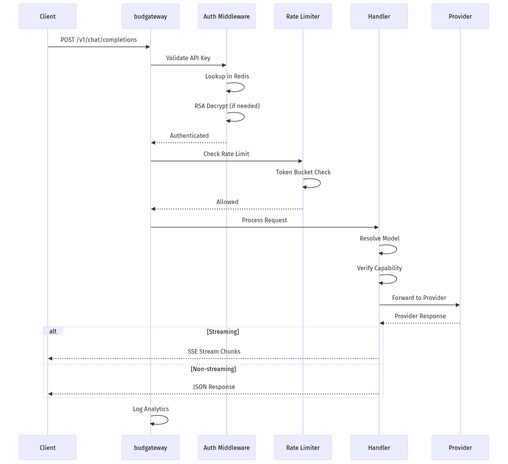
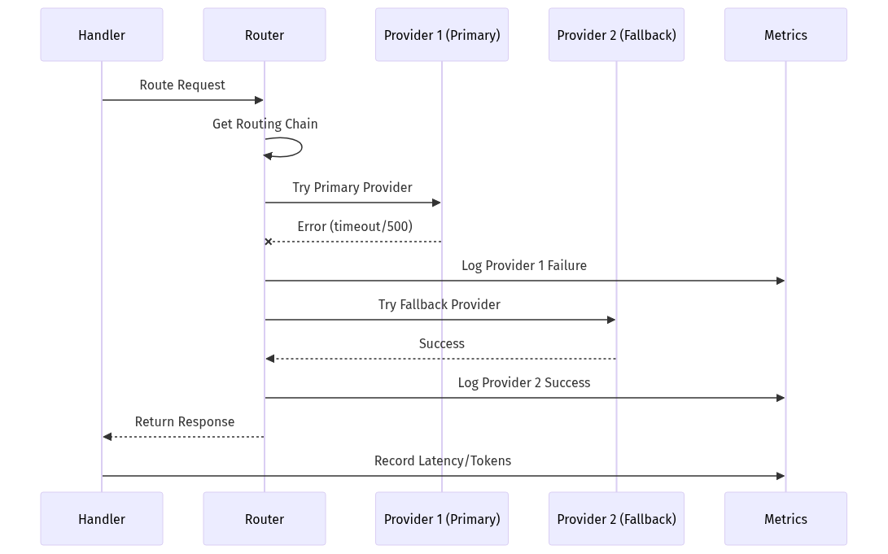

# budgateway - Low-Level Design
---

## 1. Document Overview

### 1.1 Purpose

This LLD provides build-ready technical specifications for budgateway, the high-performance Rust-based API gateway of Bud AI Foundry. It is forked from TensorZero and handles all inference traffic with OpenAI-compatible APIs, multi-provider routing, and sub-millisecond latency.

### 1.2 Scope

**In Scope:**
- OpenAI-compatible inference API (chat, completions, embeddings, audio, images)
- Multi-provider routing with fallback chains
- Request/response streaming (SSE)
- API key authentication with RSA decryption
- Rate limiting and usage limiting
- Metrics collection for budmetrics
- Guardrails and blocking rules
- GeoIP and user-agent analytics

**Out of Scope:**
- User/project management (handled by budapp)
- Model registry (handled by budmodel)
- Cluster management (handled by budcluster)
- Performance simulation (handled by budsim)

### 1.3 Intended Audience

| Audience | What They Need |
|----------|----------------|
| Developers | Provider implementation, middleware stack, routing |
| Operations | Performance tuning, configuration, monitoring |
| Security | Authentication flow, RSA encryption, rate limiting |
| Integrators | API compatibility, provider configuration |

### 1.4 References

| Document | Description |
|----------|-------------|
| [High-Level Architecture](../architecture/high-level-architecture.md) | System overview |
| [Main LLD Index](../architecture/low-level-design.md) | Cross-cutting concerns |
| [budgateway Service Documentation](./budgateway.md) | Service summary |
| [TensorZero Documentation](https://tensorzero.com/docs) | Upstream reference |

---

## 2. System Context & Assumptions

### 2.1 Business Assumptions

- Inference traffic is latency-sensitive (<1ms P99 gateway overhead target)
- Multiple AI providers serve the same model for redundancy
- API keys are stored encrypted in Redis by budapp
- Clients use OpenAI-compatible SDK interfaces
- Streaming responses are common for chat completions

### 2.2 Technical Assumptions

- Rust 1.70+ with async runtime (Tokio)
- Redis available for authentication and rate limiting
- ClickHouse available for observability (optional)
- Model runtimes accessible via HTTP (Bud, OpenAI API, etc.)
- TOML configuration files mounted at runtime

### 2.3 Constraints

| Constraint Type | Description | Impact |
|-----------------|-------------|--------|
| Latency | <1ms P99 gateway overhead | Minimal middleware |
| Memory | ~50MB baseline footprint | MiMalloc allocator |
| Connections | 10,000+ concurrent | Async I/O |
| Audio File Size | 25MB max upload | Multipart limits |

### 2.4 External Dependencies

| Dependency | Type | Failure Impact | Fallback Strategy |
|------------|------|----------------|-------------------|
| Redis | Optional | No auth/rate limiting | Pass through |
| ClickHouse | Optional | No observability | Local logging |
| Model Runtimes | Required | Inference fails | Fallback chain |
| budapp | Producer | No API key updates | Use cached |
| budmetrics | Consumer | No metrics storage | Discard |

---

## 3. Detailed Architecture

### 3.1 Component Overview


### 3.2 Middleware Stack (Execution Order)

```
Request ────▶ add_version_header
                    │
                    ▼
             OtelTraceLayer (distributed tracing)
                    │
                    ▼
             require_api_key (if auth enabled)
                    │
                    ▼
             early_model_extraction
                    │
                    ▼
             usage_limit_middleware (if enabled)
                    │
                    ▼
             rate_limit_middleware (if enabled)
                    │
                    ▼
             analytics_middleware
                    │
                    ▼
             blocking_middleware
                    │
                    ▼
             Handler (inference/embedding/audio/etc.)
                    │
                    ▼
Response ◀──────────┘
```

### 3.3 Component Breakdown

#### 3.3.1 Config Parser

**Purpose:** Load and validate TOML configuration

**Key Structures:**
```rust
pub struct Config {
    pub gateway: GatewayConfig,
    pub models: HashMap<String, ModelConfig>,
    pub providers: HashMap<String, ProviderConfig>,
    pub functions: HashMap<String, FunctionConfig>,
    pub guardrails: HashMap<String, GuardrailConfig>,
}

pub struct ModelConfig {
    pub routing: Vec<String>,        // Provider priority list
    pub endpoints: Vec<Capability>,  // chat, embedding, audio_*, etc.
}
```

#### 3.3.2 Model Resolution

**Purpose:** Map client request to provider routing

**Flow:**
1. Extract model name from request
2. Look up model configuration
3. Verify capability (chat, embedding, audio, etc.)
4. Return provider routing list

#### 3.3.3 Provider System

**Purpose:** Abstract AI provider implementations

**Supported Providers:**
| Provider | Type | Capabilities |
|----------|------|--------------|
| OpenAI | `openai` | chat, embedding, audio, images, moderation |
| Anthropic | `anthropic` | chat |
| Azure OpenAI | `azure` | chat, embedding |
| Together AI | `together` | chat, images |
| Anyscale | `anyscale` | chat |
| Bud/Local | `openai` | chat, embedding |

**Provider Trait:**
```rust
#[async_trait]
pub trait InferenceProvider: Send + Sync {
    async fn infer(
        &self,
        request: InferenceRequest,
        credentials: &InferenceCredentials,
    ) -> Result<InferenceResponse, Error>;

    async fn stream(
        &self,
        request: InferenceRequest,
        credentials: &InferenceCredentials,
    ) -> Result<BoxStream<Result<StreamChunk, Error>>, Error>;
}
```

---

## 4. Data Design

### 4.1 Configuration Schema

**Gateway Configuration:**
```toml
[gateway]
host = "0.0.0.0"
port = 3000
debug = false
bind_address = "0.0.0.0:3000"

[gateway.authentication]
enabled = true

[gateway.export.otlp.traces]
enabled = true
```

**Model Configuration:**
```toml
[models."gpt-4"]
routing = ["primary_provider", "fallback_provider"]
endpoints = ["chat"]

[models."gpt-4".providers.primary_provider]
type = "openai"
model_name = "gpt-4"
api_key_location = { env = "OPENAI_API_KEY" }

[models."whisper-1"]
routing = ["openai"]
endpoints = ["audio_transcription", "audio_translation"]
```

### 4.2 Credential Storage (Redis)

**Key Format:** `api_key:{api_key_id}`

**Value Schema:**
```json
{
  "id": "uuid",
  "project_id": "uuid",
  "user_id": "uuid",
  "scopes": ["chat", "embedding"],
  "rate_limit_rpm": 60,
  "usage_limit_tokens": 1000000,
  "encrypted_key": "hex_encoded_rsa_encrypted",
  "expires_at": "2024-12-31T23:59:59Z"
}
```

### 4.3 Analytics Events (ClickHouse)

**Inference Event Schema:**
```sql
CREATE TABLE inference_events (
    event_id UUID,
    timestamp DateTime64(3),
    model_name String,
    provider_name String,
    project_id UUID,
    endpoint_id UUID,
    input_tokens UInt32,
    output_tokens UInt32,
    latency_ms Float64,
    ttft_ms Float64,
    is_success Bool,
    error_code String,
    request_ip IPv4,
    country_code String,
    user_agent String
) ENGINE = MergeTree()
PARTITION BY toYYYYMM(timestamp)
ORDER BY (project_id, timestamp)
```

---

## 5. API & Interface Design

### 5.1 OpenAI-Compatible Endpoints

#### 5.1.1 POST /v1/chat/completions

**Purpose:** Chat completion inference

**Request:**
```json
{
  "model": "gpt-4",
  "messages": [
    {"role": "system", "content": "You are a helpful assistant."},
    {"role": "user", "content": "Hello!"}
  ],
  "stream": true,
  "temperature": 0.7,
  "max_tokens": 1000
}
```

**Response (non-streaming):**
```json
{
  "id": "chatcmpl-123",
  "object": "chat.completion",
  "created": 1704067200,
  "model": "gpt-4",
  "choices": [
    {
      "index": 0,
      "message": {"role": "assistant", "content": "Hello! How can I help?"},
      "finish_reason": "stop"
    }
  ],
  "usage": {
    "prompt_tokens": 20,
    "completion_tokens": 10,
    "total_tokens": 30
  }
}
```

**Response (streaming - SSE):**
```
data: {"id":"chatcmpl-123","object":"chat.completion.chunk","choices":[{"delta":{"content":"Hello"}}]}

data: {"id":"chatcmpl-123","object":"chat.completion.chunk","choices":[{"delta":{"content":"!"}}]}

data: [DONE]
```

#### 5.1.2 POST /v1/embeddings

**Request:**
```json
{
  "model": "text-embedding-ada-002",
  "input": ["Hello world", "Goodbye world"]
}
```

**Response:**
```json
{
  "object": "list",
  "data": [
    {"object": "embedding", "index": 0, "embedding": [0.1, 0.2, ...]},
    {"object": "embedding", "index": 1, "embedding": [0.3, 0.4, ...]}
  ],
  "model": "text-embedding-ada-002",
  "usage": {"prompt_tokens": 4, "total_tokens": 4}
}
```

#### 5.1.3 POST /v1/audio/transcriptions

**Request (multipart/form-data):**
```
file: audio.mp3
model: whisper-1
response_format: json
language: en
```

**Response:**
```json
{
  "text": "Hello, this is a transcription."
}
```

#### 5.1.4 POST /v1/images/generations

**Request:**
```json
{
  "model": "dall-e-3",
  "prompt": "A beautiful sunset over mountains",
  "n": 1,
  "size": "1024x1024",
  "response_format": "url"
}
```

**Response:**
```json
{
  "created": 1704067200,
  "data": [
    {"url": "https://...generated-image.png"}
  ]
}
```

### 5.2 Management Endpoints

| Method | Path | Description |
|--------|------|-------------|
| GET | `/health` | Health check |
| GET | `/metrics` | Prometheus metrics |
| GET | `/v1/models` | List available models |

### 5.3 Internal Endpoints

| Method | Path | Description |
|--------|------|-------------|
| POST | `/inference` | TensorZero native inference |
| POST | `/batch_inference` | Batch inference |
| POST | `/feedback` | Inference feedback |

---

## 6. Logic & Algorithm Details

### 6.1 Provider Fallback Chain

**Algorithm:**
```rust
async fn route_to_providers(
    request: InferenceRequest,
    routing: Vec<String>,
) -> Result<InferenceResponse, Error> {
    let mut last_error = None;

    for provider_name in routing {
        let provider = get_provider(provider_name)?;

        match provider.infer(request.clone()).await {
            Ok(response) => return Ok(response),
            Err(e) => {
                tracing::warn!("Provider {} failed: {}", provider_name, e);
                last_error = Some(e);
                continue;  // Try next provider
            }
        }
    }

    Err(last_error.unwrap_or(Error::NoAvailableProviders))
}
```

### 6.2 RSA Decryption for API Keys

**Algorithm:**
```rust
pub fn decrypt_api_key(encrypted: &str) -> Result<String, Error> {
    // 1. Load private key from environment
    let private_key = load_private_key()?;

    // 2. Decode hex-encoded ciphertext
    let ciphertext = hex::decode(encrypted)?;

    // 3. Decrypt with OAEP SHA256 padding
    let decrypted = private_key.decrypt(
        Oaep::new::<Sha256>(),
        &ciphertext,
    )?;

    // 4. Return UTF-8 string
    Ok(String::from_utf8(decrypted)?)
}
```

### 6.3 Rate Limiting

**Token Bucket Algorithm:**
```rust
pub struct RateLimiter {
    redis: RedisClient,
}

impl RateLimiter {
    pub async fn check_rate_limit(
        &self,
        key: &str,
        limit: u32,
        window_seconds: u32,
    ) -> Result<bool, Error> {
        let script = r#"
            local key = KEYS[1]
            local limit = tonumber(ARGV[1])
            local window = tonumber(ARGV[2])

            local current = redis.call('incr', key)
            if current == 1 then
                redis.call('expire', key, window)
            end

            return current <= limit
        "#;

        self.redis.eval(script, &[key], &[limit, window_seconds]).await
    }
}
```

### 6.4 Model Resolution

```rust
pub fn resolve_model(
    model_name: &str,
    capability: EndpointCapability,
    config: &Config,
) -> Result<&ModelConfig, Error> {
    let model = config.models.get(model_name)
        .ok_or(Error::ModelNotFound(model_name.to_string()))?;

    if !model.endpoints.contains(&capability) {
        return Err(Error::CapabilityNotSupported {
            model: model_name.to_string(),
            capability,
        });
    }

    Ok(model)
}
```

---

## 7. GenAI/ML-Specific Design

### 7.1 Endpoint Capabilities

| Capability | Description | Providers |
|------------|-------------|-----------|
| `chat` | Chat completions | All |
| `embedding` | Text embeddings | OpenAI, Azure, Local |
| `moderation` | Content moderation | OpenAI |
| `audio_transcription` | Speech-to-text | OpenAI (Whisper) |
| `audio_translation` | Audio to English | OpenAI (Whisper) |
| `text_to_speech` | Text-to-speech | OpenAI |
| `image_generation` | Generate images | OpenAI, Together |
| `responses` | Structured responses | OpenAI |

### 7.2 Streaming Implementation

**SSE Format:**
```rust
pub async fn stream_response(
    stream: BoxStream<Result<StreamChunk, Error>>,
) -> impl IntoResponse {
    let body = Body::from_stream(stream.map(|chunk| {
        match chunk {
            Ok(data) => Ok(format!("data: {}\n\n", serde_json::to_string(&data)?)),
            Err(e) => Err(e),
        }
    }));

    (
        [(header::CONTENT_TYPE, "text/event-stream")],
        body,
    )
}
```

### 7.3 Token Counting

**Pre-flight token estimation:**
- Chat: Count messages using tiktoken-equivalent
- Embeddings: Count input text tokens
- Audio: Estimate from file duration (150 tokens/second)

### 7.4 Guardrails Integration

```toml
[guardrails.profanity_filter]
type = "keyword_block"
keywords = ["bad_word1", "bad_word2"]
action = "block"

[guardrails.max_tokens]
type = "token_limit"
max_input_tokens = 4096
max_output_tokens = 2048
action = "truncate"
```

---

## 8. Configuration & Environment

### 8.1 Environment Variables

| Variable | Required | Default | Description |
|----------|----------|---------|-------------|
| TENSORZERO_CONFIG_PATH | No | tensorzero.toml | Config file path |
| TENSORZERO_REDIS_URL | No | - | Redis for auth/rate limit |
| TENSORZERO_CLICKHOUSE_URL | No | - | ClickHouse for analytics |
| TENSORZERO_RSA_PRIVATE_KEY_PATH | No | - | RSA key for decryption |
| TENSORZERO_RSA_PRIVATE_KEY_PASSWORD | No | - | Key password |
| OPENAI_API_KEY | No | - | OpenAI provider key |
| ANTHROPIC_API_KEY | No | - | Anthropic provider key |
| OTEL_EXPORTER_OTLP_TRACES_ENDPOINT | No | - | OTLP endpoint |

### 8.2 Feature Flags

| Flag | Description |
|------|-------------|
| `gateway.debug` | Enable debug logging |
| `gateway.authentication.enabled` | Enable API key auth |
| `gateway.export.otlp.traces.enabled` | Enable OTLP tracing |

### 8.3 Provider-Specific Configuration

**OpenAI:**
```toml
[models."gpt-4".providers.openai]
type = "openai"
model_name = "gpt-4"
api_key_location = { env = "OPENAI_API_KEY" }
base_url = "https://api.openai.com"  # Optional override
```

**Azure:**
```toml
[models."gpt-4".providers.azure]
type = "azure"
deployment_name = "gpt-4-deployment"
api_key_location = { env = "AZURE_OPENAI_API_KEY" }
azure_endpoint = "https://myinstance.openai.azure.com"
api_version = "2024-02-15-preview"
```

---

## 9. Security Design

### 9.1 Authentication Flow

```
Client Request
       │
       ▼
┌─────────────┐
│ Extract     │
│ API Key     │
│ (Bearer)    │
└──────┬──────┘
       │
       ▼
┌─────────────┐     ┌─────────────┐
│ Lookup in   │────▶│   Redis     │
│   Redis     │     │   Cache     │
└──────┬──────┘     └─────────────┘
       │
       ▼
┌─────────────┐
│ RSA Decrypt │
│ (if needed) │
└──────┬──────┘
       │
       ▼
┌─────────────┐
│ Validate    │
│ Expiry/     │
│ Scopes      │
└──────┬──────┘
       │
       ▼
┌─────────────┐
│ Attach to   │
│ Request     │
│ Extensions  │
└─────────────┘
```

### 9.2 RSA Encryption Details

| Property | Value |
|----------|-------|
| Algorithm | RSA-OAEP |
| Hash | SHA-256 |
| Key Format | PEM (PKCS#1 or PKCS#8) |
| Encoding | Hex or Base64 |
| Key Size | 4096 bits (recommended) |

### 9.3 Rate Limiting Configuration

```toml
[gateway.rate_limiting]
enabled = true
default_rpm = 60
default_tpm = 100000

[gateway.rate_limiting.tiers.premium]
rpm = 1000
tpm = 1000000
```

### 9.4 Blocking Rules

```rust
pub struct BlockingRule {
    pub rule_type: BlockingRuleType,
    pub patterns: Vec<String>,
    pub action: BlockingAction,
}

pub enum BlockingAction {
    Block,      // Return 403
    Log,        // Log and continue
    Throttle,   // Apply stricter rate limit
}
```

---

## 10. Performance & Scalability

### 10.1 Performance Targets

| Metric | Target |
|--------|--------|
| Gateway Latency (P99) | <1ms |
| Max Concurrent Connections | 10,000+ |
| Memory Footprint | ~50MB |
| Throughput | 100,000+ req/s |

### 10.2 Optimization Techniques

| Technique | Benefit |
|-----------|---------|
| MiMalloc allocator | Better multi-threaded allocation |
| Zero-copy streaming | Minimal memory for large responses |
| Connection pooling | Reuse provider connections |
| Async I/O (Tokio) | Non-blocking concurrency |
| Arc for config | Shared immutable config |

### 10.3 Memory Management

```rust
#[global_allocator]
static GLOBAL: MiMalloc = MiMalloc;

// Use Arc for shared immutable data
let config: Arc<Config> = Arc::new(config);

// Stream responses to avoid buffering
async fn stream_response(stream: impl Stream<Item = Chunk>) {
    // Each chunk is processed and sent immediately
}
```

### 10.4 Connection Pooling

```rust
pub struct ProviderClient {
    client: reqwest::Client,  // Connection pool
}

impl ProviderClient {
    pub fn new() -> Self {
        let client = reqwest::Client::builder()
            .pool_max_idle_per_host(100)
            .pool_idle_timeout(Duration::from_secs(60))
            .build()
            .unwrap();

        Self { client }
    }
}
```

---

## 11. Error Handling & Logging

### 11.1 Error Classification

| Error Type | HTTP Code | Retry | User Message |
|------------|-----------|-------|--------------|
| AuthenticationError | 401 | No | Invalid API key |
| AuthorizationError | 403 | No | Insufficient permissions |
| ModelNotFound | 404 | No | Model not found |
| RateLimitExceeded | 429 | Yes (with backoff) | Rate limit exceeded |
| ProviderError | 502 | Yes (fallback) | Provider error |
| InternalError | 500 | Maybe | Internal error |

### 11.2 Error Response Format

```json
{
  "error": {
    "message": "Rate limit exceeded",
    "type": "rate_limit_error",
    "code": "rate_limit_exceeded",
    "param": null
  }
}
```

### 11.3 Structured Logging

```rust
tracing::info!(
    model = %model_name,
    provider = %provider_name,
    latency_ms = %latency.as_millis(),
    input_tokens = %usage.prompt_tokens,
    output_tokens = %usage.completion_tokens,
    "Inference completed"
);
```

### 11.4 Debug Mode

When `gateway.debug = true`:
- Full request/response bodies logged
- Provider raw responses included
- Error stack traces exposed

---

## 12. Deployment & Infrastructure

### 12.1 Deployment Topology

```
┌─────────────────────────────────────────────────────────────────────────────┐
│                    Kubernetes Cluster                                        │
├─────────────────────────────────────────────────────────────────────────────┤
│                                                                              │
│  ┌──────────────┐   ┌──────────────┐   ┌──────────────┐                     │
│  │  budgateway  │   │  budgateway  │   │  budgateway  │                     │
│  │  (replica 1) │   │  (replica 2) │   │  (replica 3) │                     │
│  └──────┬───────┘   └──────┬───────┘   └──────┬───────┘                     │
│         │                  │                  │                              │
│         └──────────────────┼──────────────────┘                              │
│                            │                                                 │
│                            ▼                                                 │
│                    ┌──────────────┐                                         │
│                    │   Ingress    │                                         │
│                    │   (L7 LB)    │                                         │
│                    └──────────────┘                                         │
│                                                                              │
└──────────────────────────────────────────────────────────────────────────────┘
```

### 12.2 Resource Requirements

| Component | CPU | Memory | Notes |
|-----------|-----|--------|-------|
| budgateway | 500m-4 | 128Mi-512Mi | Scales with connections |

### 12.3 Health Checks

```yaml
livenessProbe:
  httpGet:
    path: /health
    port: 3000
  initialDelaySeconds: 5
  periodSeconds: 10

readinessProbe:
  httpGet:
    path: /health
    port: 3000
  initialDelaySeconds: 2
  periodSeconds: 5
```

### 12.4 Configuration Mounting

```yaml
volumes:
  - name: config
    configMap:
      name: budgateway-config
  - name: rsa-keys
    secret:
      secretName: budgateway-rsa-key

volumeMounts:
  - name: config
    mountPath: /config
  - name: rsa-keys
    mountPath: /keys
    readOnly: true
```

---

## 13. Testing Strategy

### 13.1 Unit Tests

```rust
#[test]
fn test_model_resolution() {
    let config = test_config();
    let result = resolve_model("gpt-4", EndpointCapability::Chat, &config);
    assert!(result.is_ok());
}

#[test]
fn test_capability_not_supported() {
    let config = test_config();
    let result = resolve_model("gpt-4", EndpointCapability::ImageGeneration, &config);
    assert!(matches!(result, Err(Error::CapabilityNotSupported { .. })));
}
```

### 13.2 Integration Tests

```rust
#[tokio::test]
async fn test_chat_completion() {
    let app = test_app().await;

    let response = app
        .oneshot(
            Request::builder()
                .method("POST")
                .uri("/v1/chat/completions")
                .header("Authorization", "Bearer test-key")
                .header("Content-Type", "application/json")
                .body(Body::from(r#"{
                    "model": "gpt-4",
                    "messages": [{"role": "user", "content": "Hello"}]
                }"#))
                .unwrap(),
        )
        .await
        .unwrap();

    assert_eq!(response.status(), StatusCode::OK);
}
```

### 13.3 E2E Tests

```bash
# With real providers (requires API keys)
cargo test --features e2e_tests

# Test streaming
curl -X POST http://localhost:3000/v1/chat/completions \
  -H "Authorization: Bearer $API_KEY" \
  -H "Content-Type: application/json" \
  -d '{"model": "gpt-4", "messages": [{"role": "user", "content": "Hello"}], "stream": true}'
```

---

## 14. Limitations & Future Enhancements

### 14.1 Known Limitations

| Limitation | Impact | Workaround |
|------------|--------|------------|
| No WebSocket support | No real-time bidirectional | SSE for streaming |
| Single region | No geo-routing | Deploy per region |
| TOML config only | No dynamic config | Restart for changes |
| No request queuing | Backpressure limited | Rate limiting |

### 14.2 Tech Debt

| Item | Priority | Notes |
|------|----------|-------|
| Hot config reload | Medium | Avoid restarts |
| WebSocket support | Medium | Real-time use cases |
| Provider health checks | Low | Proactive fallback |

### 14.3 Planned Improvements

1. **Hot Configuration Reload** - Update config without restart
2. **WebSocket Support** - Real-time bidirectional streaming
3. **Request Queuing** - Handle burst traffic gracefully
4. **Provider Health Probes** - Preemptive failover

---

## 15. Appendix

### 15.1 Glossary

| Term | Definition |
|------|------------|
| SSE | Server-Sent Events for streaming |
| OAEP | Optimal Asymmetric Encryption Padding |
| OTLP | OpenTelemetry Protocol |
| MiMalloc | Microsoft's mimalloc allocator |
| Axum | Rust web framework based on Tower |

### 15.2 Sequence Diagrams

#### 15.2.1 Inference Request Flow



#### 15.2.2 Provider Fallback Flow



### 15.3 Configuration Examples

**Production Configuration:**
```toml
[gateway]
host = "0.0.0.0"
port = 3000
debug = false

[gateway.authentication]
enabled = true

[gateway.export.otlp.traces]
enabled = true

[[providers]]
name = "local-vllm"
type = "openai"
base_url = "http://vllm-service:8000/v1"

[[providers]]
name = "openai-fallback"
type = "openai"
api_key_location = { env = "OPENAI_API_KEY" }

[models."llama-3.1-70b"]
routing = ["local-vllm", "openai-fallback"]
endpoints = ["chat"]
```

**Development Configuration:**
```toml
[gateway]
host = "127.0.0.1"
port = 3000
debug = true

[gateway.authentication]
enabled = false

[models."gpt-4"]
routing = ["openai"]
endpoints = ["chat", "embedding"]

[models."gpt-4".providers.openai]
type = "openai"
model_name = "gpt-4"
api_key_location = { env = "OPENAI_API_KEY" }
```
