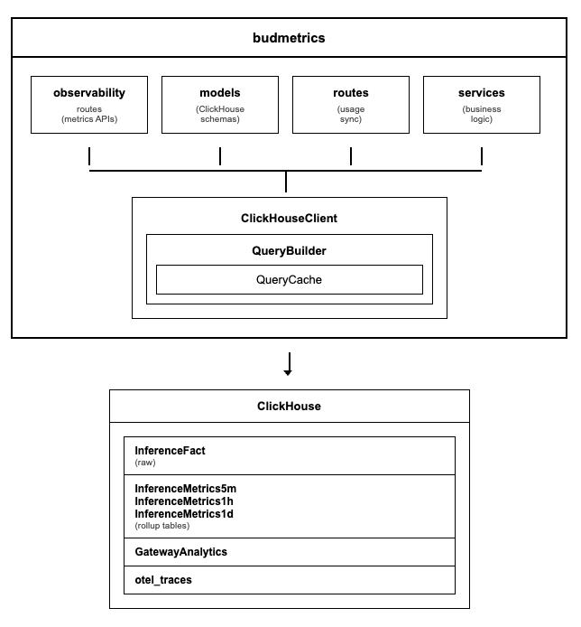

# budmetrics - Low-Level Design
---

## 1. Document Overview

### 1.1 Purpose

This LLD provides build-ready technical specifications for budmetrics, the observability and analytics service of Bud AI Foundry. Developers should be able to implement metrics collection, time-series analytics, and performance monitoring features directly from this document.

### 1.2 Scope

**In Scope:**
- ClickHouse-based inference metrics storage and analytics
- Time-series query building with dynamic aggregations
- Rollup table optimization for high-performance queries
- Geographic distribution analysis from gateway data
- Credential usage tracking and user activity monitoring
- OpenTelemetry trace storage and retrieval
- Real-time dashboard metrics with delta calculations

**Out of Scope:**
- User authentication (handled by budapp)
- Model inference execution (handled by budgateway)
- Cluster management (handled by budcluster)
- Performance simulation (handled by budsim)

---

## 2. System Context & Assumptions

### 2.1 Business Assumptions

- Inference metrics are ingested at high velocity (thousands per second)
- Dashboard queries must return within 500ms for good UX
- Historical data retention spans 90+ days
- Users need both real-time and historical analytics
- Geographic analysis requires IP-based location data

### 2.2 Technical Assumptions

- ClickHouse is available with native protocol access (port 9000)
- budgateway pushes inference metrics via Dapr pub/sub
- OpenTelemetry traces are collected from all services
- Redis/Valkey is available for state management
- Network latency to ClickHouse is <10ms

### 2.3 Constraints

| Constraint Type | Description | Impact |
|-----------------|-------------|--------|
| Query Timeout | 300s max execution time | Long queries may fail |
| Memory | 10GB max per query | Complex aggregations limited |
| Batch Size | 1000 entries max per insert | Client must batch |
| Date Range | 90 days max per query | Prevents full table scans |
| Concurrent Queries | 10 max via semaphore | Prevents resource exhaustion |

### 2.4 External Dependencies

| Dependency | Type | Failure Impact | Fallback Strategy |
|------------|------|----------------|-------------------|
| ClickHouse | Required | No metrics storage/queries | Return 503 |
| Redis/Valkey | Required | No Dapr state | Service degraded |
| budgateway | Producer | No new metrics ingested | Queue backlog |
| budapp | Consumer | No usage sync | Queue updates |
| PostgreSQL | Optional | No PSQL fallback | Continue with ClickHouse |

---

## 3. Detailed Architecture

### 3.1 Component Overview

#### 3.2.1 QueryBuilder

**Purpose:** Constructs optimized ClickHouse queries for analytics

**Key Responsibilities:**
- Dynamic metric definition registration
- Time bucket expression generation
- Filter and grouping clause construction
- CTE (Common Table Expression) management
- TopK query generation
- Rollup vs raw table selection

**Metric Types Supported:**

| Metric | Description | Tables Used |
|--------|-------------|-------------|
| request_count | Total inference requests | InferenceFact/Rollup |
| success_request | Successful requests + rate | InferenceFact/Rollup |
| failure_request | Failed requests + rate | InferenceFact/Rollup |
| queuing_time | Request queue wait time | InferenceFact (raw) |
| input_token | Input token count | InferenceFact/Rollup |
| output_token | Output token count | InferenceFact/Rollup |
| concurrent_requests | Max concurrent at timestamp | InferenceFact (raw) |
| ttft | Time to first token (avg, p95, p99) | InferenceFact (raw for percentiles) |
| latency | Response latency (avg, p95, p99) | InferenceFact (raw for percentiles) |
| throughput | Tokens per second | InferenceFact/Rollup |
| cache | Cache hit rate/count | InferenceFact/Rollup |

#### 3.2.2 ClickHouseClient

**Purpose:** Manages ClickHouse connection pooling and query execution

**Configuration:**

**Connection Pool Lifecycle:**

#### 3.2.3 QueryCache

**Purpose:** LRU cache with TTL for frequently executed queries

**Cache Key Generation:**

**Cache Hit Flow:**

---

## 4. Data Design
#### 4.1.1 InferenceFact (Raw Data)

**Purpose:** Stores individual inference events for detailed analysis

**Indexes:**
- Primary: (project_id, endpoint_id, request_arrival_time)
- Secondary: model_id, api_key_id, user_id

#### 4.1.2 Rollup Tables (Pre-aggregated)

**Purpose:** Pre-aggregated metrics for fast dashboard queries

**Rollup Hierarchy:**

**Table Selection Logic:**

| Time Range | Frequency | Table Selected |
|------------|-----------|----------------|
| < 6 hours | hour | InferenceMetrics5m |
| 6h - 7 days | day | InferenceMetrics1h |
| > 7 days | week/month | InferenceMetrics1d |

---

## 5. API & Interface Design
#### 5.1.1 POST /observability/add

**Purpose:** Ingest inference metrics in batches

**Constraints:**
- Max batch size: 1000 entries
- Duplicate detection by inference_id
- Validation errors logged, partial success allowed
#### 5.1.3 POST /observability/inferences/list

**Purpose:** Paginated list of individual inferences

**Request:**#### 5.2.1 Rollup Query Construction

#---

## 6. Configuration & Environment

### 6.1 Environment Variables

| Variable | Required | Default | Description |
|----------|----------|---------|-------------|
| CLICKHOUSE_HOST | Yes | - | ClickHouse server hostname |
| CLICKHOUSE_PORT | Yes | 9000 | Native protocol port |
| CLICKHOUSE_USER | Yes | - | Database user |
| CLICKHOUSE_PASSWORD | Yes | - | Database password |
| CLICKHOUSE_DB_NAME | No | bud | Database name |
| CLICKHOUSE_ENABLE_QUERY_CACHE | No | false | Enable LRU cache |
| CLICKHOUSE_ENABLE_CONNECTION_WARMUP | No | false | Pre-warm connections |
| PSQL_HOST | No | - | PostgreSQL host (optional) |
| PSQL_PORT | No | - | PostgreSQL port (optional) |
| PSQL_DB_NAME | No | - | PostgreSQL database (optional) |

### 6.2 Feature Flags

| Flag | Default | Description |
|------|---------|-------------|
| CLICKHOUSE_ENABLE_QUERY_CACHE | false | Enable query result caching |
| CLICKHOUSE_ENABLE_CONNECTION_WARMUP | false | Pre-establish connections |

---

## 7. Security Design

### 7.1 Authentication

- Service-to-service via Dapr mTLS
- No direct user authentication (handled by budapp gateway)
- API accessed through budapp reverse proxy

### 7.2 Authorization

- Project-level filtering enforced at query level
- API key project ID used for client-specific metrics
- No cross-tenant data access possible

### 7.3 Data Protection

| Data Type | Protection |
|-----------|------------|
| IP Addresses | Stored as IPv4, logged |
| User IDs | UUID, no PII |
| API Keys | Only ID stored, not key value |
| Query Strings | Not stored |

---

## 8. Performance & Scalability

### 8.1 Query Optimization Strategies

| Strategy | Benefit | Implementation |
|----------|---------|----------------|
| Rollup tables | 100x faster aggregations | Materialized views |
| Query caching | Avoid duplicate computation | LRU with TTL |
| Connection pooling | Reduce connection overhead | asynch pool |
| Semaphore limiting | Prevent resource exhaustion | 10 concurrent max |
| Time partitioning | Efficient range queries | PARTITION BY month |

### 8.2 Expected Load

| Operation | Expected Volume | Target Latency |
|-----------|-----------------|----------------|
| Metric ingestion | 10,000/sec peak | < 100ms |
| Dashboard query | 100/sec | < 500ms |
| Trace retrieval | 10/sec | < 200ms |
| Export (large) | 1/min | < 30s |

### 8.4 Scaling Approach

- **Horizontal:** Multiple budmetrics replicas behind load balancer
- **Vertical:** ClickHouse cluster with sharding for large datasets
- **Data Lifecycle:** Rollup tables + TTL-based expiration

---

## 9. Deployment & Infrastructure

### 10.2 Resource Requirements

| Component | CPU | Memory | Storage |
|-----------|-----|--------|---------|
| budmetrics | 500m-2 | 512Mi-2Gi | - |
| Dapr sidecar | 100m | 128Mi | - |
| ClickHouse | 4+ | 16Gi+ | 500Gi+ |

### 10.3 Health Checks
